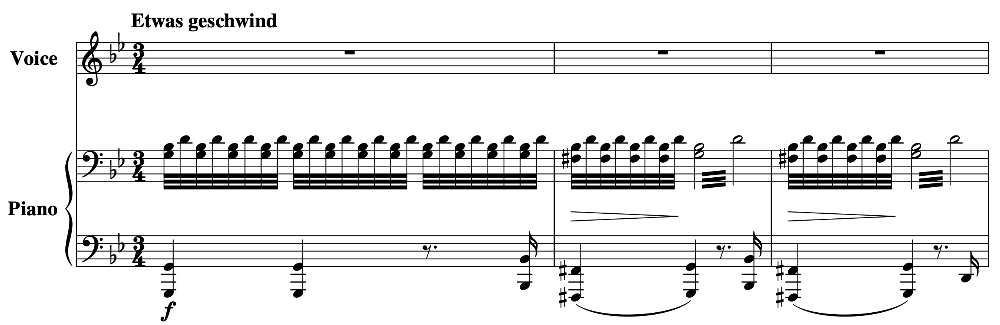
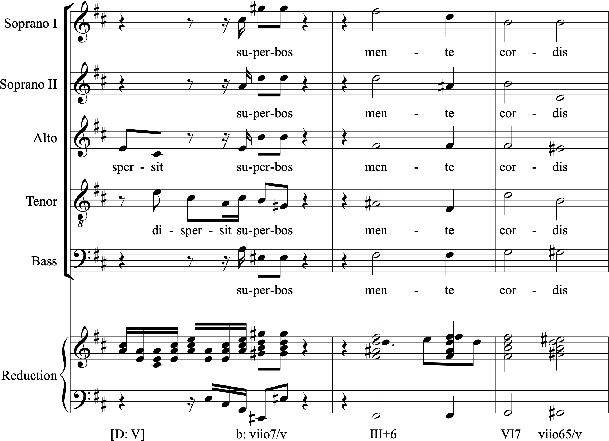
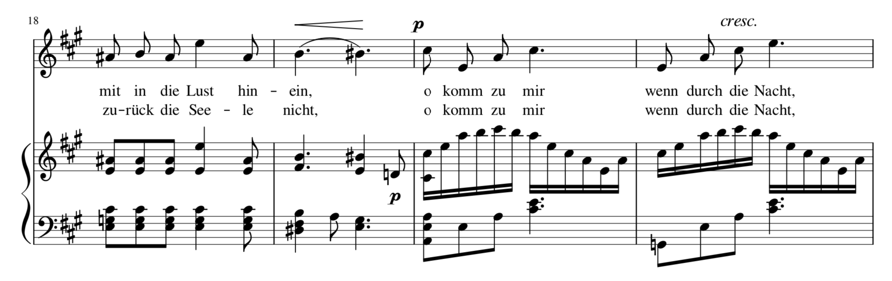

V. 半音化

增三和弦的选项（Augmented Options）Mark Gotham
核心要点
增三和弦：

- 比其他三种三和弦类型（大三和弦、小三和弦和减三和弦）罕见得多。
- 因多种原因而有趣，包括：罕见性本身，以及对称构造所带来的潜在灵活性和模糊性（就像减七和弦一样）。
- 最常见于两种形式之一：作为和声小调中的 III+（这是大/小调体系中唯一不需要半音变化的形式），以及作为大调中 V 和 I 之间的半音经过和弦：V、V+、I。

我们是不是忘记了什么？我们现在深入到了半音和声，却几乎没有提到四种表面上的自然音三和弦之一：我们已经了解了增六和弦，但还没有了解增三和弦。那么这个增三和弦究竟是什么？作曲家如何使用它？我们为什么忽视了它这么久（以及为什么这么多教科书完全忽略了它）？

回想一下，我们可以仅用大三度和小三度构建四种三和弦：

- 减三和弦（小三度 + 小三度）
- 小三和弦（小三度 + 大三度）
- 大三和弦（大三度 + 小三度）
- 增三和弦（大三度 + 大三度）

所以增三和弦是这组可能性的一部分，但显然不是一个平等的成员，至少在共性实践作曲家眼中不是。显然，大三和弦和小三和弦对调性音乐至关重要，减三和弦也是如此，特别是在其属功能角色中（作为 viio 和 V7 的一部分）。增三和弦相对于这些主角来说是一个略微边缘化的角色。

## 始终是半音的？

罕见性的一部分与大/小调体系本身的结构有关：和声小调中的 III+ 是增三和弦在大/小调体系中唯一不需要半音变化就出现的情况。这个 III+ 三和弦与属和弦（V）和小调主和弦（i）都密切相关：在两种情况下，有两个音级保持共同，只有一个半音区分发生变化的和弦音：

- III+ 和 V：$\hat5$ 和 $\hat7$ 共同，$\hat2$ 和 $\hat3$ 之间为半音；
- III+ 和 i：$\hat3$ 和 $\hat5$ 共同，$\hat1$ 和 $\hat7$ 之间为半音。

总体而言，我认为 III+ 的声音和用法通常暗示属功能。看看你对下面舒伯特《阿特拉斯》开头的例子（例 1）有什么看法：

- 降 B 和 D 始终保持不变（$\hat3$ 和 $\hat5$）。
- G 移动到升 F 再返回（$\hat1$ 和 $\hat7$）。
- 这可以说给人一种主-属交替的印象，但变化非常微小。

例 1.
舒伯特《阿特拉斯》开头的摘录（选自《天鹅之歌》，D.957），展示了增三和弦 III+（可能，取决于你的分析视角），以及该和弦与 V 和 i 的密切关系。

这是整首歌曲：

这些和弦之间的微小步进关系到"新里曼"和声方法中至关重要的"简约声部进行"的关键部分，该方法试图解释 19 世纪后期变得更加常见的扩展调性关系。有关更多信息，请参阅新里曼三和弦进行。现在，让我们继续看一些增三和弦在实践中的例子。

## 很少作为焦点

增三和弦相对边缘的角色和罕见性可能会被认为降低了它的重要性，但正如黄金、钻石和其他稀有商品的价格所证明的那样，这种罕见性本身可能是有价值的。对勋伯格来说，这使得增三和弦比减三和弦和减七和弦"更能抵御平庸"（1911年，译本 1983年，第 239 页）。

罕见性的概念也需要解构：当我们谈到和声中的"罕见"时，我们通常是指该和弦在焦点角色中出现是不寻常的。这印证了理查德·科恩的观察："当增三和弦出现在 1830 年之前的音乐中时，它的行为通常是规范而不引人注目的，隐藏在乐句中间而非暴露在其边界，快速经过且缺乏节拍重音"（2012年，第 43 页）。

在一般情况下这可能是正确的，但这并不是说没有辉煌的反例。例 2 给出了一个这样的例子，来自巴赫《尊主颂》（1723年，1733年）中"他施展大能"结尾的"mente cordis"部分。这是一个非凡的时刻：不仅有一个增三和弦，而且它是由几乎完整的力量引入的，跨越整个音域，并且在戏剧性的全体休止之后，而该休止本身之前有一个减七和弦。你不可能在任何曲目中找到比这更清晰、更具戏剧前景的增三和弦了。

例 2.
巴赫《尊主颂》"他施展大能"中的一个突出增和弦，以及该段落的一种可能和声解读，将增三和弦视为在一个由两个二级属和弦 vii/v 包围的小调 V 段落中设置了一个阻碍终止。

## 半音经过和弦

虽然增三和弦只有一种自然音形式（小调中的 III+），但当我们扩展范围包括半音变化时，显然有更多的可能性。然而在这里，有些也比其他更常见。一种特别受青睐的用法是将增和弦作为大调中从 V 到 I 的半音经过运动的一部分，$\hat2$ 到 $\hat3$ 的全音步进被半音运动"填充"。这可以以几种方式出现：

- 作为简单的 V–V+–I
- 在初始 $\hat2$ 上有另一个和声：例如，ii–V+–I
- 带或不带七度：例如，ii7–V+7–I

例 3，来自范妮·门德尔松·亨塞尔的《船歌》（6 首歌曲，Op. 1, no. 6），展示了这一点。第 19-20 小节可以被视为 A 大调中的 V6/V–V+–I 终止（或者带七度，V$\mathrm{^6_5}$/V–V+7–I），其中：

- 增和弦出现在属功能中；
- 该增和弦的关键音（升 B）是升高的上主音，通过从 $\hat2$ 到 $\hat3$ 的半音运动产生（在声乐部分和钢琴中都有）。

例 3.
范妮·门德尔松·亨塞尔《船歌》（6 首歌曲，Op. 1, no. 6）的摘录

这是整首歌曲：

## 李斯特《R. W. 威尼斯》中增三和弦作为图形或背景

IMSLP 上的乐谱

到目前为止，我们已经看到了增三和弦在自然音形式（III+）中的例子，以及作为半音变化但具有明确定义功能（V+）的例子。现在让我们进一步探索半音领域，看看以突出、焦点方式使用增三和弦的作品。李斯特晚期的音乐包括一些迷人的小品，其中许多大量强调增三和弦。[1] 《R.W. 威尼斯》就是这样一部作品，突出增和弦总体，特别是升 C 增三和弦 [升 C, F, A]。这个和弦获得了如此大的权重，以至于它对某种整体首要性或主音性的主张令人瞩目，至少挑战甚至可能战胜了来自调性中心（降 B）的相应主张。

科恩（2012年，第 47 页），继哈里森（1994年，第 75 页及以下）之后，讨论了舒伯特《城》中减和弦的类似强调，正确地观察到"通常保留给协和音的修辞外衣"在这部曲目中被用来赋予不协和和弦一种替代主音的地位（另见摩根 1976年）。这些修辞策略被精炼的"第一、最后、最响、最长"概念很好地概括了。

《R.W. 威尼斯》以一个升 C 增和弦开始，通过简约声部进行解决到降 B 小调，作为上行半音序列的开始，最终变成一长串上行（最初是平行的增）三和弦，在一个灿烂的、强奏的降 B 大调中达到高潮。那个强奏段落随后通过更多的简约声部进行循环，然后返回升 C 增和弦，现在是极强。最后，这个升 C 增和弦开始了一个下行，巧妙地结合了降 B 小调和升 C 增三和弦的音高 [降 B, 升 C, F, A]，在一个齐奏升 C 上结束，带有模糊性。最后的升 C 被重复，将模糊性一直带到最后一个音符。如果第二个、最后的升 C 是降 B，那么这首曲子会更坚定地支持降 B 小调。事实上，李斯特保持了微妙的平衡，让我们想知道哪个是图形，哪个是背景。

简而言之，升 C 来"第一"和"最后"，而降 B 可能在"最响"的比拼中胜出，留下"最长"作为模糊性的主要载体。增和弦的使用比当时的平均水平要多得多，即使对李斯特来说也是如此（他是远高于平均水平的使用者），尽管仍不如大三和弦或小三和弦。话又说回来，升 C 增三和弦的使用程度大约与降 B 大调和小调的总和相当，增强了它作为"主音"的论据。这是否足够尚有争议；最终，我在一个惊人有效的平衡中听到它们，两者都没有完全凸显出来。

## 曲集示例

本章考察了关于特定进行相对常见程度的一些说法。但到目前为止，我们只看了例子。为了理解这类说法，我们应该考虑整体情况。我们在这里没有空间详细讨论，但最后一节提供了一些方向，指向大量的更多例子供你探索。

首先，这里是从文献中收集的约 200 个例子的初始列表。该列表可以被视为增三和弦的"经典"——那些值得注意的实例，在理论或历史文献中都有提及。这些曲目出现在功能和音色上各不相同。许多确实"仅仅"是偶然的倚音和装饰，而其他则是基本的、参考性的音响；有些是孤立的案例，其他是更广泛的、反复出现的和声过程的核心部分；有些角色模糊，其他具有明确的音乐甚至音乐外的意义，包括通常围绕死亡、矛盾心理或神秘的主题关联。[2]

其次，前往和声曲集章节，查看 OpenScore 歌曲集中分析师从增和弦角度审视的时刻列表。该列表可按作曲家、合集、歌曲、小节、罗马数字（图形）和调性排序。每个条目包含乐谱链接。

作业

- 前往和声曲集章节中的增和弦部分，选择一个（或多个）列表中的曲目示例，其中分析师已识别出增和弦的使用。对于该段落，对相关小节及其前后各一两小节（足以建立和弦进行和一些语境）进行罗马数字分析。创建一个包含所提供的增三和弦的和声分析（图形和调性在表中给出）。如果你不同意该解读（你很可能会），则提供一个不含增三和弦的替代和声分析。
- 对几个案例执行步骤 1，并找出任何彼此相似的案例，以及与上述相似的案例。例如，对于曲集中标记为 V+ 的案例，其中许多是否类似于上面亨塞尔中的半音经过运动？你能找到像巴赫那样的戏剧性例子吗？你看到本章未描述的其他反复出现的实践吗？

- 见科恩 2000年；福特 1987年；古特 1975年；汉茨 1982年；麦金尼 1993年；萨廷德拉 1992年、1997年；托德 1981年、1996年。↵
- 见穆莫，《增五度的表现性运用》（1985年，第 354 页及以下），其中有大量明显的音乐外用法，也许最引人注目的是他的最后一个例子，第 213e 条，用于蒙东维尔《达芙妮与阿尔西马杜尔》（1754年）中大炮射击的描绘。↵
---

## 🎵 音频与互动示例

<iframe src="https://musescore.com/user/32728834/scores/4985985/embed" width="100%" height="240" frameborder="0" allowfullscreen allow="autoplay"></iframe>

<iframe src="https://musescore.com/user/32728834/scores/5101361/embed" width="100%" height="240" frameborder="0" allowfullscreen allow="autoplay"></iframe>
