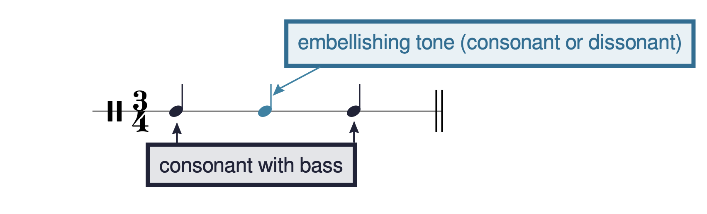

IV. 自然音和声、主音化与转调

装饰音
John Peterson
要点总结

- 装饰音（embellishing tone）可以分为三类（总结见例13）：
  仅涉及级进运动：经过音（passing tone）、邻音（neighbor tone）
  涉及跳进：倚音（appoggiatura）、逸音（escape tone）
  涉及静态音：延留音（suspension）、延展音（retardation）、持续音（pedal）、先现音（anticipation）

章节播放列表

# 概述

例1再现了玛丽亚·希曼诺夫斯卡的第6首进行曲，我们在讨论强下属和弦时也曾见过。你可能注意到第8–10小节低音声部中的一些音不符合我们的和声分析。这些在例1中用蓝色标出并圈出的音统称为"装饰音"，因为它们装饰属于和弦的音。装饰音可以分为三类，我们将在下面描述。

例1.玛丽亚·希曼诺夫斯卡，《六首进行曲》第6首中的装饰音（0:00-0:16）。

例2.
大多数装饰音的常见三音布局。

在几乎所有情况下，装饰音是一个三音手势的中间音，其中第一个和最后一个音与低音协和（例2）。装饰音本身可以与低音协和或不协和。然而在几乎所有情况下，装饰音是一个不属于底层和弦的音。

# 经过音、邻音：级进运动的装饰音

例1展示了两种级进运动的装饰音：经过音（PT）和邻音（NT）。经过音以级进进入并以同方向级进离开，上行或下行（例3）。邻音以级进进入并以反方向级进离开，产生上邻音或下邻音（例4）。

例3.二声部织体中的经过音，(a) 上行和 (b) 下行。

例4.二声部织体中的 (a) 上邻音和 (b) 下邻音。

# 倚音和逸音：涉及跳进的装饰音

例5和6展示了两种涉及跳进的装饰音：倚音（APP）和逸音（ET）。倚音以跳进进入、以反方向级进离开（例7）。倚音通常出现在比其周围音更强的节拍位置。逸音以级进进入、以反方向跳进离开（例8）。逸音通常出现在比其周围音更弱的节拍位置。倚音和逸音更常见的是向下运动离开（例7a和8a），而非向上（7b和8b）。

例5.约瑟夫·布洛涅，弦乐四重奏第4号，第一乐章，第5–9小节中的倚音（0:09-0:19）。

例6.玛格丽特·卡森，《布谷鸟》中的逸音。

例7.二声部织体中的倚音。

例8.二声部织体中的逸音。

# 延留音、先现音和持续音：涉及静态音的装饰音

例9–11展示了四种涉及静态音（即不移动的音）的装饰音中的三种：延留音（SUS）、延展音（RET）和持续音（PED）。第四种装饰音——先现音，值得在下面特别讨论。

延留音以静态音进入、以级进下行离开，而延展音以静态音进入、以级进上行离开（例9和10）。延留音和延展音总是出现在比周围音更强的节拍位置。（延留音在第四类对位章节中有更详细的讨论。）

持续音通常出现在低音声部。它们由一系列静态音组成，和弦变化发生在其上方但不包含低音。我们通常用持续音的音级数字来标记它们，如例11所示。

例9.约瑟夫·布洛涅的弦乐四重奏第4号，第一乐章，第47–49小节中的延留音和延展音（1:30–1:36）。

例10.二声部织体中的 (a) 延留音和 (b) 延展音。

例11.约瑟芬·朗（Josephine Lang）的《国王之子》（"Dem Königs-Sohn"），第16–18小节中的持续音。

与延留音、延展音和持续音一样，先现音也涉及静态音。但先现音是一个二音（而非三音）手势，其中一个和弦音作为非和弦音提前出现（例12）。换句话说，它"先现"了即将到来的和弦成员身份。

例12.约瑟芬·朗的《回忆》（"Erinnerung"），第29–30小节中的先现音（1:54–1:59）。

# 总结

例13中的表格总结了本章涵盖的装饰音。

类别 | 装饰音 | 进入方式 | 离开方式 | 方向 | 附加细节
涉及级进 | 经过音（PT） | 级进 | 级进 | 同向 | 可上行或下行
邻音（NT） | 级进 | 级进 | 反向 | 上邻音和下邻音均存在
涉及跳进 | 倚音（APP） | 跳进 | 级进 | 反向 | 倚音通常在强拍位置
逸音（ET） | 级进 | 跳进 | 反向 | 逸音通常在弱拍位置
涉及静态音 | 延留音（SUS） | 静态音 | 级进 | 下行 | 延留音总在强拍位置
延展音 | 静态音 | 级进 | 上行 | 延展音总在强拍位置
持续音（x̂Ped） | 静态音 | 静态音 | 不适用 |
先现音（ANT） | 不适用 | 静态音 | 不适用 | 先现音通常在弱拍位置

例13.装饰音总结。

作业

- 装饰音（.pdf, .mscz）。要求学生在二声部织体中书写装饰音并在片段中标记装饰音。
  练习录音

---

---

## 🎵 音频与互动示例

<iframe src="https://musescore.com/user/32728834/scores/6233992/embed" width="100%" height="240" frameborder="0" allowfullscreen allow="autoplay"></iframe>

<iframe src="https://musescore.com/user/32728834/scores/6234000/embed" width="100%" height="240" frameborder="0" allowfullscreen allow="autoplay"></iframe>

<iframe src="https://musescore.com/user/32728834/scores/6234003/embed" width="100%" height="240" frameborder="0" allowfullscreen allow="autoplay"></iframe>

<iframe src="https://musescore.com/user/32728834/scores/6234074/embed" width="100%" height="240" frameborder="0" allowfullscreen allow="autoplay"></iframe>

<iframe src="https://musescore.com/user/32728834/scores/6234078/embed" width="100%" height="240" frameborder="0" allowfullscreen allow="autoplay"></iframe>

<iframe src="https://musescore.com/user/32728834/scores/6234081/embed" width="100%" height="240" frameborder="0" allowfullscreen allow="autoplay"></iframe>

<iframe src="https://musescore.com/user/32728834/scores/6234083/embed" width="100%" height="240" frameborder="0" allowfullscreen allow="autoplay"></iframe>

<iframe src="https://musescore.com/user/32728834/scores/6234088/embed" width="100%" height="240" frameborder="0" allowfullscreen allow="autoplay"></iframe>

<iframe src="https://musescore.com/user/32728834/scores/6234093/embed" width="100%" height="240" frameborder="0" allowfullscreen allow="autoplay"></iframe>

<iframe src="https://musescore.com/user/32728834/scores/6234090/embed" width="100%" height="240" frameborder="0" allowfullscreen allow="autoplay"></iframe>

<iframe src="https://musescore.com/user/32728834/scores/23270794/embed" width="100%" height="240" frameborder="0" allowfullscreen allow="autoplay"></iframe>

📋 **章节播放列表**: <https://open.spotify.com/playlist/3EmB4b8iSoA2O9uHxlffru>

*原文: [Embellishing Tones](https://viva.pressbooks.pub/openmusictheory/chapter/embellishing-tones) | CC BY-SA*
