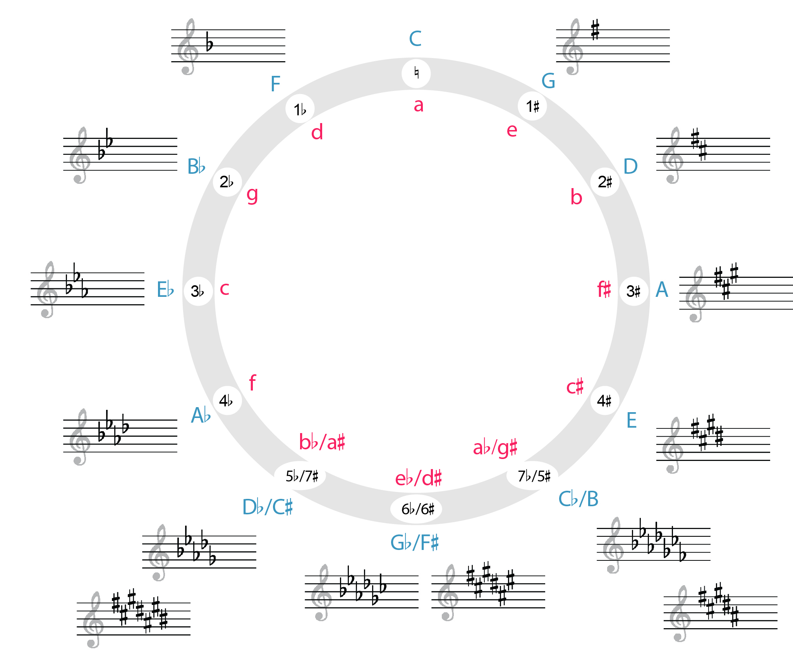
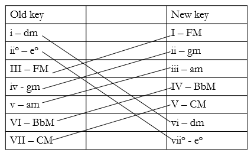

IV. 自然音和声、临时主音化与转调

扩展临时主音化与向近关系调的转调（Extended Tonicization and Modulation to Closely Related Keys） John Peterson

要点总结

- 转调（modulation）（有时称为"换调"）涉及主音的较长期变化。
- 作曲家引入新调有两种基本方式：直接的、突兀的转调（例 1）。枢轴和弦（pivot chord）转调，更为微妙（例 2）。
- 有时，作曲家会模糊临时主音化和转调之间的界限。我们将此类情况称为"扩展临时主音化"。

章节播放列表

我们已经看到，临时主音化涉及使非主和弦听起来像临时主音。在本章中，我们讨论转调，与临时主音化的临时性质相比，转调涉及主音的较长期变化。有时人们将转调称为"换调"。

# 分析转调

作曲家引入新调有两种基本方式：他们可以使换调突兀（例 1），也可以更微妙（例 2）。两条建议有助于识别转调：

- 记住终止（cadence）建立调性，所以如果你能在开始分析之前识别终止，你就会知道新调在哪里出现。
- 一段音乐中反复出现相同的变化记号是潜在转调的标志。如果你开始看到一致的变化记号，看看你是否能识别一个建立了与变化记号变化相对应的新调的终止。

## 直接转调（突兀的）

突兀的转调通常被称为"直接转调"，因为作曲家直接转到新调。这些有时也被称为"乐句转调"，因为它们倾向于出现在乐句的边界处。要在分析中识别直接转调，只需标记新调，然后像例 1 中那样继续你的和声分析。

<iframe src="https://musescore.com/user/32728834/scores/6279080/embed" width="100%" height="240" frameborder="0" allowfullscreen allow="autoplay"></iframe>

例 1. Joseph Bologne《弦乐四重奏 No. 4, I》中的直接转调，第 15–29 小节（0:27-0:56）。

## 枢轴和弦转调（微妙的）

作曲家可以使用各种技巧使转调更微妙，但其中更常见的方法之一是使用枢轴和弦（pivot chord）。枢轴和弦是同时属于原调和新调的自然音和弦。例 2 展示了我们使用一个特殊符号来分析枢轴和弦，上面的罗马数字标记该和弦在旧调中的身份，下面的罗马数字标记该和弦在新调中的身份。在例 2 的第 6 小节中，我们可以说"iv7 变成 ii7"。没有一种方法总是能找到枢轴和弦，但一种有帮助的策略是在旧调中分析直到它不再合理，然后退回一个和弦并尝试将其分析为你的枢轴和弦。如果那个和弦也不适合作为枢轴，再退回一个和弦。

<iframe src="https://musescore.com/user/32728834/scores/6279089/embed" width="100%" height="240" frameborder="0" allowfullscreen allow="autoplay"></iframe>

例 2. Josephine Lang《Der Winter》中的枢轴和弦转调，第 1–12 小节。

有时多个和弦都可以作为枢轴。在这种情况下，最好的和弦是上下罗马数字都是属前和弦的那些。这是因为 V 通常会在枢轴之后不久出现，而在枢轴和弦标记的两个位置都有属前和弦表明我们在旧调和新调中都在通往 V 的路上。你的第二好选择是在旧调中是主和弦、在新调中是属前和弦（I 变成 IV）。由于主和弦可以直接进行到 V，这里的分析仍然有功能意义。不好的枢轴和弦分析通常涉及属和弦。例如，"V 变成 I"这样的分析暗示同一个和弦同时是不稳定的（V）和非常稳定的（I），这不是我们可能听到它的方式。

## 近关系调（Closely related keys）

虽然作曲家可以转调到任何地方，但某些转调比其他转调更常见，因为两个调共享的和弦数量不同。调号在一个升降号以内的调（例如 C 大调和 G 大调）被认为是近关系调，共享许多共同和弦。要找到给定主调的所有近关系调，请执行以下操作。你可能会发现参考五度圈（circle of fifths）很有用（例 3）。

例 3.

五度圈。点击放大。

- 创建一个三列两行的网格。
- 将主调放在上排的中央。
- 在主调的调号上添加一个升号（或减去一个降号——等同于添加一个升号）并将该调列在右边。
- 在主调的调号上添加一个降号（或减去一个升号）并将该调列在左边。
- 在下排，列出上排每个调的关系大调或小调。

如果你以 F 大调为起点进行此操作，你应该得到类似例 4 的结果。注意，这些调将始终对应于主调罗马数字宇宙中的每个大三或小三和弦（所以在大调中：I、ii、iii、IV、V 和 vi；在小调中：i、III、iv、v、VI 和 VII）。这是检查你工作的好方法。

| 降方向一步 | 起始调号 | 升方向一步
起始调 | B♭ | F | C
关系调 | Gmi | Dmi | Ami

例 4. 确定 F 大调的近关系调。

虽然可以转调到任何调，但某些调比其他调常见得多：

- 在大调中：I→V 和 I→vi（例如，C→G 和 C→Am）
- 在小调中：i→III 和 i→v（例如，Cm→E♭ 和 Cm→Gm）

# 使用枢轴和弦写作转调

如果你正在写作使用枢轴和弦的转调乐句，你需要选择一个枢轴和弦，然后确定适当的进行。

## 识别潜在的枢轴

要识别两个调之间的潜在枢轴和弦（例 5）：

- 创建一个两列的表格。
- 在左侧列出旧调中的所有三和弦。
- 在右侧列出新调中的所有三和弦。
- 匹配在两列中都出现的三和弦。

记住，最好的枢轴是在两个调中都是属前和弦的那些。

例 5. 识别从 Dm 到 F 转调的枢轴。

## 选择进行

我们的耳朵往往需要时间来适应听到新调。如果你希望你的新调听起来确定地建立起来，最好不要在枢轴之后太快终止。一个好的策略是使用欺骗性运动来避免在新调中终止，然后重试并成功实现终止（例 6）。注意例 6 以标准的主音扩展进行建立主调开始。

<iframe src="https://musescore.com/user/32728834/scores/6279114/embed" width="100%" height="240" frameborder="0" allowfullscreen allow="autoplay"></iframe>

例 6. 写作一个转调乐句。

# 临时主音化与转调之比较

临时主音化和转调可以被视为基于相关片段长度和新调建立强度的光谱上的两个极点（例 7）。转调比临时主音化更长、更强。这里的"更强"是什么意思？最清晰的转调是那些通过终止建立新调，然后片段在终止之后继续在新调中的情况。较弱的转调可能只通过终止建立新调，然后直接回到主调。有时人们会以不同方式听同一段音乐：一些人的耳朵似乎比其他人更愿意接受调性变化。在你的分析中，你应该能够表达你对给定片段的听觉感受并解释你为什么这样听，你也应该能够理解为什么别人可能以不同方式听它。

例 7. 临时主音化与转调之间的光谱。

在清晰的临时主音化和转调之间是一个灰色地带，我们称之为"扩展临时主音化"。这些是像例 8 中那样的片段，比两个和弦长（比，例如，$\mathrm{V^6_5/V}$ 到 V 长），但没有长到导致一个建立真正转调的终止。在这种情况下，我们临时在一个新调中分析，通过将新调的罗马数字放在涵盖整个扩展临时主音化的括号下方来表示。例 8 在 E♭ 大调中开始，然后临时主音化 F 小调，所以我们将罗马数字 ii 放在括号下方。在例 8 的情况下，扩展临时主音化还帮助我们从 E♭ 大调过渡到 C 小调——换句话说，扩展临时主音化本身充当了枢轴区域。

通常，分析者在以下两种情况之一发生时意识到扩展临时主音化正在发生：

- 分析者意识到他们在短时间内反复写着 x/ii、y/ii、z/ii。
- 罗马数字在主调中不再有功能意义，但即将到来的终止仍在主调中。

<iframe src="https://musescore.com/user/32728834/scores/6279128/embed" width="100%" height="240" frameborder="0" allowfullscreen allow="autoplay"></iframe>

例 8. Joseph Bologne《弦乐四重奏 Op. 4, II》中的扩展临时主音化（0:25-0:39）。

练习

- 扩展临时主音化与向近关系调的转调（.pdf, .docx）。要求学生回顾临时主音化、识别近关系调和枢轴和弦、进行分析，并创建一个转调进行。

---

*原文: [Extended Tonicization and Modulation to Closely Related Keys](https://viva.pressbooks.pub/openmusictheory/chapter/extended-tonicization-and-modulation-to-closely-related-keys) | CC BY-SA*
