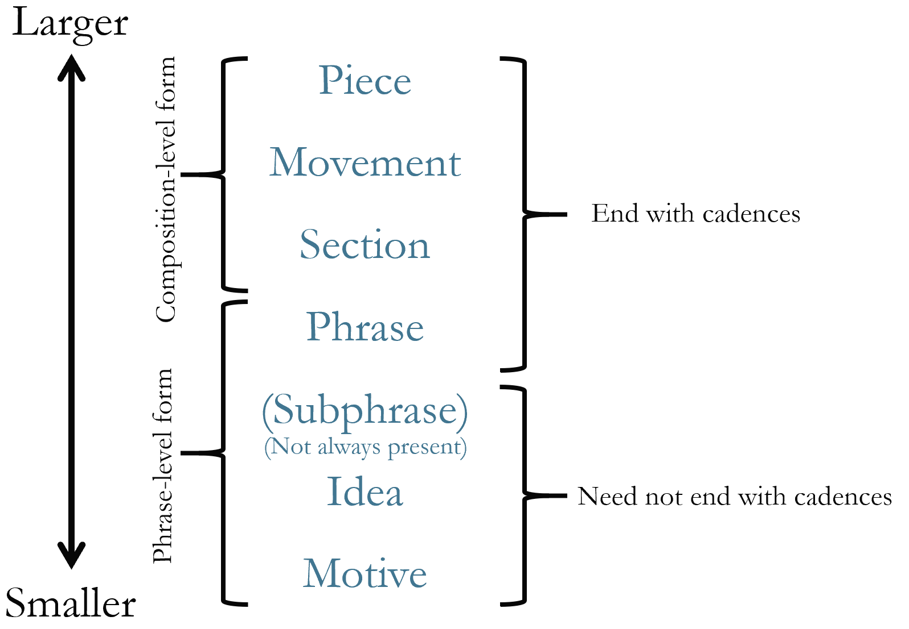
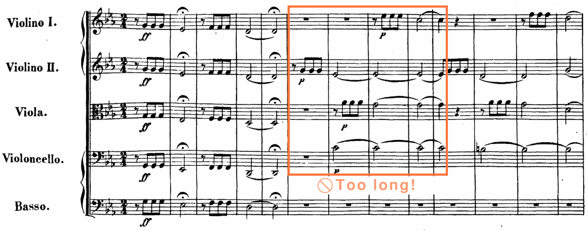

III. 曲式

乐句级曲式的基础概念 John Peterson

要点总结

本章描述了音乐曲式的层次结构、动机（motives）和分节分析（segmentation analysis）。

- 音乐曲式（musical form）可以被理解为一个分组单元的层次结构。
- 这些分组中最小的是动机（motive），它是一个定期出现的音乐单元，通常小于一个乐思（idea）。在分析中，我们圈出并标记在整部作品中重复出现和变形的动机。避免将大型旋律或旋律片段识别为动机——动机是短小的！
- 分节分析（segmentation analysis）是一种展示一段或整首作品分组单元的方法。进行分节分析时，我们首先识别乐句的结束，这些通常由终止（cadence）标记。然后，我们使用乐谱上方的方括号将乐句（phrases）划分为更小的单元，以展示乐思层级。

章节播放列表

# 层次结构

例 1. 古典音乐中曲式的层次结构。

理解音乐曲式的一种方式是将其视为一个分组单元的层次结构。例 1 展示了一首作品包含乐章（movements），乐章包含段落（sections），段落包含主题（themes），主题包含乐句（phrases），依此类推。

虽然例 1 中的图表看起来相当简单，但各层级之间的关系在实际中更为复杂。例如，有时两个层级被合并为一个：一个单独的乐句可能构成作品的一个完整段落，因此区分每个层级并不总是有意义的。最好将例 1 视为一个指南，而非严格定义曲式层级的东西。

本章及其后的三章都聚焦于乐句级曲式（phrase-level form），即乐句可以由动机、乐思以及有时乐节（subphrases）（将在后续章节中讨论）构成的各种方式。

# 动机

一个动机（motive）就像旋律的一个小片段。它是一个定期出现的音乐单元，通常小于一个乐思（本章下一部分的重点）。例 2–4 中的每个视频讨论了不同作品中的一个动机。它们都包含相同的基本信息，所以你可以选择看最感兴趣的那一个，或者三个都看。

例 2. 动机分析：John Williams《Journey to the Island》（1:20–1:46）和《侏罗纪公园》主题（0:48–1:06）。

<iframe src="https://www.youtube.com/embed/SHEcqFSA0Ds" width="560" height="315" frameborder="0" allowfullscreen></iframe>

例 3. 动机分析：Ludwig van Beethoven《第五交响曲》I（0:00–0:27）。

<iframe src="https://www.youtube.com/embed/1CDeaj_c16Y" width="560" height="315" frameborder="0" allowfullscreen></iframe>

例 4. 动机分析：Lin-Manuel Miranda《Hamilton》中的"Aaron Burr, Sir"（0:12–0:16）。

<iframe src="https://www.youtube.com/embed/n6vaYX4Rr-I" width="560" height="315" frameborder="0" allowfullscreen></iframe>

虽然动机不一定需要重复，但那些确实重复的通常是最有趣的讨论对象，因此我们倾向于关注在整个片段中反复出现的动机。

有许多种类的动机（例如，节奏动机、音高动机、轮廓动机、音色动机），但"动机"一词本身通常指基于音高的动机。一个主要通过其节奏设计来识别的动机会被称为"节奏动机"。

当一个动机在整部作品中反复出现时，它往往会变化。一些常见的变形包括：

- 扩大（Enlargement）：使动机的时值比原来更长
- 缩小（Contraction）：使动机的时值比原来更短
- 倒影（Inversion）：改变动机的方向（例如，上行变为下行）
- 移位（Displacement）：改变动机相对于原始陈述的节拍位置
- 逆行（Retrograde）：与原始陈述相比倒序陈述动机
- 音程操作（Intervallic manipulation）：改变构成动机的音程大小（例如，小二度变为大二度）
- 装饰（Embellishment）：在动机的基本轮廓上添加装饰音

当人们最初被要求在一部作品中识别动机时，他们往往会选择太大的内容，比如整个主题。例 5 展示了 Ludwig van Beethoven 第五交响曲开头动机分析中的一个常见错误：将过长的片段识别为动机。更有用的方法请参见例 3 中的视频。

例 5.

. 框起来的小节表示太长而不能被视为动机的内容。

练习 1：动机分析

这个练习将引导你对 John Williams《Duel of the Fates》的开头进行动机分析。首先，听开头（0:15–0:26），然后开始测验。

# 乐思层级、乐句与分节分析

一个乐句（phrase）是一个相对完整的思想，表现出朝向目标的轨迹，到达一种结束感。虽然乐句将在下一章中更详细地考察，但这里有两个要点：

- "相对完整"意味着乐句有开始、中间和结束的感觉。
- 在许多调性音乐中，结束最常由终止（cadence）来表示（尽管其他实现结束的方式将在下一章中考察）。在演奏中，知道乐句以结束收尾可以帮助我们塑造朝向目标的片段。[1]

当我们分析一个乐句时，我们通常从分节分析（segmentation analysis）开始，它使用乐谱上方的方括号来识别乐句的组成部分。

分节分析的最小层级称为乐思层级（idea level）。（如果需要，请参见例 1 回顾乐思层级在曲式层次结构中的位置。）乐思是包含作品动机材料的短小分组单元。它们通常有两小节长，但也可能更长或更短。乐思可以组合在一起形成乐节或乐句，这将在下一章中更详细地讨论。

要进行分节分析，请执行以下操作：

- 识别潜在的结束点。考虑乐句需要有开始、中间和结束的感觉，因此要注意你不要过于细碎地确定乐句在哪里结束。在调性音乐中，终止通常告诉我们乐句的结束在哪里。
- 将每个乐句划分为更小的单元。（要识别这些单元，考虑：如果你要指导某人准备这个乐句，你会如何划分它以便他们可以分成更小的部分来练习？）
- 使用乐谱上方的方括号指示那些小单元。
- 验证并标记任何存在的终止。

例 6 和 7 中的视频各自演示了一次分节分析。它们包含类似的解释，所以你可以两个都看或选择最感兴趣的那一个。

例 6. Donizetti《Me voglio fà 'na casa》的分节分析（0:00–0:43）。

<iframe src="https://www.youtube.com/embed/_LuV3GKx5So" width="560" height="315" frameborder="0" allowfullscreen></iframe>

例 7. Clara Schumann《钢琴三重奏 Op. 17, I》的分节分析（0:00–0:32）。

<iframe src="https://www.youtube.com/embed/GOJuGtNGxfo" width="560" height="315" frameborder="0" allowfullscreen></iframe>

练习

- 乐句级曲式的基础概念（.pdf, .docx）。要求学生对三个片段进行动机分析：John Williams《哈利·波特》中的"Hedwig's Theme"；Omar Thomas《A Mother of a Revolution!》；以及 Maria Szymanowska《56 Dances of Different Genres, Polonaise in E minor, Trio》第 1–8 小节。

练习播放列表

- 有时人们会混淆"乐句"和"分句"这两个术语。通常当人们说"分句"时，他们指的是一个片段可能被塑造的方式（在哪里推动和拉伸时间，在哪里以及如何改变力度层次等），他们可能指也可能不指一个实际的乐句（以终止结束的完整思想）。↵

---

*原文: [Foundational Concepts for Phrase-Level Forms](https://viva.pressbooks.pub/openmusictheory/chapter/foundational-concepts) | CC BY-SA*
