I. 基础知识

音符、谱号与加线的记谱
Chelsey Hamm
要点

- 音符（note）同时表示 pitch（音高）和 rhythm（节奏）。
- 音符书写在 staff（五线谱）上。频率较高（波长较短）的音符写在谱上较高的位置，频率较低（波长较长）的音符写在谱上较低的位置。即较高的音符位于较低音符的上方。
- notehead（符头）必须仔细地画在五线谱上。符头是椭圆形的（不是圆形的）；此外，它不应太大或太小，并且略微向右上方倾斜。
- 音符的 stem（符干）可以朝上（在音符右侧）或朝下（在音符左侧）。对于中间线以上的音符，符干朝下；对于中间线以下的音符，符干朝上。中间线上的音符可以朝任一方向，取决于周围的音符。
- 书写二度音程时，总是需要将一个音符向左或向右偏移一个符干的距离。无论符干朝上还是朝下，较低的音符总是在左边。
- clef（谱号）标明五线谱的线和间分别对应哪些音高。
- 叫做 ledger lines（加线）的额外短线可以将五线谱向上或向下延伸。

西方音乐记谱法关注两个音乐特征：pitch（音高）和 rhythm（节奏）。音高以垂直方向记谱（y 轴），节奏以水平方向记谱（x 轴）。西方音乐记谱法从左到右、从上到下阅读，就像英文书籍的页面一样。

# 音符的记谱

音符同时表示音高和节奏。每个书写音符由一个 notehead（符头，空心或实心）组成，也可以有 stem（符干）和 beam（符尾）或 flag（符尾旗）（参见《节奏记谱》）。例 1 展示了符头、符干、连梁和符尾旗的图示：

例 1.
符头、符干、连梁和符尾旗。

# 五线谱记谱

staff（五线谱）对于传达音高至关重要。五线谱由五条等距的水平线组成，每个音符放置在与其音高对应的线或间上（参见下文《谱号》）。例 2 描绘了一个五线谱：

[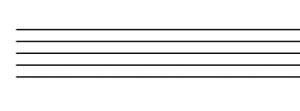](https://viva.pressbooks.pub/app/uploads/sites/12/2019/05/Staff-300x111.png)
例 2.
一个五线谱。

# 将音符放在五线谱上

线上的符头应填满其上下各半个间。间中的符头应刚好接触到上下方的线。例 3 展示了正确的符头示例，包括空心和实心，以及在线上和在间中的情况：

[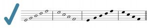](https://viva.pressbooks.pub/app/uploads/sites/12/2022/07/Correct-Noteheads-300x58.jpg)
例 3.
正确的符头，空心（白色）和实心（黑色），在线上和间中。

符头应为椭圆形（不是圆形），并略微向右上方倾斜。例 4 展示了不正确的符头。[1] 如图所示，符头可能画得太小、太大或形状不对。

[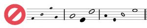](https://viva.pressbooks.pub/app/uploads/sites/12/2019/05/Incorrect-Noteheads-300x58.jpeg)
例 4.
不正确的符头示例。

# 符干和连梁

音符的符干可以朝上（在音符右侧）或朝下（在音符左侧）。对于中间线以上的音符，符干朝下；对于中间线以下的音符，符干朝上。中间线上的音符可以朝任一方向，取决于周围的音符。如例 5 所示：

[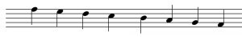](https://viva.pressbooks.pub/app/uploads/sites/12/2022/07/Stemming-Directions-300x46.jpg)
例 5.
正确的符干方向。

符干方向和连梁规范在《简单拍子与拍号》和《复合拍子与拍号》中有更多讨论。手绘符干时，其长度等于五线谱的四条线距。连梁的粗细大约是符干的四倍。

您可以通过以下练习中的拖放操作来练习符干方向：

练习

# 绘制二度音程

当二度音程（参见《键盘与大谱表》中的《一般音程》部分）以和声方式出现时，它们位于五线谱相邻的线和间上，因此需要将一个音符向左或向右偏移一个符干的距离。无论符干朝上还是朝下，较低的音符总是在左边。例 6 展示了绘制二度音程的正确方法：

[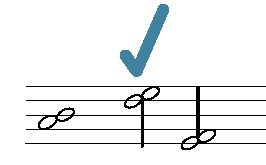](https://viva.pressbooks.pub/app/uploads/sites/12/2022/07/Correct-Seconds-1-e1657554954232.jpg)
例 6.
三个正确的二度音程。

二度音程不应上下叠放，较低的音符也不应在右边，如例 7 所示：

例 7.
三个不正确的二度音程。

七和弦中二度音程的绘制在《七和弦》中有讨论。

# 谱号

五线谱的线和间上的音符代表音高。音乐家使用空间隐喻来描述五线谱上的音符：位于五线谱上方的音符被称为"较高"，位于下方的被称为"较低"。较高的音高由波长较短（因此频率较高）的声波产生；波长较长（频率较低）的声波产生较低的音高。

为了让音符传达超出"较高"和"较低"的音高信息，它们所在的五线谱必须包含一个谱号。谱号标明五线谱的线和间分别对应哪些音高（另见《识读谱号》）。当今最常用的两种谱号是 treble clef（高音谱号）和 bass clef（低音谱号）。您可能遇到的另外两种谱号是 alto clef（中音谱号）和 tenor clef（次中音谱号）。例 8 展示了相同的音高分别放在高音、低音、中音和次中音谱号之后：

[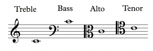](https://viva.pressbooks.pub/app/uploads/sites/12/2019/05/clefs-300x100.png)
例 8.
同一音高分别放在高音、低音、中音和次中音谱号之后。

较高的音符，如长笛演奏或女高音演唱的音符，通常用高音谱号记谱；较低的音符，如长号演奏或男低音演唱的音符，通常用低音谱号记谱。中音和次中音谱号相比高音和低音谱号较为少见。但在某些情况下，中音谱号用于中高音区，次中音谱号用于中低音区。

# 绘制谱号

绘制高音谱号可以用三个简单步骤完成，如例 9 所示：[2]

[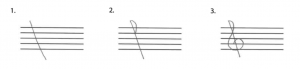](https://viva.pressbooks.pub/app/uploads/sites/12/2019/11/DrawTrebleClef-300x69.png)
例 9.
分三步绘制高音谱号。

- 画一条倾斜的垂直线，略微延伸到五线谱的上方和下方。
- 画一个半圆，使其在从上数第二条线处与倾斜线相交。
- 围绕从下数第二条线画圆。尽量将圆保持在下方两个间内。

同样，低音谱号也可以用三步绘制，如例 10 所示：

[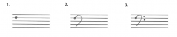](https://viva.pressbooks.pub/app/uploads/sites/12/2019/11/DrawBassClef-300x63.png)
例 10.
分三步绘制低音谱号。

- 在从上数第二条线上画一个点。
- 画一个反向的 C，使其结束在五线谱的最下方间中，确保 C 的上部不超过五线谱。
- 在反向 C 的右边放置两个点，分别位于五线谱上方两个间的中心位置。

如例 11 所示，中音谱号可以用四步绘制：

[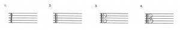](https://viva.pressbooks.pub/app/uploads/sites/12/2019/11/DrawAltoClef-300x51.png)
例 11.
分四步绘制中音谱号。

- 画一条贯穿五线谱的粗垂直线。
- 在旁边画一条较细的垂直线。
- 画两个反向的 C，第一个占据五线谱上半部略少的空间，第二个占据五线谱下半部略少的空间。
- 用一个位于五线谱中间线上的点将这两个反向 C 连接起来。

如例 12 所见，次中音谱号的绘制方式与中音谱号相同，只是在五线谱上向上移了一条线。第 1 步和第 2 步中的垂直线从从下数第二条线开始，略微延伸到五线谱上方。第一个反向 C 略微延伸到五线谱上半部以上，第二个占据五线谱中间两个间略少的空间。连接它们的点位于从上数第二条线上。

[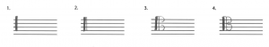](https://viva.pressbooks.pub/app/uploads/sites/12/2019/11/DrawTenorClef-300x53.png)
例 12.
分四步绘制次中音谱号。

有时音乐家绘制中音或次中音谱号时，会用字母"K"作为一种速记方式。例 13 展示了这一点：

[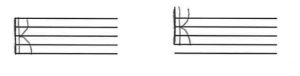](https://viva.pressbooks.pub/app/uploads/sites/12/2022/07/K-Clefs-300x76.jpg)
例 13.
使用字母"K"绘制中音和次中音谱号。

# 书写加线

当音符太高或太低而无法写在五线谱上时，会画出叫做加线的小线来延伸五线谱。例 14 展示了五线谱上方和下方的加线：

[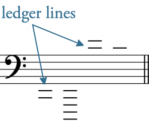](https://viva.pressbooks.pub/app/uploads/sites/12/2019/05/ledger-lines-for-chelsey_0006-300x248.png)
例 14.
带低音谱号的五线谱上方和下方的加线。

例 15 展示了画在加线上的音符（带符干和连梁），位于五线谱的上方和下方。

[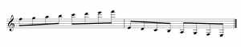](https://viva.pressbooks.pub/app/uploads/sites/12/2019/05/LedgerLineswithNotes-300x59.png)
例 15.
带高音谱号的五线谱上方和下方加线上的音符（带符干和连梁）。

书写加线时，确保不要在您正在书写的音符上方或下方放入多余的加线。例 16 首先展示了在加线上书写音符的正确方式，然后是不正确的方式，音符上下有多余的加线：[3]

[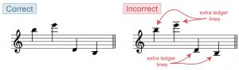](https://viva.pressbooks.pub/app/uploads/sites/12/2019/12/ch2-ex13-ledger_lines-300x89.jpg)
例 16.
正确和不正确的加线记谱。

延伸阅读

- 2001. "Ledger line." Grove Music Online. https://doi.org/10.1093/gmo/9781561592630.article.16296.
- Gerou, Tom and Linda Lusk. 1996. Essential Dictionary of Music Notation. Los Angeles: Alfred.
- Gould, Elaine. 2011. Behind Bars: the Definitive Guide to Music Notation. London: Faber Music.
- Hiley, David. 2001. "Clef (i)." Grove Music Online. https://doi.org/10.1093/gmo/9781561592630.article.05927.
- ——. 2001. "Staff." Grove Music Online. https://doi.org/10.1093/gmo/9781561592630.article.26519.
- McGrain, Mark. 1986. Music Notation. Boston: Berklee Press.
- Roemer, Clinton. 1985. The Art of Music Copying: The Preparation of Music for Performance, 2nd edition. Sherman Oaks: Roerick Music Company.
- Straus, Joseph. 2022. Elements of Music. New York: Oxford.

在线资源

- Pitch and Frequency (the Physics of Sound) (physicsclassroom.com)
- The Music Staff (essential-music-theory.com)
- Drawing Notes (YouTube)
- Clefs (Music Notes Now)
- Drawing Treble and Bass Clefs (YouTube)
- Drawing C Clefs (Ultimate Music Theory)
- The Staff, Clefs, and Ledger Lines (musictheory.net)
- Music Notation Style Guide (Indiana University)

互联网作业

- 五线谱（.pdf）
- 在线和间上绘制符头，高低音（.pdf）

作业

- 书写符头、谱号和加线（含 C 谱号）（.pdf, .docx）。要求学生练习手写音乐记谱元素。
- 书写符头、谱号和加线（仅高音和低音谱号）（.pdf, .docx）。要求学生练习手写音乐记谱元素。

---

---

## 🎵 音频与互动示例

**互动练习**（需网络，原站加载）:

- Stem Direction Matching

*原文: [音符、谱号与加线的记谱](https://viva.pressbooks.pub/openmusictheory/chapter/notation-of-notes-clefs-and-ledger-lines) | CC BY-SA*
