I. 基础知识

识读谱号
Chelsey Hamm
要点

- 在西方音乐记谱法中，pitch（音高）由字母 A、B、C、D、E、F 和 G 指定，循环重复。
- 不同的 clef（谱号）使不同音域的读谱更加容易。
- 每个谱号标明五线谱的线和间如何对应音高。

在西方音乐记谱法中，音高由拉丁字母表的前七个字母指定：A、B、C、D、E、F 和 G。在 G 之后，这些字母名循环重复：A、B、C、D、E、F、G、A、B、C、D、E、F、G、A、B、C 等。这种字母名的循环存在是因为当今的音乐家和音乐理论家接受了所谓的 octave equivalence（八度等价），即假设相隔一个 octave（八度）的音高应具有相同的字母名。关于这一概念的更多信息可以在下一章《键盘与大谱表》中找到。

这一假设因 milieu（环境）而异。例如，一些古希腊音乐理论家不接受八度等价。这些理论家使用超过七个希腊字母来命名音高。[1]

# 谱号与音域

《音符、谱号与加线的记谱》一章介绍了四种谱号：treble clef（高音谱号）、bass clef（低音谱号）、alto clef（中音谱号）和 tenor clef（次中音谱号）。谱号标明五线谱的线和间分别对应哪些音高。在下一章《键盘与大谱表》中，我们将看到拥有多种谱号使得不同音域的读谱更加容易。高音谱号通常用于较高的声部和乐器，如长笛、小提琴、小号或女高音声部。低音谱号通常用于较低的声部和乐器，如大提琴、大管、长号或男低音声部。中音谱号主要用于中提琴，这是一种中音乐器；次中音谱号有时用于大提琴、大管和长号的乐谱中（尽管这些乐器使用的主要谱号是低音谱号）。

每个谱号标明五线谱的线和间如何对应音高。记忆每个谱号的模式将帮助您识读为不同声部和乐器编写的音乐。

# 识读高音谱号

高音谱号是当今最常用的谱号之一。例 1 展示了使用高音谱号时五线谱各线的字母名。一个可能帮助您记住字母顺序的 mnemonic device（记忆辅助法）是"Every Good Bird Does Fly"（E、G、B、D、F）。如例 1 所见，高音谱号围绕 G 线（从下数第二条线）旋转。因此，它有时被称为"G 谱号"。

[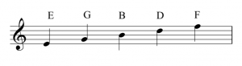](https://viva.pressbooks.pub/app/uploads/sites/12/2019/05/Screen-Shot-2019-05-29-at-10.28.19-AM-300x82.png)
例 1.
高音谱号各线的字母名。

例 2 展示了使用高音谱号时五线谱各间的字母名。记住这些字母名拼出单词"face"可能使识别这些间更加容易。

[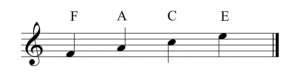](https://viva.pressbooks.pub/app/uploads/sites/12/2019/05/Screen-Shot-2019-05-29-at-10.28.23-AM-300x83.png)
例 2.
高音谱号各间的字母名。

例 3 展示了一个 octave treble clef（八度高音谱号）。注意谱号底部的小"8"：

例 3.
底部有"8"的八度高音谱号。

底部有"8"的八度高音谱号表示音符应比记谱低一个八度来演唱或演奏。男高音声部、吉他手和贝斯手的音乐经常使用八度高音谱号。double treble clef（双高音谱号）也表示音符应比记谱低一个八度来演唱或演奏，但它远不那么常见。例 4 展示了双高音谱号：

例 4.
双高音谱号。

有时短笛或长笛的音乐会使用顶部有"8"的八度高音谱号。这表示音符应比记谱高一个八度来演奏。例 5 展示了这种谱号：

例 5.
顶部有"8"的八度高音谱号。

然而，短笛音乐总是假设比记谱高一个八度发声，无论使用的是普通高音谱号还是八度高音谱号。

# 识读低音谱号

当今另一个最常用的谱号是 bass clef（低音谱号）。例 6 展示了使用低音谱号时五线谱各线的字母名。一个记忆辅助法是"Good Bikes Don't Fall Apart"（G、B、D、F、A）。低音谱号有时被称为"F 谱号"；如例 6 所见，低音谱号的点从 F 线（从上数第二条线）开始。

[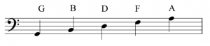](https://viva.pressbooks.pub/app/uploads/sites/12/2019/05/Screen-Shot-2019-05-29-at-11.00.29-AM-300x66.png)
例 6.
低音谱号各线的字母名。

例 7 展示了使用低音谱号时五线谱各间的字母名。记忆辅助法"All Cows Eat Grass"（A、C、E、G）可能使识别这些间更加容易。

[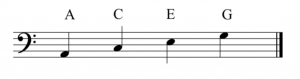](https://viva.pressbooks.pub/app/uploads/sites/12/2019/05/Screen-Shot-2019-05-29-at-11.00.34-AM-300x79.png)
例 7.
低音谱号各间的字母名。

# 识读中音谱号

例 8 展示了使用 alto clef（中音谱号）时五线谱各线的字母名，中音谱号在当今使用较少。记忆辅助法"Fat Alley Cats Eat Garbage"（F、A、C、E、G）可能帮助您记住字母顺序。如例 8 所见，中音谱号的中心凹入围绕 C 线（中间线）。因此它有时被称为"C 谱号"。

[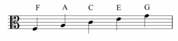](https://viva.pressbooks.pub/app/uploads/sites/12/2019/05/Screen-Shot-2019-05-29-at-11.10.40-AM-300x69.png)
例 8.
中音谱号各线的字母名。

例 9 展示了使用中音谱号时五线谱各间的字母名，可用记忆辅助法"Grand Boats Drift Flamboyantly"（G、B、D、F）来记忆。

[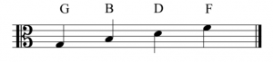](https://viva.pressbooks.pub/app/uploads/sites/12/2019/05/Screen-Shot-2019-05-29-at-11.10.45-AM-300x69.png)
例 9.
中音谱号各间的字母名。

# 识读次中音谱号

tenor clef（次中音谱号）是另一种使用较少的谱号，有时也被称为"C 谱号"，但其中心凹入围绕从上数第二条线。例 10 展示了使用次中音谱号时五线谱各线的字母名，可用记忆辅助法"Dodges, Fords, and Chevrolets Everywhere"（D、F、A、C、E）来记忆：

[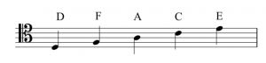](https://viva.pressbooks.pub/app/uploads/sites/12/2019/05/Screen-Shot-2019-05-29-at-11.27.17-AM-300x72.png)
例 10.
次中音谱号各线的字母名。

例 11 展示了使用次中音谱号时五线谱各间的字母名。记忆辅助法"Elvis's Guitar Broke Down"（E、G、B、D）可能使识别这些间更加容易。

[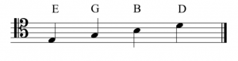](https://viva.pressbooks.pub/app/uploads/sites/12/2019/05/Screen-Shot-2019-05-29-at-11.27.22-AM-300x78.png)
例 11.
次中音谱号各间的字母名。

您可以通过以下练习来练习识别谱号：

练习

# 其他 C 谱号

soprano clef（女高音谱号）、mezzo-soprano clef（次女高音谱号）和 baritone clef（上低音谱号）也是 C 谱号。这些谱号在当今使用频率要低得多，但在文艺复兴时期（1400-1600）很常见（有关风格时期的更多信息，参见《记谱的其他方面》）。这些谱号的中心凹入围绕 C 线。例 12 展示了使用每种谱号时五线谱各线的字母名：

[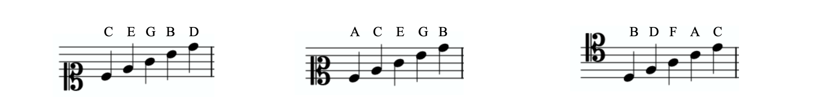](https://viva.pressbooks.pub/app/uploads/sites/12/2025/06/Soprano-Mezzo-Soprano-Baritone-Clef-Line-Letters-scaled-e1749827413950.png)
例 12.
女高音、次女高音和上低音谱号各线的字母名。

# 加线

当音符太高或太低而无法写在五线谱上时，会画出小线来延伸五线谱。您可能从前一章回忆起这些额外的线叫做加线。加线可以用于带有任何谱号的五线谱延伸。例 13 展示了高音谱号五线谱上方的加线：

[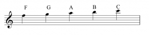](https://viva.pressbooks.pub/app/uploads/sites/12/2019/05/Screen-Shot-2019-05-29-at-12.05.34-PM-300x71.png)
例 13.
高音谱号五线谱向上延伸的加线。

注意五线谱上方的每个间和线都会在加线上获得字母名，就好像五线谱只是继续向上延伸一样。五线谱下方的加线也是如此，如例 14 所示：

[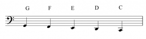](https://viva.pressbooks.pub/app/uploads/sites/12/2019/05/Screen-Shot-2019-05-29-at-12.14.51-PM-300x81.png)
例 14.
低音谱号五线谱向下延伸的加线。

注意五线谱下方的每个间和线都会在加线上获得字母名，就好像五线谱只是继续向下延伸一样。

# 中性谱号

neutral clef（中性谱号）有时被称为"percussion clef（打击乐谱号）"，因为它通常用于音高不定的打击乐器。例 15 展示了五线谱上的中性谱号：

例 15.
五线谱上的中性谱号。

在打击乐谱号中，五线谱的线和间不代表字母名，而是可能代表不同的乐器。中性谱号有时用于单线五线谱，如例 16 所见：

例 16.
单线五线谱上的中性谱号。

延伸阅读

- Gerou, Tom and Linda Lusk. 1996. Essential Dictionary of Music Notation. Los Angeles: Alfred.
- Gould, Elaine. 2011. Behind Bars: the Definitive Guide to Music Notation. London: Faber Music.
- Hiley, David. 2001. "Clef (i)." Grove Music Online. https://doi.org/10.1093/gmo/9781561592630.article.05927.
- Mathiesen, Thomas J. 2014. "Greek Music Theory." In The Cambridge History of Western Music Theory, ed. Thomas Christensen. New York: Cambridge University Press.
- McGrain, Mark. 1986. Music Notation. Boston: Berklee Press.
- Roemer, Clinton. 1985. The Art of Music Copying: The Preparation of Music for Performance, 2nd edition. Sherman Oaks: Roerick Music Company.

在线资源

- The Staff, Clefs, and Ledger Lines (musictheory.net)
- Timed Game: Flashcards for Treble, Bass, Alto, and Tenor Clefs (Richman Music School)
- Printable Treble Clef Flash Cards (Samuel Stokes Music)(pages 3 to 5)
- Printable Bass Clef Flash Cards (Samuel Stokes Music)(pages 1 to 3)
- Printable Alto Clef Flash Cards (Samuel Stokes Music)
- Printable Tenor Clef Flash Cards (Samuel Stokes Music)
- Paced Game: Treble Clef (Tone Savvy)
- Paced Game: Bass Clef (Tone Savvy)
- Paced Game: Alto Clef (Tone Savvy)
- Paced Game: Tenor Clef (Tone Savvy)

互联网作业

### 初级

- 高音和低音谱号（.pdf）
- 高音谱号（.pdf）
- 低音谱号（.pdf）
- 中音谱号（.pdf）
- 次中音谱号（.pdf）

### 进阶

- 仅高音谱号（.pdf）
- 带加线的高音谱号（.pdf）
- 低音谱号练习（.pdf）
- 带加线的低音谱号（.pdf）
- 混合高音和低音谱号（.pdf）
- 中音谱号练习（.pdf）
- 次中音谱号练习（.pdf）

作业

- 书写和识别音符作业 #1（.pdf, .mscz）。要求学生在高音、低音、中音和次中音谱号中书写和识别音符，带和不带加线。
- 书写和识别音符作业 #2（.pdf, .mscz）。要求学生在高音、低音、中音和次中音谱号中书写和识别音符，带和不带加线。
- 音高记谱（.pdf, .mscz）。要求学生仅在高音和低音谱号中书写和识别音符，带和不带加线。

---
*原文: [识读谱号](https://viva.pressbooks.pub/openmusictheory/chapter/clefs) | CC BY-SA*
