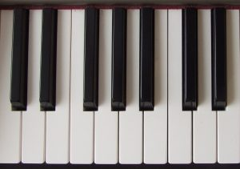
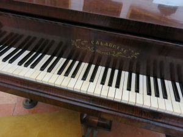
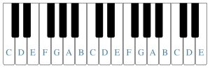
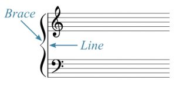
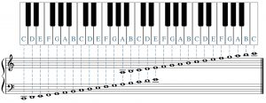
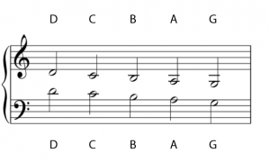
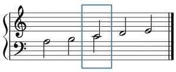
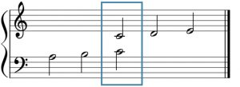
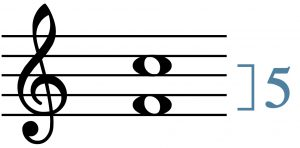

I. 基础

键盘与大谱表
Chelsey Hamm
要点

- 弹奏钢琴将帮助你进行音乐理论学习，使你能够通过身体运动（kinesthetic）方式与音乐互动。
- 钢琴键盘上黑键以两组和三组交替的模式在七个八度中重复出现。
- 白键C位于两组黑键的正左侧，白键F位于三组黑键的正左侧。
- 钢琴演奏者（也称为钢琴家）在大谱表（grand staff）上阅读乐谱。
- 中央C（middle C）是出现在大谱表两行谱表之间连线上方的音符。
- 在钢琴键盘上计算音程时，始终将第一个音符计为"一"。

许多学生发现，当他们以身体运动方式参与音乐学习时，音乐理论会变得更容易。换句话说，通过演奏乐器（如钢琴）来实际发声，有助于你更好地在脑中视觉化和听觉化（audiate）你正在书写或研究的音乐。这使学生能够更快地理解和"感受"不同音高之间的关系。

# 钢琴键盘

学习在钢琴上弹奏音符是以身体运动方式参与音乐的一种简便方法。你可以在学校找到钢琴键盘（原声或电子）的使用权。如果你愿意，也可以购买一架价格适中的电子键盘。另一种选择是下载免费的钢琴应用，在手机上弹奏，例如Tiny Piano。

在例1中，注意键盘既有白键也有黑键。黑键被分为三组或两组。在例2中，注意三组和两组黑键在整个钢琴键盘长度上交替出现，在每个八度（octave）中重复该模式。

例1.
钢琴键盘的一小部分。

例2.
钢琴键盘的较大部分。

# 弹奏钢琴

当你坐在钢琴前时，重要的是坐直身体，保持头部在肩膀正上方，肩膀应自然下沉放松。你的肘部应与身体保持舒适的距离，手指应保持弯曲（就像从书架上抽出一本书一样）。保持膝盖和手腕灵活（不要僵硬），双脚平放在地面上，除非你正在使用踏板。

例3解释了如何在钢琴前保持正确的姿势。

例3. Benjamin Corbin博士（克里斯托弗纽波特大学）演示正确的钢琴姿势。

# 八度等价与钢琴键盘上的白键字母名称

例4展示了标有白键音高字母名称的钢琴键盘。相同的字母名称出现在键盘的不同琴键上。如前一章所述，西方音乐记谱中的音高由字母A、B、C、D、E、F和G指定，循环重复。由于西方体系中的八度等价（octave equivalence）原则，相隔一个八度的音高具有相同的字母名称。

例4.
白键音高的字母名称已标注。

在钢琴键盘上，当黑键以两组形式出现时，它们正左侧的音符是C。当黑键以三组形式出现时，它们正左侧的音符是F。

你可以在以下练习中练习识别钢琴键盘上的白键音符：

练习

# 大谱表

钢琴音乐通常以大谱表（grand staff）上的高音谱号和低音谱号书写，如例5所示。制作大谱表时，将带高音谱号的谱表置于带低音谱号的谱表上方。两行谱表在左侧用一条线和一个花括号连接。通常，钢琴家用左手弹奏较低的音符（低音谱号中的），用右手弹奏较高的音符（高音谱号中的）。

例5.
大谱表通过一条线和一个花括号连接。

例6展示了标有字母名称的大谱表上的线和间。如你所见，高音谱号和低音谱号的线和间的字母名称与前一章（阅读谱号）中讨论的内容一致。

例6.
标有音高名称的大谱表上的线和间。

让我们仔细看一下可能出现在高音谱表下方和低音谱表上方的加线音符。例7展示了其中一些音符，用字母名称标注。每一对垂直排列的音符是相同的音高，即使它们分别在两种不同的谱号中记谱。（符干朝上的音符属于高音谱表，符干朝下的音符属于低音谱表。）

例7.
高音谱表下方和低音谱表上方的音高，用字母名称标注。

例8展示了例7的谱表垂直压缩后的效果——如果高音谱号和低音谱号的谱表之间没有那么多空间，这些音符会如何呈现。例8中的字母名称与例7中的相同。

例8. 例7的谱表已垂直压缩，两个音符合并为一个（带有两个符干）。

例9展示了垂直压缩的大谱表，其中C音被方框标注。这个被框住的C被称为中央C（middle C），之所以如此命名，是因为在例9所示的垂直压缩大谱表中，它出现在高音谱号和低音谱号谱表的中间位置。此外，中央C在钢琴键盘上大约位于中间位置的音符，通常在品牌名称的下方。

例9.
在垂直压缩的大谱表中，C音被方框标注。

例10展示了例9垂直扩展到正常间距后的效果，中央C仍被方框标注。虽然它现在同时出现在高音谱号和低音谱号的谱表中，但这个音符仍然发出相同的音高。

例10.
垂直扩展的例9。

# 音程数（音程大小）

在音乐理论中，你经常会想要测量或描述音符之间的距离——无论是在钢琴键盘上还是在谱表上。这种在钢琴键盘或谱表上对音符的"计数"被称为音程数（generic interval）。在计算音程数时，重要的是要知道计数第一个音符时，应该将其计为一而不是零。例11展示了高音谱号谱表上的两个音符F和C。如果你计算例11中从F到C的音符（通过计算两个音符之间的每条线和每个间），你可能会倾向于这样做：F到G是一，G到A是二，A到B是三，B到C是四。然而这是不正确的。相反，你需要将F计为一，F到G计为二，G到A计为三，A到B计为四，B到C计为五。因此我们说F和C相隔五个音，而不是四个。音乐理论家和音乐家会将这两个音符之间的距离称为"五度"。

例11.
五度的示例。

延伸阅读

- Gerou, Tom and Linda Lusk. 1996. Essential Dictionary of Music Notation. Los Angeles: Alfred.
- Hiley, David. 2001. "Staff." Grove Music Online. https://doi.org/10.1093/gmo/9781561592630.article.26519.
- Hoover, Cynthia Adams and Edwin M. Good. 2013. "Piano." Grove Music Online. https://doi.org/10.1093/gmo/9781561592630.article.A2257895.
- Jacobson, Jeanie M. 2015. Professional Piano Teaching Volume 1: Elementary Levels. Los Angeles: Alfred Music.
- Lindley, Mark (revised Murray Campbell and Clive Greated). 2011. "Interval." Grove Music Online. https://doi.org/10.1093/gmo/9781561592630.article.13865.
- McGrain, Mark. 1986. Music Notation. Boston: Berklee Press.
- Roskell, Penelope. 2020. The Complete Pianist: from Healthy Technique to Natural Artistry. New York: Peters Edition.

在线资源

- 钢琴姿势提示 (Liberty Park Music)
- 白键命名练习 (musictheory.net)
- 大谱表 (musictheory.net)
- 音程数 (musictheory.net)
- 虚拟钢琴 (Online Pianist)
- 学生或教师用空白键盘

网上作业

- 绘制大谱表、识别音符 (.pdf)
- 大谱表上无变音记号的音符识别 (.pdf,.pdf,.pdf,.pdf,.pdf)
- 识别钢琴上的白键 (pdf,.pdf)

作业

- 钢琴键盘与大谱表 (.pdf,.docx)
- 钢琴键盘与带加线的大谱表 (.pdf,.docx)
- 音程数 (.pdf,.docx)
- 带加线的大谱表音符名称 (.pdf,.docx)
- 学生或教师用空白键盘 (.pdf)

---

---

## 🎵 音频与互动示例

<iframe src="https://www.youtube.com/embed/93k3JolSjF8" width="560" height="315" frameborder="0" allowfullscreen></iframe>

**互动练习**（需网络，原站加载）:

- Label the White Keys Drag and Drop

*原文: [键盘与大谱表](https://viva.pressbooks.pub/openmusictheory/chapter/the-keyboard-and-grand-staff) | CC BY-SA*
