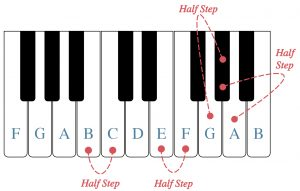
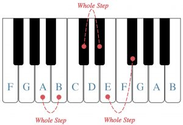
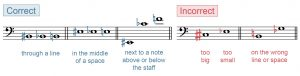
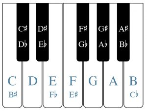
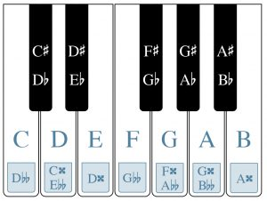

I. 基础

半音、全音与变音记号 — Chelsey Hamm

要点

- 钢琴上某个键上方的半音（half step）是其正右侧的键，而该键下方的半音是其正左侧的键。
- 全音（whole step）等于两个半音。上方的全音是向右两个键，而下方的全音是向左两个键。
- 变音记号（accidental）改变音符的音高。升号（sharp）将音符升高一个半音，而降号（flat）将音符降低一个半音。还原号（natural）取消先前的变音记号。
- 重升号（double sharp）将音符升高一个全音，而重降号（double flat）将音符降低一个全音。
- 务必将变音记号写在音符的左侧，直接对准音符所在的线或间。
- 当音符拼写不同但听起来相同时，它们具有等音等价性（enharmonic equivalence）。

在上一章《键盘与大谱表》中，我们讨论了钢琴键盘上白键的字母名称，并指出黑键以两组或三组交替排列。然而，在讨论黑键的名称之前，我们必须首先了解半音和全音。

# 半音和全音

半音被认为是西方音乐记谱中最小的音程（interval），即两个音符之间的距离。示例 1 展示了一个标有白键音高字母名称和一些半音标注的钢琴键盘。在钢琴键盘上（见示例 1），对于大多数白键音符来说，该音符上方的半音将是其右上方的黑键，而下方的半音将是其左上方的黑键。例如，G 右上方的黑键"位于"音符 G 和 A 之间；人们会说这个黑键在 G 上方半个音，在 A 下方半个音。两对白键——E/F 和 B/C——之间没有黑键（见示例 1）。这是因为 E–F 和 B–C 都是半音。将黑键分为两组或三组使得键盘手能够更容易、更快速地看到和感觉到它们。

示例 1.
标有白键字母名称的钢琴键盘；标注了一些半音。

全音等于两个半音。示例 2 展示了一个标有白键音高字母名称的钢琴键盘，以及一些用方括号标注的全音。中间有黑键的白键对（A 和 B、C 和 D、D 和 E、F 和 G，以及 G 和 A）相距一个全音。要找到音符 E 或 B 上方的全音，只需向右数两个键：E 上方的全音是 F 音右侧的黑键，而 B 上方的全音是 C 音右侧的黑键。同样，向左数两个键可以找到音符 C 或 F 下方的全音：分别是 B 和 E 音左侧的黑键。要从黑键开始找到全音，你需要向右或向左数两个键。例如，C 右侧黑键上方的全音是 D 音右侧的黑键。B 左侧黑键下方的全音是 A 音左侧的黑键。

示例 2.
标有白键字母名称的钢琴键盘；标注了一些全音。

半音和全音听起来是什么样的？示例 3 中的短视频进行了演示：

示例 3. Chelsey Hamm 博士（克里斯托弗纽波特大学）演示半音和全音的声音。

# 升号、降号和还原号

变音记号改变音符的音高。升号（♯）看起来像一个倾斜的井号，它将音符升高一个半音。降号（♭）看起来像一个倾斜的小写字母"b"，它将音符降低一个半音。还原号（♮）看起来像一个倾斜的方框，左上角和右下角各伸出一条线，它取消先前的变音记号，如升号或降号。升号、降号和还原号是三种最常见的变音记号。

重升号（通常记为 𝄪 或较少见地记为 ♯♯）将音符升高两个半音（即一个全音）。重降号（𝄫）将音符降低两个半音（即一个全音）。变音记号始终写在音符的左侧，无论符干方向如何。变音记号应直接写在音符所在的线或间上。

示例 4 展示了记录升号、降号和还原号的正确和错误方式：

示例 4.
绘制变音记号的正确和错误方式。

当两个音符出现在同一条线或同一个间但具有不同的变音记号时，变音记号分别适用于第一个和第二个音符。示例 5 展示了这一点：

示例 5.
降 B 和还原 B 并列。

你可以在以下较简单的练习中通过拖放来练习识别高音谱号和低音谱号中的半音和全音：

练习

你可以在以下较难的练习中通过拖放来练习识别所有谱号中的半音和全音：

练习

# 钢琴键盘上的黑键

示例 6 展示了一个标有黑键字母名称的钢琴键盘。在白键上方半个音的黑键采用白键的名称加上"升"字。例如，C 音右侧的黑键称为"升 C"，写作 C♯。在白键下方半个音的黑键采用白键的名称加上"降"字。例如，D 音左侧的黑键称为"降 D"，写作 D♭。

示例 6.
标有黑键字母名称的钢琴键盘。

F 也称为升 E，E 也称为降 F。C 也称为升 B，B 也称为降 C。示例 7 还展示了一些重升号和重降号变音记号。重升号是一个音符上方两个半音。例如，升升 D 也是 E；升升 E 也是升 F（或降 G）。重降号是一个音符下方两个半音。例如，降降 A 也是 G；降降 C 也是降 B 或升 A。

示例 7.
钢琴键盘上的重变音记号。

你可以在以下练习中通过拖放来练习识别钢琴上的黑键和白键：

练习

# 等音等价性

你可能已经注意到，钢琴键盘上的每个键都有不止一个名称。当音符拼写不同但听起来相同时，它们具有等音等价性（enharmonic equivalence）。例如，你可以看到升 C 和降 D 是等音等价的，如示例 6 和 7 所示。示例 7 还展示了 D 音与升升 C 和降降 E 等音等价。换句话说，弹奏 D、升升 C 或降降 E 将产生相同的音高。

延伸阅读

- Drabkin, William and Mark Lindley. 2001. "Semitone." Grove Music Online. https://doi.org/10.1093/gmo/9781561592630.article.25395.
- Gerou, Tom and Linda Lusk. 1996. Essential Dictionary of Music Notation. Los Angeles: Alfred.
- Gould, Elaine. 2011, Behind Bars: the Definitive Guide to Music Notation. London: Bloomsbury.
- Hiley, David. 2001. "Accidental." Grove Music Online. https://doi.org/10.1093/gmo/9781561592630.article.00103.
- Hoover, Cynthia Adams and Edwin M. Good. 2013. "Piano." Grove Music Online. https://doi.org/10.1093/gmo/9781561592630.article.A2257895.
- McGrain, Mark. 1986. Music Notation. Boston: Berklee Press.
- Roemer, Clinton. 1985. The Art of Music Copying: the Preparation of Music for Performance, 2nd edition. Sherman Oaks: Roerick Music Company.
- Rushton, Julian. 2001. "Enharmonic." Grove Music Online. https://doi.org/10.1093/gmo/9781561592630.article.08837.

在线资源

- 半音、全音和变音记号教程 (musictheory.net)
- 半音、全音和变音记号练习游戏 (drawmusic.com)
- 变音记号教程 (mymusictheory.com)
- 钢琴黑键教程 (musicradar.com)
- 练习钢琴键盘 (musictheory.net)
- 钢琴键盘音符标注游戏 (quizlet.com)
- 等音等价性教程 (The Music Notation Project)
- 学生或教师用空白键盘

网上作业

- 钢琴键盘和谱表记谱中的半音和全音 (.pdf)
- 谱表记谱中的半音和全音 (.pdf)
- 书写和识别带变音记号的音符，第 1 页 (.pdf)，第 9-11 页 (.pdf)
- 键盘与谱表记谱匹配 (.pdf)
- 等音等价性，第 3 页 (.pdf)，(.pdf)

资源

- 学生或教师用空白键盘 (.pdf)

作业

- 钢琴上的黑键 (.pdf,.docx)。要求学生识别标记的音高将在哪个钢琴键上演奏。
- 钢琴上的半音和全音 (.pdf,.docx)。要求学生识别标记的音高将在哪个钢琴键上演奏，并识别钢琴上哪些相邻键构成半音或全音。
- 书写变音记号 (.pdf,.docx)。要求学生在谱表上绘制带变音记号的音符。
- 书写和识别变音记号 (.pdf,.docx)。要求学生在谱表记谱中识别和记录带有变音记号符号的音高。
- 谱表记谱中的半音和全音。要求学生在给定音符上方/下方记录全音和半音，在记谱中识别全音/半音，并分析旋律以定位和标注全音和半音。所有谱号 (.pdf,.mscz) 仅高音谱号和低音谱号 (.pdf,.mscz)
- 等音等价性。要求学生书写和识别等音等价的音符。所有谱号 (.pdf,.mscz) 仅高音/低音谱号 (.pdf,.mscz)

## 许可

Open Music Theory Copyright © 2023 by Mark Gotham; Kyle Gullings; Chelsey Hamm; Bryn Hughes; Brian Jarvis; Megan Lavengood; and John Peterson 采用知识共享署名-相同方式共享 4.0 国际许可协议，另有说明的除外。

---
*原文: [半音、全音与变音记号](https://viva.pressbooks.pub/openmusictheory/chapter/half-and-whole-steps) | CC BY-SA*
