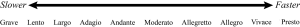
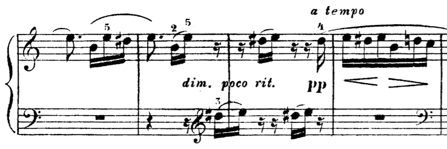
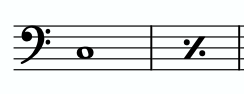
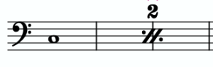
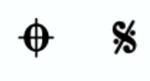
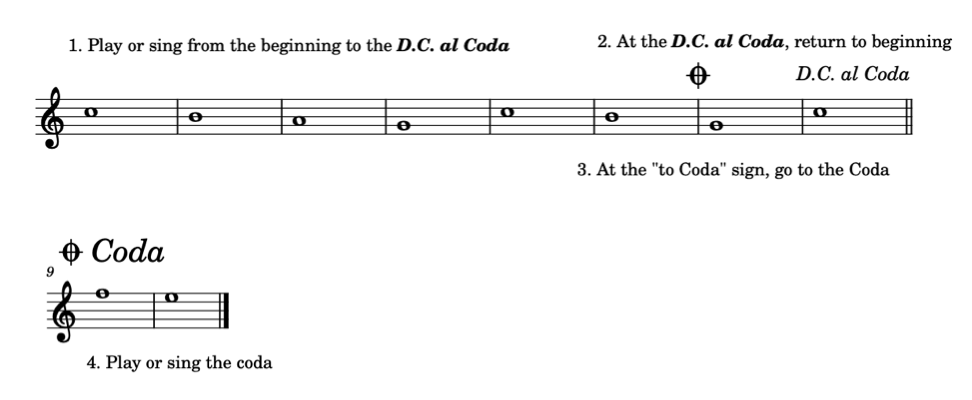
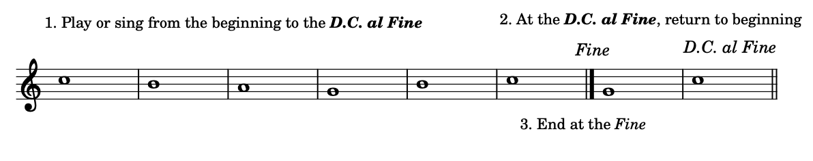
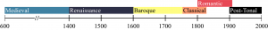

I. 基础

记谱法的其他方面 — Mark Gotham 和 Chelsey Hamm

要点

- 力度（dynamics）表示音乐的响度。音乐家使用各种意大利语词汇在西方音乐记谱中指定力度。
- 渐强（crescendo）表示响度增加，而渐弱（decrescendo 或 diminuendo）表示响度降低。
- 术语奏法（articulation）指的是音符之间的连接或分离，以及音符起始（attack）处的重音程度。
- 速度标记（tempo indication）告诉音乐家演奏或演唱作品的速度快慢。
- 音乐家将音乐按历史时期划分（periodize），记住这些时期很有用。这些历史时期内的作品往往具有相似的风格特征。
- 结构特征（structural features）将作品或乐章划分为较小的部分。

在本章中，我们将探索音高（在前面的章节中讨论过）和时值（在后面的章节中讨论过）之外的其他音乐元素。这些元素包括力度、奏法、速度、风格时期和结构标记。

# 力度

力度（dynamics）表示音乐的响度。在西方音乐记谱中，我们经常使用斜体的意大利语词汇（可以缩写）来描述力度。力度标记 forte 意为响亮，而 piano 意为轻柔。在乐谱中，这些词写在谱表的上方或下方。

几个意大利语词汇和后缀可以修饰 piano 和 forte，以创造从非常轻柔到非常响亮的力度范围（示例 1）。意大利语单词 mezzo 意为"适中地"。音乐家用 mezzo forte 表示适中地响亮，用 mezzo piano 表示适中地轻柔。意大利语后缀 -issimo 意为"非常"或"极其"。音乐家用 pianissimo 表示"非常轻柔"，用 fortissimo 表示"非常响亮"。这个后缀可以叠加；例如，可以说 pianississimo 表示"非常、非常轻柔地"，或 fortississimo 表示"非常、非常响亮地"。

示例 1.
力度从最轻到最响排列。

力度在西方音乐记谱中通常被缩写，如下所示。

- fff = fortississimo（极强）
- ff = fortissimo（很强）
- f = forte（强）
- mf = mezzo forte（中强）
- mp = mezzo piano（中弱）
- p = piano（弱）
- pp = pianissimo（很弱）
- ppp = pianississimo（极弱）

有些作曲家会添加更多的"-issimo"，但这很少见。不过，你可能会在演奏或演唱的音乐中发现 ppppp 或 fffff！

你可以在以下练习中练习将力度从最轻到最响排列：

练习

还有三个其他意大利语词汇常用于表示力度级别的变化。渐强（crescendo，缩写 cresc.）意为变得更响亮，而渐弱（decrescendo，缩写 decresc.）和 diminuendo（缩写 dim.）都意为变得更轻柔。渐强和渐弱以两种不同方式表示：写出缩写 cresc. 或 decresc.（可能后跟点号），或绘制渐强渐弱记号。术语"渐强渐弱记号"指的是以下符号，它们大致类似于发夹（或"hairpin"）的形状，如示例 2 所示。

示例 2.
渐强和渐弱（"渐强渐弱记号"）。

# 奏法

术语奏法（articulation）指的是音符之间的连接或分离，以及音符起始（attack）处的重音程度。与力度一样，西方音乐记谱中的奏法通常用意大利语书写。示例 3 至 7 演示了几种奏法。打击乐器、拨弦乐器、弓弦乐器、管乐器、铜管乐器和人声都有不同的方法来执行特定的起音和奏法。你需要咨询私人教师或合奏指导，以获得在你的乐器或人声上应用不同奏法的帮助。

示例 3：连奏（Legato）意为流畅地或连贯地演奏或演唱。这种奏法通过弯曲的连线（slur）标记表示。

示例 4：另一种表示流畅、连贯演奏的方式是使用保持音（tenuto）标记，它看起来像音符上方或下方的小横线。

示例 5：断奏（Staccato）意为更分离地演奏或演唱音符，在音符之间留出空间。这种奏法通常用放在音符上方或下方的点表示。

示例 6：重音记号（accent，一个横向的 V）意为以额外的力度或强调来演奏或演唱音符。

示例 7：强音记号（marcato，一个倒置的 V）意为以更有力的重音来演奏或演唱音符。

示例 3.
连线音符。
示例 4.
保持音音符。
示例 5.
断奏音符。
示例 6.
重音音符。
示例 7.
强音音符。

重音音符也可以用斜体缩写 sfz、sf 或 fz（sforzando、forzando 或 forzato）来表示。这些重音通常被解释为比普通重音稍微更有力（即更响亮）。这些符号的作用类似于力度标记，直接放在它们所适用音符的上方或下方。

# 速度

速度（tempo，复数 tempi）是描述作品演奏快慢的术语。速度通常以节拍器标记（metronome marking）方式精确标示，或以文字方式不太精确地标示。节拍器标记通常以每分钟拍数（bpm）表示。标记为 ♩ = 60 的作品每分钟包含 60 个四分音符（每秒一个四分音符）。用手机上的免费节拍器应用，你可以轻松检查正在演奏或演唱的作品的速度。

与力度一样，大多数速度标记用意大利语书写。它们通常出现在作品、乐章或部分的开头，在第一个谱表或谱行的左上角。最常见的速度如下：

- 快速：活泼（vivace）、急板（presto）、快板（allegro）、小快板（allegretto）（-etto 是意大利语后缀，意为"小"）
- 中速：中板（moderato）、行板（andante）
- 慢速：柔板（adagio）、广板（largo）、慢板（lento）、庄板（grave）

示例 8 描绘了从最慢到最快的速度：

示例 8.
速度从最慢到最快排列。

你可以在以下练习中练习将速度从最慢到最快排列：

练习

作曲家有时会使用额外的意大利语词汇，特别是富有感情的表达，来修饰速度标记。像 assai（"非常"或"相当"）、espressivo（"富有表现力地"）或 cantabile（"如歌地"）这样的词经常出现在速度标记之后，尤其是在 1800 年之后创作的作品中。例如，人们可能会遇到像"allegro assai"（"非常快"）、"andante cantabile"（"中速，如歌地"）或"adagio espressivo"（"慢而富有表现力地"）这样的速度标记。一定要查阅你音乐中任何不认识的词语的定义。

还有两个其他意大利语词汇常用于表示速度变化：渐慢（ritardando，缩写 rit.）表示逐渐减速，渐快（accelerando，缩写 accel.）表示逐渐加速。两个词通常用斜体书写，并且经常被缩写（分别为 rit. 和 accel.）。当这些指示旨在适用于多个小节时，它们后面通常跟点号。点号在需要遵循该指示的范围内持续出现。

在渐慢或渐快之后，作曲家通常会回到原速。为此，他们会写 a tempo（原速），通常放在谱表上方。示例 9 展示了路德维希·凡·贝多芬的《致爱丽丝》（1810 年）的片段：

示例 9.
一个带有渐慢和 a tempo 标记的音乐示例。

在示例 9 的第三小节中，你可以看到有一个渐慢标记。在第四小节上方写着 a tempo，表示回到作品的原速。

# 结构特征

以下词汇和符号表示作品中的结构特征（structural features）。结构特征将作品或乐章划分为较小的部分。

- 示例 10：延长记号（fermata）表示音符应持续超过其正常时值。延长记号通常出现在音乐段落的开头或结尾。
- 示例 11：休止记号（caesura）表示音乐中的中断或截断。
- 示例 12：换气记号（breath mark）表示管乐器演奏者或声乐演员的换气。对于打击乐手、键盘手或弦乐手来说，它表示一个长度类似于换气的停顿。

示例 10.
高音谱号中带有延长记号的音符。
示例 11.
低音谱号中带有休止记号的音符。
示例 12.
中音谱号中带有换气记号的音符。

反复记号（repeat signs）表示一段音乐应重复演奏（示例 13）。如果重复段落每次结束不同，则用第一结尾和第二结尾表示（示例 14）。

示例 13. 低音谱号中的四个音符被反复记号包围。

示例 14. 高音谱号中带有第一结尾和第二结尾的反复记号。

偶尔你可能会遇到有两个以上结尾的音乐。带第三甚至第四结尾的重复段落在某些音乐风格中很常见，例如百老汇音乐剧。它们的运作方式与第一结尾和第二结尾相同：第三结尾在段落第三次重复后演奏，第四结尾在第四次重复后演奏，依此类推。

单独一小节或两小节的音乐重复也很常见。一小节或两小节反复记号（repeat sign）表示应该重复前一小节或前两小节。示例 15 展示了一小节反复记号，而示例 16 展示了两小节反复记号：

示例 15.
一小节反复记号。

示例 16.
两小节反复记号。

你可能还会遇到其他几个结构标记，包括 D.C. al Coda、D.C. al Fine、D.S. al Coda 和 D.S. al Fine。这些结构标记使用两个符号，记住它们很有用。示例 17 展示了这些符号：

示例 17.
左边是"到尾声"符号，右边是"记号"符号。

D.C. al Coda（da capo al coda）意为从头开始演奏或演唱作品，直到看到 D.C. al Coda。然后回到开头，演奏或演唱到"到尾声"符号。然后跳到尾声（coda），演奏或演唱到作品结束。示例 18 展示了这个过程：

示例 18.
展示 D.C. al Coda 过程的音乐示例。

D.S. al Coda 的工作方式与 D.C. al Coda 类似，不同之处在于回到示例 17 右侧的符号而不是作品的开头。D.C. al Fine（da capo al fine）意为从头开始演奏或演唱作品，直到看到 D.C. al Fine。然后回到开头，演奏或演唱到 Fine（结束）。示例 19 展示了这个过程：

示例 19.
展示 D.C. al Fine 过程的音乐示例。

D.S. al Fine 的工作方式与 D.C. al Fine 类似，不同之处在于回到示例 17 右侧的符号而不是作品的开头。

# 风格时期

当你开始学习音乐理论时，基本了解音乐理论家和音乐学家（musicologist）如何在历史上对西方古典音乐进行时期划分（periodize）将很有帮助。这段音乐历史中的时间划分是灵活的，但拥有一个将具有某些风格相似性的音乐作品分组的总体框架对音乐家很有用。

以下时间段（如示例 20 所示）通常被大多数音乐学家所认同：

- 中世纪：约 600–1400 年
- 文艺复兴：约 1400–1600 年
- 巴洛克：约 1600–1750 年
- 古典：约 1750–1820 年
- 浪漫：约 1800–1910 年
- 后调性：约 1900 年至今

示例 20.
描绘音乐风格时期通常认可年份的时间线。

延伸阅读

- Brown, Clive. 2001. "Articulation Marks." Grove Music Online. https://doi.org/10.1093/gmo/9781561592630.article.40671.
- Gerou, Tom and Linda Lusk. 1996. Essential Dictionary of Music Notation. Los Angeles: Alfred.
- London, Justin. 2001. "Tempo (i)." Grove Music Online. https://doi.org/10.1093/gmo/9781561592630.article.27649.
- McGrain, Mark. 1986. Music Notation. Boston: Berklee Press.
- Roemer, Clinton. 1985. The Art of Music Copying: The Preparation of Music for Performance, 2nd edition. Sherman Oaks: Roerick Music Company.
- Thiemel, Matthias. 2001. "Dynamics." Grove Music Online. https://doi.org/10.1093/gmo/9781561592630.article.08458.
- Tilmouth, Michael. 2001. "Repeat." Grove Music Online. https://doi.org/10.1093/gmo/9781561592630.article.23214.
- Westrup, Jack. 2001. "Da capo." Grove Music Online. https://doi.org/10.1093/gmo/9781561592630.article.07043.

在线资源

- 力度教程 (Music Theory Academy)
- 力度教程 (Lumen's Music Appreciation)
- 奏法 (BBC)
- 奏法 (libretexts.org)
- 速度 (BBC)
- 速度 (Music Theory Academy)
- 音乐学中的时期划分笔记 (Oxford History of Western Music)
- 音乐学中的历史时期 (Naxos)
- 音乐记谱风格指南 (Indiana University)

网上作业

- 力度，第 13–17 页 (.pdf)，(.pdf,.pdf)，以及第 1–2 页 (.pdf)
- 奏法 (.pdf,.pdf)
- 速度 (.pdf)，以及第 3–4 页 (.pdf)
- 结构标记 (.pdf,.pdf)
- 混合术语 (.pdf)

作业

- 记谱法的其他方面 (.pdf,.docx)。要求学生排列力度、速度和历史时期；绘制奏法、结构特征和渐强渐弱记号；并回答有关记谱法这些方面的问题。

---

## 🎵 音频与互动示例

<iframe src="https://musescore.com/user/32728834/scores/6275123/embed" width="100%" height="240" frameborder="0" allowfullscreen allow="autoplay"></iframe>

*<https://musescore.com/user/32728834/scores/6275123>*

<iframe src="https://musescore.com/user/32728834/scores/6275124/embed" width="100%" height="240" frameborder="0" allowfullscreen allow="autoplay"></iframe>

*<https://musescore.com/user/32728834/scores/6275124>*

**互动练习**（需网络，原站加载）:

- Dynamic Matching

- Tempo Matching

## 许可

Open Music Theory Copyright © 2023 by Mark Gotham; Kyle Gullings; Chelsey Hamm; Bryn Hughes; Brian Jarvis; Megan Lavengood; and John Peterson 采用知识共享署名-相同方式共享 4.0 国际许可协议，另有说明的除外。

---
*原文: [记谱法的其他方面](https://viva.pressbooks.pub/openmusictheory/chapter/other-aspects-of-notation) | CC BY-SA*
