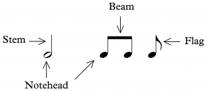
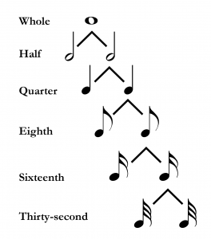
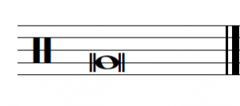
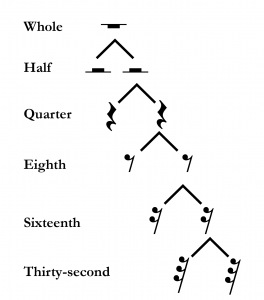
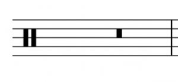
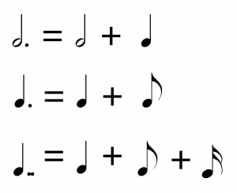

I. 基础

节奏记谱 — Mark Gotham；Chelsey Hamm；和 Bryn Hughes

要点

- 音符（notes）由几个不同的组成部分构成，包括符头（notehead）、符干（stem）、符杠（beam）和符尾（flag）。
- 常见的音符时值包括全音符（whole note）、二分音符（half note）、四分音符（quarter note）、八分音符（eighth note）和十六分音符（sixteenth note）。
- 常见的休止符时值包括全休止符（whole rest）、二分休止符（half rest）、四分休止符（quarter rest）、八分休止符（eighth rest）和十六分休止符（sixteenth rest）。
- 节奏时值的英国术语与美国术语不同。
- 附点（dot）将音符的时值增加一半。后续的附点增加前一个附点时值的一半。
- 连线（tie）连接两个或多个相同音高的音符。不要重新发音任何"被连线连接的"音符。

音乐是一种时间性（temporal）艺术——换句话说，时间是其组成部分之一——因此组织时间对于西方音乐记谱至关重要。接下来的几章将聚焦于节奏（rhythm）和节拍（meter）的时间方面，从本章开始介绍此记谱体系中的基本音符和休止符时值。

# 音符时值

广义上讲，节奏指的是音乐声和休止在时间中的持续时间。正如你在《音符、谱号和加线的记谱》一章中回忆的那样，音符可能包含几个不同的组成部分，如示例 1 所示：

示例 1.
标注了符头、符干、符杠和符尾的音符。

在西方音乐记谱中有许多常见的音符时值（note values）。音符时值是分层级的（hierarchical）；换句话说，它们的长度是相互定义的。每个音符时值可以分为两个较小的时值，如示例 2 所示。就像一个完整的披萨分成两半、四等份、八等份等一样，全音符分成两个二分音符、四个四分音符、八个八分音符，依此类推。

示例 2.
常见音符时值之间的相对关系。

特别注意示例 2 的以下方面：

- 符头可以是实心的（黑色）或空心的（白色）；四分音符及更短时值的音符是实心的。
- 空心符头可能有也可能没有符干，但实心符头始终有符干。
- 符尾只添加到实心符头的符干上。

此外，有三种方法可以将音符时值减半：

- 给音符添加符干（即全音符变为二分音符）
- 将符头填实（即二分音符变为四分音符）
- 添加符尾（即四分音符变为八分音符，或八分音符变为十六分音符）

你可以在以下等值练习中练习音符时值：

练习

Open Music Theory 优先使用音符时值的北美名称，但了解英国名称也很有价值。下表提供了这些名称。

符号 | 美国名称 | 英国名称
𝅝 | 全音符 | 半全音符 (Semibreve)
𝅗𝅥 | 二分音符 | 拍音符 (Minim)
𝅘𝅥 | 四分音符 | 拐杖音符 (Crotchet)
𝅘𝅥𝅮 | 八分音符 | 颤音 (Quaver)
𝅘𝅥𝅯 | 十六分音符 | 半颤音 (Semiquaver)

比十六分音符更短的音符时值（三十二分音符、六十四分音符等）通过添加额外的符尾来创建。你可能还会遇到一种不太常见的音符时值，称为倍全音符（double whole note，英国英语中称为 breve；示例 3）。倍全音符有时只在符头两侧各画一条线。在较古老的记谱样式中，符头看起来更方而不是椭圆。倍全音符分为全音符（即两个全音符构成一个倍全音符）。

示例 3.
一条线上的倍全音符。

# 休止符时值

广义上讲，休止符（rests）指的是音乐中静默的持续时间。每个层级的音符时值都有对应的休止符时值，如示例 4 所示。与音符时值一样，每个休止符时值可以分为两个较小的时值。示例 4 的几个额外方面值得注意：

- 注意全休止符从线上悬挂下来，而二分休止符坐在线上方。可以将全休止符想象为比二分休止符更"重"，以记住它悬挂下来；同样，二分休止符像一顶大礼帽，所以你可以想象它像戴在人头上一样坐在线上方。
- 仔细练习绘制四分休止符；许多学生发现它们很难画。
- 给休止符添加符尾（即八分到十六分）将休止符的时值减半。

示例 4.
常见休止符时值之间的相对关系。

虽然很少见，但你可能会遇到二全休止符（breve rest，示例 5）。二全休止符的长度等于两个全休止符。它看起来像一个实心方框，出现在从上数第二个间中。

示例 5.
二全休止符。

你可以在以下练习中练习音符和休止符时值：

练习

你可以在以下等值练习中练习音符和休止符时值：

练习

# 附点和连线

附点和连线可以延长时值。附点（dot）紧跟在音符或休止符之后书写，将其时值增加一半（示例 6）。例如，四分音符的时值等于两个八分音符；因此，附点四分音符等于三个八分音符。同样，全音符等于两个二分音符，所以附点全音符等于三个二分音符。

可以在一个时值上添加多个附点，每个后续附点增加前一个附点时值的一半。例如，双附点四分音符（即带两个附点的四分音符）的时值等于四分音符、八分音符和十六分音符相加。换句话说，双附点音符是原始音符时值的 1¾ 倍。

示例 6.
两个附点音符和一个双附点音符的节奏分解。

你可以在以下等值练习中练习附点音符和休止符时值：

练习

连线（tie）是连接两个或多个相同音高音符的弯曲线条。（连线从不用于休止符。）被连线连接的音符不再重新发音。换句话说，连线用于合并多个音符的时值。示例 7 中连接前两个音符的连线表示，当这些二分音符和四分音符被演奏或演唱时，四分音符不应被发音；换句话说，第一个音符应持续三个四分音符的时值，而不是两个。书写这个时值的另一种方式是附点二分音符。

示例 7. 连线连接了前两个音符。

你可能正确地认为连线看起来像连音线（slur）（见《记谱法的其他方面》）。两者之间的区别是连音线连接不同音高的音符，并表示以保持音（tenuto）方式演奏或演唱，而连线连接相同音高的音符以创建更长时值的音符。

延伸阅读

- Gerou, Tom and Linda Lusk. 1996. Essential Dictionary of Music Notation. Los Angeles: Alfred.
- Gould, Elaine. 2011. Behind Bars: the Definitive Guide to Music Notation. London: Faber Music.
- Hefling, Stephen E. 2001. "Dotted Rhythms." Grove Music Online. https://doi.org/10.1093/gmo/9781561592630.article.08054.
- McGrain, Mark. 1986. Music Notation. Boston: Berklee Press.
- Morehen, John, revised by Richard Rastall. 2001. "Note Values." Grove Music Online. https://doi.org/10.1093/gmo/9781561592630.article.20127.
- Rastall, Richard. 2001. "Rest." Grove Music Online. https://doi.org/10.1093/gmo/9781561592630.article.23250.
- ——. 2001. "Tie." https://doi.org/10.1093/gmo/9781561592630.article.27937.
- Roemer, Clinton. 1985. The Art of Music Copying: The Preparation of Music for Performance, 2nd edition. Sherman Oaks: Roerick Music Company.

在线资源

- 音符时值 (musictheory.net)
- 节奏时值 (learnmusictheory.net)
- 音符时值 (Essentials of Harmony)
- 附点和连线 (YouTube)
- 附点和连线 (musictheory.net)

网上作业

- 书写音符和休止符、节奏等式，第 3–7 页 (.pdf)
- 高级节奏等式，第 3 页 (.pdf)
- 连音线和连线 (.pdf)

作业

- 音符和休止符时值 (.pdf,.docx\*)
- 附点和连线 (.pdf,.docx\*)

* 作业使用 Noto Music 字体来显示音符时值。从 Google Fonts 下载 Noto Music。

## 许可

Open Music Theory Copyright © 2023 by Mark Gotham; Kyle Gullings; Chelsey Hamm; Bryn Hughes; Brian Jarvis; Megan Lavengood; and John Peterson 采用知识共享署名-相同方式共享 4.0 国际许可协议，另有说明的除外。

---
*原文: [节奏记谱](https://viva.pressbooks.pub/openmusictheory/chapter/notating-rhythm) | CC BY-SA*
