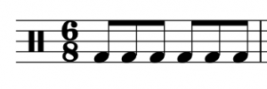

I. 基础

复拍子与拍号 — Mark Gotham 和 Chelsey Hamm

要点

- 复拍子（compound meters）是拍子分为三部分，然后进一步细分为六部分的拍子。
- 二拍子（duple meters）有两拍一组的组合，三拍子（triple meters）有三拍一组的组合，四拍子（quadruple meters）有四拍一组的组合。你可以通过仔细聆听并跟着打拍子来听觉判断这些组合。
- 二拍子、三拍子和四拍子有不同的指挥图示；这些在复拍子和单拍子中是相同的。
- 复拍子中的拍号（time signatures）表达两件事：每小节包含多少细分（上方数字），以及细分单位（division unit）——哪个音符获得细分（下方数字）。
- 复拍子中的节奏根据其细分单位获得不同的数拍。不发音的拍子（因为包含超过一拍或因为连线、休止符或附点）在其计数周围加上括号。

章节播放列表

在前一章《单拍子与拍号》中，我们探索了单拍子（simple meters）中的节奏和拍号——即拍子分为两部分并进一步细分为四部分的拍子。在本章中，我们将学习复拍子（compound meters）——即拍子分为三部分并进一步细分为六部分的拍子。

# 聆听和指挥复拍子

复拍子可以是二拍子、三拍子或四拍子，就像单拍子一样。换句话说，复拍子的拍子分为两组、三组或四组。区别在于每拍分为三个细分而不是两个，你可以通过仔细聆听以下示例来感受：

- Kesha 的"Godzilla"（2017 年）是二拍子——拍子分为两组模式。跟着打拍子，注意它如何分为三部分而不是两部分。如果你进一步细分拍子（以两倍速度打拍子），你会感受到拍子细分为六部分。
- 弗朗茨·约瑟夫·海顿的《G大调奏鸣曲第 42 号》（1784 年）第二乐章（小步舞曲）是复三拍子。聆听三拍一组的组合，每拍分为三部分。
- 最后，复四拍子（compound quadruple）包含四拍，每拍分为三部分。聆听另类摇滚乐队 Muse 的"Exogenesis Symphony Part III"（2010 年）。这是复四拍子；换句话说，拍子分为四组模式。

一般来说，以复拍子写作的音乐不太常见。尽管如此，你必须学会如何阅读和演奏这些拍子的音乐，以掌握西方音乐记谱。

回顾前一章中单拍子的指挥图示，因为它们与复拍子相同。

# 拍号

复拍子中的小节（measures）等同于一组拍子（二拍、三拍或四拍），就像单拍子中一样。然而，拍号中的两个数字在复拍子中表达不同的信息。复拍子拍号的上方数字表示一小节中的细分数，而下方数字表示细分单位（division unit）——即哪个音符时值是细分。示例 1 展示了一个常见的复拍子拍号。

示例 1.
两个数字（6 和 8）构成一个常见的复拍子拍号。

就像在单拍子中一样，复拍子拍号不是分数（两个数字之间没有横线），它们放在谱表上谱号之后。在示例 1 中，上方数字（6）意味着每小节将包含六个细分；下方数字（8）意味着八分音符是细分。这意味着这个拍号中的每小节将包含六个八分音符，你可以通过检查示例 1 来验证。

在复拍子中，上方数字始终是三的倍数。将此数字除以三可以找到单拍子中对应的拍数：6、9 和 12 分别对应二拍子、三拍子和四拍子。在复拍子中，下方数字通常是以下之一：

- 8，表示八分音符获得细分。
- 4，表示四分音符获得细分。
- 16，表示十六分音符获得细分。

下表总结了我们到目前为止涵盖的六类拍子：

单拍子还是复拍子？ | 二拍、三拍、四拍？ | 拍子组合 | 拍子细分 | 拍号示例
单拍子 | 二拍 | 2 | 2 | $\mathbf{^2_4} \quad \mathbf{^2_8} \quad \mathbf{^2_2}  \quad\mathbf{^{\:2}_{16}}$
单拍子 | 三拍 | 3 | 2 | $\mathbf{^3_4} \quad \mathbf{^3_8} \quad \mathbf{^3_2} \quad \mathbf{^{\:3}_{16}}$
单拍子 | 四拍 | 4 | 2 | $\mathbf{^4_4} \quad \mathbf{^4_8} \quad \mathbf{^4_2} \quad \mathbf{^{\:4}_{16}}$
复拍子 | 二拍 | 2 | 3 | $\mathbf{^6_8} \quad \mathbf{^6_4} \quad \mathbf{^{\:6}_{16}}$
复拍子 | 三拍 | 3 | 3 | $\mathbf{^9_8} \quad \mathbf{^9_4} \quad \mathbf{^{\:9}_{16}}$
复拍子 | 四拍 | 4 | 3 | $\mathbf{^{12}_{\:8}} \quad \mathbf{^{12}_{\:4}} \quad \mathbf{^{12}_{16}}$

示例 2. 拍子的类别。

你可以在以下练习中练习复拍子拍号：

练习

# 复拍子中的数拍

在数复拍子节奏时，建议你进行指挥以保持稳定的速度。因为复拍子中的拍子分为三部分，所以它们始终是附点的。复拍子中的拍子如下：

- 如果下方数字是 8，拍子是附点四分音符（等于三个八分音符）。
- 如果下方数字是 4，拍子是附点二分音符（等于三个四分音符）。
- 如果下方数字是 16，拍子是附点八分音符（等于三个十六分音符）。

在单拍子中，拍子分为两部分，第一部分有重音，第二部分没有重音。在复拍子中，拍子分为三部分，第一部分有重音，第二和第三部分没有重音。复拍子的数拍与单拍子不同，如示例 3 所示，该示例是 $\mathbf{^6_8}$ 拍。

示例 3. 复二拍子中的数拍。

在这个拍号中，每小节有两拍（6÷3=2），表示二拍子。每个附点四分音符（拍子）获得一个计数，用阿拉伯数字表示，就像在单拍子中一样。对于比一拍更长的音符（如示例 3 第四小节中的附点二分音符），不被大声数出的拍子仍然用括号书写。细分使用音节"la"（第一个细分）和"li"（第二个细分）来数拍。如示例 3 的最后一小节所示，在十六分音符级别的进一步细分数为"ta"，八分音符细分上的"la"和"li"音节保持不变。

示例 3 的第三小节展示了两种最常见的带细分的复拍子节奏，所以如果你不熟悉复拍子，请务必仔细复习这一小节。

请注意，你的教师可能使用不同的数拍系统。Open Music Theory 优先使用美国传统数拍法，但这不是唯一的方法。

示例 4 给出了 (a) 二拍子、(b) 三拍子和 (c) 四拍子的节奏示例。就像单拍子一样，复二拍子只有两拍，复三拍子有三拍，复四拍子有四拍。

示例 4. (a) 复二拍子有两拍，(b) 复三拍子有三拍，(c) 复四拍子有四拍。

就像在单拍子中一样，因休止符和连线而不发音的拍子用括号书写，不被大声数出，如示例 5 所示。然而，附点节奏不会像在单拍子中那样导致拍子用括号书写，因为在复拍子中附点音符获得一拍。



示例 5. 不被大声数出的拍子放在括号中。

你可以在以下练习中练习单拍子和复拍子拍号中的音符/休止符等值：

练习

# 以 4 和 16 为细分单位的数拍

到目前为止，我们专注于以附点四分音符为拍子的拍子。在以其他拍单位（显示在拍号的下方数字中）的复拍子中，相同的数拍模式用于拍子和细分，但它们对应不同的音符时值（示例 6）。



示例 6. 用三种不同拍单位书写的相同节奏：(a) 附点四分音符，(b) 附点二分音符，(c) 附点八分音符。

这些节奏中的每一个听起来都相同，数法也相同。它们也都被认为是复三拍子。每个示例中的区别是下方数字——哪个音符获得细分单位（八分、四分或十六分），然后决定拍单位。

# 符杠、符干和符尾

在复拍子中，符杠（beams）仍然按拍将音符连接在一起；因此符杠的连接方式在不同的拍号中会变化。在示例 7 的第一小节中，十六分音符被分为六组，因为在 $\mathbf{^6_8}$ 拍号中六个十六分音符等于一拍。在示例 7 的第二小节中，十六分音符被分为三组，因为在 $\mathbf{^{\:6}_{16}}$ 拍号中三个十六分音符等于一拍。

示例 7. 两种不同拍子中的符杠连接。

当音乐涉及比四分音符更小的音符时值时，无论拍号是单拍子还是复拍子，你都应该始终用符杠来明确节拍。示例 8 展示了十二个十六分音符在两种不同拍子中的正确符杠连接。第一小节是单拍子，所以音符按拍分为四组；在第二小节中，复拍子要求音符按拍分为六组。

示例 8.
正确的符杠连接在单拍子和复拍子中都是必不可少的。

在单拍子中适用的符干和符尾规则在复拍子中仍然适用。对于中间线以上的音符，符干和符尾在音符左侧朝下；对于中间线以下的音符，符干和符尾在音符右侧朝上。中间线上音符的符干和符尾可以指向任一方向，取决于周围的音符。

就像在单拍子中一样，部分符杠可用于混合节奏分组。如果你还不熟悉这些惯例，请特别注意示例 9 中音符的符杠连接方式。

示例 9. 以八分音符为细分单位的最常见部分符杠变体。

延伸阅读

- Bent, Ian D. et al. 2001. "Notation." Grove Music Online. https://doi.org/10.1093/gmo/9781561592630.article.20114.
- Gerou, Tom and Linda Lusk. 1996. Essential Dictionary of Music Notation. Los Angeles: Alfred.
- Gould, Elaine. 2011. Behind Bars: the Definitive Guide to Music Notation. London: Faber Music.
- London, Justin. 2001. "Metre." Grove Music Online. https://doi.org/10.1093/gmo/9781561592630.article.18519.
- McGrain, Mark. 1986. Music Notation. Boston: Berklee Press.
- Roemer, Clinton. 1985. The Art of Music Copying: The Preparation of Music for Performance, 2nd edition. Sherman Oaks: Roerick Music Company
- Spitzer, John et al. 2021. "Conducting." Grove Music Online. https://doi.org/10.1093/gmo/9781561592630.article.06266.

在线资源

- 复拍子教程 (musictheory.net)（复拍子大约在中间开始）
- 单拍子与复拍子拍号对比 (YouTube)（从 1:49 开始看复拍子）
- 复拍子数拍和拍号 (John Ellinger)
- 复拍子数拍 (YouTube)
- 复拍子节奏练习 (YouTube)
- 复拍子符杠 (Michael Sult)

网上作业

- 拍子识别（单拍子和复拍子）(.pdf)，以及第 1–2 页 (.pdf)
- 拍子符杠（单拍子和复拍子），第 4 和 5 页 (.pdf)
- 6/8 拍中的数拍 (.pdf,.pdf,.pdf)
- 拍号 (.pdf,.pdf,.pdf)
- 用休止符完成小节，第 5–6 页 (.pdf)
- 小节线 (.pdf)，第 2 页 (.pdf)，以及第 3–4 页 (.pdf)
- 在单拍子和复拍子之间转写，第 9–10 页 (.pdf)
- 聆听和混合问题（网站）

作业

- 复拍音符、休止符和小节线 (.pdf,.docx)
- 复拍节奏记谱的重新符杠 (.pdf,.mscz)

## 许可

Open Music Theory Copyright © 2023 by Mark Gotham; Kyle Gullings; Chelsey Hamm; Bryn Hughes; Brian Jarvis; Megan Lavengood; and John Peterson 采用知识共享署名-相同方式共享 4.0 国际许可协议，另有说明的除外。

---
*原文: [复拍子与拍号](https://viva.pressbooks.pub/openmusictheory/chapter/compound-meters-and-time-signatures) | CC BY-SA*
