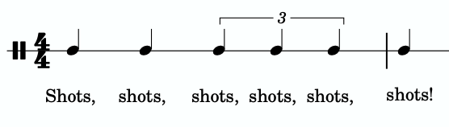
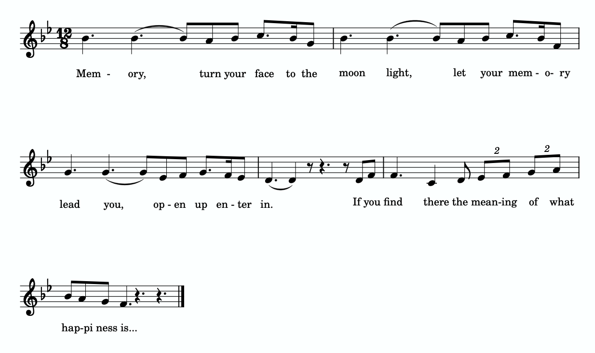

I. 基础

其他节奏要素 — Mark Gotham；Chelsey Hamm；和 Bryn Hughes

要点

- 三连音（triplet）是一种连音（tuplet），将单拍子中的一拍（或细分，或多拍）分为三部分。在三连音节奏上方书写数字 3 来标记三连音。
- 二连音（duplet）是一种将复拍子中的一拍（或细分）分为两部分的连音。在二连音节奏上方书写数字 2 来标记二连音。
- 超节拍（hypermeter）指的是在节拍层面的重音模式。
- 切分（syncopation）发生在弱拍（off-beat）节奏重音出现时，可以通过连线、附点、休止符和/或力度来创建。

# 借用细分

通常，节拍由一致的拍子细分来定义：单拍子中分为两部分，复拍子中分为三部分。有时作曲家会在单拍子中使用三拍细分，或在复拍子中使用两拍细分；这些节奏被称为连音（tuplets）。三连音（triplets）是一种将单拍子中的一拍（或细分，或多拍）分为三部分的连音。三连音有时被认为是"借用"自复拍子的，因为复拍子中的拍子通常分为三部分。三连音通过在三连音节奏上方书写数字 3 来标记。

三连音可以出现在任何节拍层面，如示例 1 所示。在示例 1a 中，三连音在拍子层面——这是三连音最常见的用法。示例 1b 展示了一个十六分音符三连音，等于一个八分音符（这个拍号中的细分）。三连音也可以跨越多拍，如示例 1c 所示。这个三连音（用三个四分音符标记）占据一个二分音符的空间。

示例 1. (a) 拍子层面、(b) 细分层面和 (c) 多拍层面的三连音。

三连音在许多不同音乐类型中极为常见。一个例子可以在 LMFAO 的"Shots"（2009 年）中找到。示例 2 展示了歌曲副歌的反复节奏，其中包含一个多拍三连音：

示例 2.
LMFAO 的"Shots"（2009 年）副歌的片段。

你可以在示例 3 中从 1:18 开始聆听"Shots"的副歌：

示例 3. LMFAO 的"Shots"；从 1:18 开始听。

二连音（duplet）是一种将复拍子中的一拍（或细分）分为两部分的连音。二连音通过在二连音节奏上方书写数字 2 来标记，如示例 4 所示。

示例 4. 在二连音节奏上方书写数字 2 来标记二连音。

二连音也相当常见，虽然可能不如三连音那么常见。示例 5 展示了安德鲁·劳埃德·韦伯的《猫》（1980 年）中"Memory"再现部的片段，其中包括拍子层面的二连音：

示例 5.
安德鲁·劳埃德·韦伯的《猫》（1980 年）中"Memory"再现部的片段。

你可以在示例 6 的开头聆听这个包含二连音的片段：

示例 6. 安德鲁·劳埃德·韦伯的"Memory"，由 Elaine Page 饰演 Grizabella 演唱。

连音节奏的数拍通常也是"借用"的。例如，三连音通常数为 1-la-li，而二连音通常数为 1-and、2-and 等。

# 超节拍简介

我们已经看到拍子要么有重音要么无重音，这在前两章关于指挥图示的讨论中已经观察到（见《单拍子与拍号》和《复拍子与拍号》）。超节拍（hypermeter）指的是形成重音模式的小节组合，特别是在较快的速度中。为了标注跨小节的重音模式，在乐谱上标注超节拍计数会很有帮助，如示例 7 所示，该示例展示了路德维希·凡·贝多芬《第九交响曲》（1824 年）"谐谑曲"的缩写片段。在聆听示例 7 时，尝试用四拍模式跟着超节拍数字指挥。通过这样做，你将能够感受（和听到）哪些小节更有重音（1 和 3），哪些较小重音（2 和 4）。

示例 7. 路德维希·凡·贝多芬《第九交响曲》（1824 年）"谐谑曲"的八小节，带有超节拍计数。

这个超节拍的介绍极为简短。如需更多信息，你可能想阅读 Open Music Theory 作者之一 Brian Jarvis 的《超节拍》。

# 切分

切分（syncopation）发生在弱拍（off-beat）节奏重音出现时（更多信息见《流行音乐中的节奏与节拍》），如示例 8 所示，它可以通过连线、附点、休止符和/或力度来创建。在第 1 小节中，连线创造了切分，而在第 2 小节中，节奏因为附点和连线而产生切分。第 3 小节中的切分感由每拍开头的休止符创造。在第 4 小节中，虽然每个细分上都有八分音符，但弱拍重音（力度）产生了切分。

示例 8. 切分节奏的不同示例。

你可以在以下练习中练习识别二连音、三连音和切分：

练习

你可以在以下练习中进一步练习二连音、三连音和切分节奏：

练习

延伸阅读

- Bent, Ian D. et al. 2001. "Notation." Grove Music Online. https://doi.org/10.1093/gmo/9781561592630.article.20114.
- Cone, Edward T. 1968. Musical Form and Musical Performance. New York: W.W. Norton & Company.
- Gerou, Tom and Linda Lusk. 1996. Essential Dictionary of Music Notation. Los Angeles: Alfred.
- Krebs, Harold. 1999. Fantasy Pieces. New York: Oxford University Press.
- Lerdahl, Fred and Ray Jackendoff. 1983. A Generative Theory of Tonal Music. Cambridge, MA: MIT Press.
- London, Justin. 2001. "Metre." Grove Music Online. https://doi.org/10.1093/gmo/9781561592630.article.18519.
- McGrain, Mark. 1986. Music Notation. Boston: Berklee Press.
- Roemer, Clinton. 1985. The Art of Music Copying: The Preparation of Music for Performance, 2nd edition. Sherman Oaks: Roerick Music Company.
- Rothstein, William. 1989. Phrase Rhythm in Tonal Music. New York: Schirmer.

在线资源

- 三连音和二连音 (YouTube)
- 三连音 (Hello Music Theory)
- 二连音 (Hello Music Theory)
- 切分 (Music Theory Academy)
- 切分节奏练习 (YouTube)

网上作业

- 数三连音 (.pdf,.pdf,.pdf,.pdf)
- 数二连音，第 13 页 (.pdf)
- 超节拍数字 (.pdf)
- 数切分 (.pdf,.pdf)

作业

- 三连音和二连音、超节拍和切分 (.pdf,.docx) 工作表播放列表

## 许可

Open Music Theory Copyright © 2023 by Mark Gotham; Kyle Gullings; Chelsey Hamm; Bryn Hughes; Brian Jarvis; Megan Lavengood; and John Peterson 采用知识共享署名-相同方式共享 4.0 国际许可协议，另有说明的除外。

---
*原文: [其他节奏要素](https://viva.pressbooks.pub/openmusictheory/chapter/other-rhythmic-essentials) | CC BY-SA*
