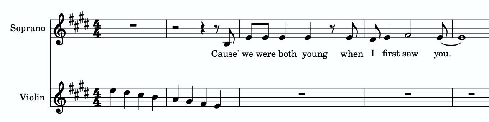
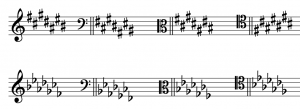
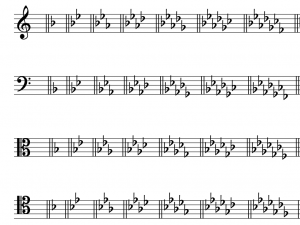

I. 基础

大调音阶、音级与调号 — Chelsey Hamm 和 Bryn Hughes

要点

- 大调音阶（major scale）是半音（H）和全音（W）的有序集合，上行顺序为 W‑W‑H‑W‑W‑W‑H。
- 大调音阶以其第一个音符（也是最后一个音符）命名，包括适用于该音符的任何变音记号。
- 音级（scale degrees）是用阿拉伯数字（Arabic numerals）标记并在上方加变音符号（carets）的唱名音节（solmization syllables）。音级为 $\hat1-\hat2-\hat3-\hat4-\hat5-\hat6-\hat7$。
- 唱名法（Solfège）唱名音节是命名大调音阶中音符的另一种方法。音节为 do、re、mi、fa、sol、la 和 ti。
- 大调音阶的每个音符也用音级名称（scale-degree names）命名：主音（tonic）、上主音（supertonic）、中音（mediant）、下属音（subdominant）、属音（dominant）、下中音（submediant）和导音（leading tone）。
- 调号（key signature）由升号（sharps）或降号（flats）组成，出现在作品开头，在谱号之后、拍号之前。
- 调号中升号的顺序是 F、C、G、D、A、E、B，而降号的顺序相反：B、E、A、D、G、C、F。在升号调号中，最后一个升号在主音（音阶的第一个音符）下方半个音。在降号调号中，倒数第二个降号就是主音。
- 五度圈（circle of fifths）是记住大调调号的便捷视觉工具。所有大调调号按变音记号数量的顺序放置在一个圆上。

音阶（scale）是半音和全音的有序集合（见《半音、全音与变音记号》复习）。

# 大调音阶

大调音阶（major scale）是半音（缩写 H）和全音（缩写 W）的有序集合，按以下上行顺序排列：W-W-H-W-W-W-H。聆听示例 1 听上行大调音阶。每个全音用方括号和"W"标记，每个半音用角括号和"H"标记。

示例 1. 一个上行大调音阶。

大调音阶始终在相同字母名称、相隔一个八度（octave）的音符上开始和结束，这个起始和结束音符决定了音阶的名称。因此，示例 1 描绘了一个 C 大调音阶，因为它的第一个和最后一个音符是 C。

你可以在以下练习中练习识别大调音阶中的半音和全音：

练习

音阶的名称包括适用于第一个和最后一个音符的任何变音记号。示例 2 展示了一个降 B 大调音阶——而不是 B 大调音阶，后者会使用不同的音高集合。注意每个大调音阶中半音和全音的模式是相同的，如示例 1 和示例 2 所示。

示例 2. 一个降 B 大调音阶。

大调音阶在许多不同音乐类型中极为常见。一个大调音阶的例子可以在泰勒·斯威夫特的"Love Story"（2008 年）中听到。示例 3 展示了这首歌结尾的片段：

示例 3.
泰勒·斯威夫特的"Love Story"（2008 年）的片段。

你可以在示例 4 中从 3:42 开始聆听示例 3 中的音乐。在人声进入前不久，聆听小提琴中的下行大调音阶：

示例 4. 泰勒·斯威夫特的"Love Story"；从 3:42 开始听。

你可以在以下练习中练习识别大调音阶：

练习

# 音级、唱名法和音级名称

音乐家以几种不同的方式命名大调音阶的音符。音级（scale degrees）是用阿拉伯数字（Arabic numerals）标记并在上方加变音符号（carets）的唱名音节（solmization syllables）。音阶的第一个音符是 $\hat{1}$，数字递增直到音阶的最后一个音符，它也是 $\hat{1}$（虽然有些教师更喜欢 $\hat{8}$）。示例 5 展示了一个 D 大调音阶，每个音级用阿拉伯数字和变音符号标记。

示例 5. 一个 D 大调音阶。

在音级下方，示例 3 还展示了命名大调音阶中音符的另一种方法：唱名法唱名音节。唱名法（Solfège，一种唱名音节系统）是命名大调音阶中音符的另一种方法。音节 do、re、mi、fa、sol、la 和 ti（发音为 doe、ray、me、fah、sew、lah 和 tea）可以应用于任何大调音阶的前七个音符；这些类似于音级 $\hat{1}$、$\hat{2}$、$\hat{3}$、$\hat{4}$、$\hat{5}$、$\hat{6}$ 和 $\hat{7}$。最后一个音符是 do（$\hat{1}$），因为它是第一个音符的重复。因为 do（$\hat{1}$）根据大调音阶的第一个音符而变化，这种唱名法被称为首调唱名法（movable do）。这与固定唱名法（fixed do）唱名系统形成对比，在固定唱名法中 do（$\hat{1}$）始终是音级 C。

你可以在以下练习中练习将大调调号与唱名法唱名音节匹配：

练习

大调音阶的每个音符也用音级名称（scale-degree names）命名：主音（tonic）、上主音（supertonic）、中音（mediant）、下属音（subdominant）、属音（dominant）、下中音（submediant）、导音（leading tone），然后再次主音。示例 6 展示了这些名称如何与上述音级数字和唱名法系统对齐。

音级数字 | 唱名法 | 音级名称
$\hat{1}$ | do | 主音 (Tonic)
$\hat{2}$ | re | 上主音 (Supertonic)
$\hat{3}$ | mi | 中音 (Mediant)
$\hat{4}$ | fa | 下属音 (Subdominant)
$\hat{5}$ | sol | 属音 (Dominant)
$\hat{6}$ | la | 下中音 (Submediant)
$\hat{7}$ | ti | 导音 (Leading Tone)
$\hat{8}$ / $\hat{1}$ | do | 主音 (Tonic)

示例 6. 音级数字、唱名法音节和音级名称。

示例 7 展示了这些音级名称应用于降 A 大调音阶：

示例 7. 带有音级名称的降 A 大调音阶。

示例 8 以展示音级名称来源的顺序展示了降 A 大调音阶的音符和音级名称。谱表上方的曲线显示了每个音级与主音之间的一般音程（generic interval）。

- 属音（dominant）一词继承自中世纪音乐理论，指的是主音上方五度在调性（diatonic）音乐中的重要性。
- 中音（mediant）意为"中间"，指的是中音位于主音和属音音高之间的事实。
- 拉丁语前缀 super 意为"上方"，所以上主音（supertonic）是主音上方的二度。这是唯一的"super-"音程。
- 拉丁语前缀 sub 意为"下方"；下主音（subtonic）、下中音（submediant）和下属音（subdominant）分别是上主音、中音和属音的倒置版本（即在主音下方）。（注意导音（leading tone）在主音下方半个音，而下主音（subtonic）在主音下方一个全音。我们将在《小调音阶、音级与调号》中更多讨论下主音。）

示例 8.
降 A 大调音阶的音符排列以展示音级名称的来源。

你可以在以下练习中练习匹配大调的音级、唱名法和音级名称：

练习

# 调号

调号（key signature）由升号（sharps）或降号（flats）组成，出现在作品开头，在谱号之后、拍号之前。你可以记住这个顺序因为它是按字母排列的：谱号（clef）、调（key）、拍号（time）。示例 9 展示了一个位于低音谱号和拍号之间的调号。

调号收集音阶中的变音记号，并将它们放在作品开头，以便更容易跟踪哪些音符有变音记号。在示例 9 中，在表示音符 B、E 和 A 的线和间上有降号（从左到右阅读）。因此，带有此调号的作品中的每个 B、E 和 A 都将是降的，无论八度。在示例 10 中，这两个 B 都将是降的，因为降 B 在调号中。

示例 9.
调号在谱号之后，但在拍号之前。
示例 10.
两个 B 都是降的，无论八度。

降号调号有特定的降号添加顺序，升号调号中的升号也是如此。这些顺序与谱号无关。示例 11 展示了四种最常见谱号中升号和降号的顺序：

示例 11.
高音谱号、低音谱号、中音谱号和次中音谱号中升号和降号的顺序。

升号的顺序始终是 F、C、G、D、A、E、B。这可以用助记符"胖猫走下小巷去吃鸟"（Fat Cats Go Down Alleys (to) Eat Birds）来记住。升号形成锯齿形模式，交替向下和向上。在高音、低音和中音谱号中，这个模式在升 D 之后"中断"然后恢复。在次中音谱号中，没有中断，但升 F 和升 G 出现在较低的八度而不是较高的八度。

降号的顺序与升号的顺序相反：B、E、A、D、G、C、F。这使得降号和升号的顺序成为回文。降号的顺序可以用这个助记符记住："鸟儿吃得很饱飞得很远"（Birds Eat And Dive Going Copiously Far）。降号总是形成完美的锯齿形模式，交替向上和向下，与谱号无关，如示例 11 所示。

有简单的方法可以记住哪个调号属于哪个大调音阶。在升号调号中，最后一个升号在主音（音阶的第一个音符）下方半个音。示例 12 展示了不同谱号中的三个升号调号。以下是用此方法识别每个调号的方式：

示例 12.
高音、低音和中音谱号中的三个不同升号调号。

- 最后一个升号（本例中是唯一的升号）升 F 在音符 G 下方半个音。因此，这是 G 大调的调号。
- 最后一个升号升 A 在音符 A 下方半个音。因此，这是 A 大调的调号。
- 最后一个升号升 E 在音符升 F 下方半个音。因此，这是升 F 大调的调号。

在降号调号中，倒数第二个降号就是主音（音阶的第一个音符）。示例 13 展示了不同谱号中的三个降号调号。以下是用此方法识别每个调号的方式：

示例 13.
低音、高音和次中音谱号中的三个不同降号调号。

- 此调号中的倒数第二个降号是降 B。因此，这是降 B 大调的调号。
- 倒数第二个降号是降 A。因此，这是降 A 大调的调号。
- 倒数第二个降号是降 G。因此，这是降 G 大调的调号。

有两个调号没有"窍门"，你只需要记住。它们是 C 大调（调号中没有任何东西——没有升号或降号）和 F 大调（有一个降号：降 B）（示例 14）。

示例 14.
C 大调（上方）和 F 大调（下方）的调号。

示例 15 展示了 C 大调（无升号或降号）的调号，然后是所有升号调号按顺序在所有四种谱号中：G、D、A、E、B、升 F 和升 C 大调。

示例 15. C、G、D、A、E、B、升 F 和升 C 在所有四种谱号中的调号。

示例 16 首先展示了 C 大调（无升号或降号）的调号，然后是所有降号调号按顺序在所有四种谱号中：F、降 B、降 E、降 A、降 D、降 G 和降 C 大调。

示例 16.
C、F、降 B、降 E、降 A、降 D、降 G 和降 C 在所有四种谱号中的调号。

示例 16 首先展示了 C 大调（无升号或降号）的调号，然后是 F、降 B、降 E、降 A、降 D、降 G 和降 C 在所有四种谱号中的调号。

还有一个"窍门"可能使调号记忆更容易：C 大调是没有升号或降号的调号，降 C 大调是每个音符都降的调号（总共 7 个降号），升 C 大调是每个音符都升的调号（总共 7 个升号）。

如果大调对应于示例 15 或 16 中的某个调号，则被认为是"真实的"。如果调号需要重升号（double sharp）或重降号（double flat），则该调号是"想象的"。偶尔，你可能会遇到想象调的音乐。示例 17 展示了一个降 F 大调音阶；降 F 大调调号是想象的，因为它需要一个重降 B。

示例 17. 高音谱号中的降 F 大调音阶。

你可以在以下练习中练习识别大调调号：

练习

# 五度圈

五度圈（circle of fifths）是一个便捷的视觉工具。在五度圈中，所有大调调号按变音记号数量的顺序放置在一个圆上。五度圈之所以如此命名，是因为每个调号与它两边的调号相距五度。示例 18 展示了大调调号的五度圈：

示例 18.
大调的五度圈。

如果你从圆的顶部（12 点钟方向）开始，C 大调的调号出现，它没有升号或降号。如果你继续顺时针方向，升号调号出现，每个后续调号增加一个升号。如果你从 C 大调继续逆时针方向，降号调号出现，每个后续调号增加一个降号。示例 16 底部的三个调号（在 7、6 和 5 点钟方向）是等音等价的（enharmonically equivalent）。例如，B 大调和降 C 大调音阶有不同的调号——分别是五个升号和七个降号——但它们听起来相同，因为音符 B 和降 C 是等音等价的。

你可以在以下练习中练习将大调调号名称与五度圈匹配：

练习

延伸阅读

- Drabkin, William. 2001. "Circle of Fifths." Grove Music Online. https://doi.org/10.1093/gmo/9781561592630.article.05806.
- ——. 2001. "Degree." Grove Music Online. https://doi.org/10.1093/gmo/9781561592630.article.07408.
- ——. 2001. "Scale." Grove Music Online. https://doi.org/10.1093/gmo/9781561592630.article.24691.
- Hyer, Brian. 2001. "Tonality." Grove Music Online. https://doi.org/10.1093/gmo/9781561592630.article.28102.
- Jander, Owen. 2001. "Solfeggio." Grove Music Online. https://doi.org/10.1093/gmo/9781561592630.article.26144.
- McGrain, Mark. 1986. Music Notation. Boston: Berklee Press.
- Palmer, Willard A. et. al. 1994. The Complete Book of Scales, Chords, Arpeggios & Cadences. Van Nuys, CA: Alfred Publishing.
- Rechberger, Herman. Scales and Modes around the World. 2008. Finland: Fennica-Gehrman.
- Roemer, Clinton. 1985. The Art of Music Copying: The Preparation of Music for Performance, 2nd edition. Sherman Oaks: Roerick Music Company.

在线资源

- 大调音阶教程 (musictheory.net)
- 大调音阶 (YouTube)
- 音级名称 (musictheory.net)
- 音级、唱名法和音级名称 (YouTube)
- 大调调号 (musictheory.net)
- 升号调号 (YouTube)
- 降号调号 (YouTube)
- 大调调号闪卡 (music-theory-practice.com)
- 五度圈 (YouTube)
- 五度圈 (Classic FM)

网上作业

- 书写大调音阶 (.pdf，带 .pdf 的网站)，在键盘上 (.pdf)，用字母名称第 2 页 (.pdf)
- 书写大调调号，第 2 和 4 页 (.pdf)
- 识别大调调号 (.pdf,.pdf)，第 1、3、5 页 (.pdf)
- 书写和识别大调调号 (.pdf)
- 简单大调工作表 (.pdf)
- 音级或唱名法（带 .pdf 的网站，.pdf,.pdf）

作业

- 大调音阶 A。要求学生书写大调音阶并书写/识别音级。所有谱号 (.pdf, .mscz) 仅高音和低音谱号 (.pdf, .mscz)
- 大调音阶 B。要求学生书写大调音阶并书写/识别音级。所有谱号 (.pdf, .mscz) 仅高音和低音谱号 (.pdf, .mscz)
- 大调调号 A。要求学生书写和识别大调调号，并在调号背景下书写音阶。所有谱号 (.pdf, .mscz) 仅高音和低音谱号 (.pdf, .mscz)
- 大调调号 B。要求学生书写和识别大调调号，并在调号背景下书写音阶。所有谱号 (.pdf, .mscz) 仅高音和低音谱号 (.pdf, .mscz)

---

## 🎵 音频与互动示例

<iframe src="https://www.youtube.com/embed/8xg3vE8Ie_E" width="560" height="315" frameborder="0" allowfullscreen></iframe>

<iframe src="https://musescore.com/user/32728834/scores/6815731/embed" width="100%" height="240" frameborder="0" allowfullscreen allow="autoplay"></iframe>

*<https://musescore.com/user/32728834/scores/6815731>*

<iframe src="https://musescore.com/user/32728834/scores/6823280/embed" width="100%" height="240" frameborder="0" allowfullscreen allow="autoplay"></iframe>

*<https://musescore.com/user/32728834/scores/6823280>*

<iframe src="https://musescore.com/user/32728834/scores/8452298/embed" width="100%" height="240" frameborder="0" allowfullscreen allow="autoplay"></iframe>

*<https://musescore.com/user/32728834/scores/8452298>*

<iframe src="https://musescore.com/user/32728834/scores/6817049/embed" width="100%" height="240" frameborder="0" allowfullscreen allow="autoplay"></iframe>

*<https://musescore.com/user/32728834/scores/6817049>*

**互动练习**（需网络，原站加载）:

- Major Scale Whole Step-Half Step

- Spelled Major Scale

- Major Scale Solfege Matching

- Major Key Signature

- Circle of Fifths Matching

## 许可

Open Music Theory Copyright © 2023 by Mark Gotham; Kyle Gullings; Chelsey Hamm; Bryn Hughes; Brian Jarvis; Megan Lavengood; and John Peterson 采用知识共享署名-相同方式共享 4.0 国际许可协议，另有说明的除外。

---
*原文: [大调音阶、音级与调号](https://viva.pressbooks.pub/openmusictheory/chapter/major-scales) | CC BY-SA*
