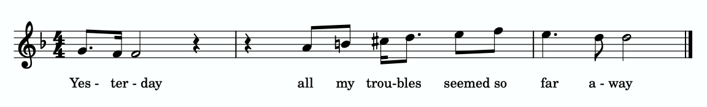
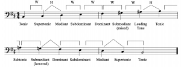
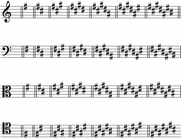
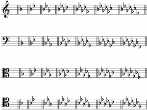
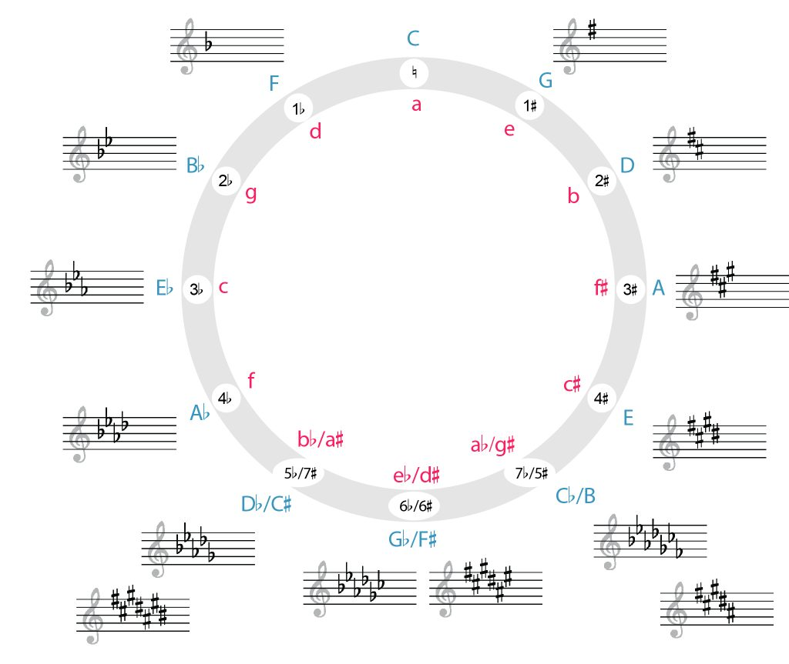

I. 基础知识

小调音阶（Minor Scales）、音级（Scale Degrees）与调号（Key Signatures）
Chelsey Hamm 和 Bryn Hughes

核心要点

- 小调音阶的第三级音总是比同名大调音阶的第三级音低一个半音。
- 小调音阶有三种形式：自然小调（natural minor）、和声小调（harmonic minor）和旋律小调（melodic minor）。
- 每种小调音阶都是由半音和全音按一定顺序排列而成，具体如下：自然小调：全‑半‑全‑全‑半‑全‑全（上行）；和声小调：全‑半‑全‑全‑半‑三个半音‑半（上行）；旋律小调：全‑半‑全‑全‑全‑全‑半（上行），全‑全‑半‑全‑全‑半‑全（下行）。
- 虽然小调音阶有三种形式，但小调和小调调号总是统称为"小调"（如"A小调"、"D小调"等），并且以自然小调为基础。
- 小调中的音级与大调相同。小调中有几个新的唱名音节，包括me、le和te。
- 小调音阶的每个音也有音级名称。这些名称在小调中与大调基本相同，唯一不同的是下主音（te或$\hat7$）。
- 大调和小调之间有两种不同的关系。平行关系（parallel relationship）是指大调和小调共享同一个主音，而关系大小调（relative relationship）是指大调和小调共享同一个调号。
- 每个大调调号都有一个对应的关系小调调号，其主音比关系大调的主音低三个半音。大调和小调调号中升号和降号的排列顺序相同。

章节目单

# 小调音阶

小调音阶的第三级音总是比同名大调音阶的第三级音低一个半音（例如B大调和B小调）。小调音阶有三种不同类型：自然小调、和声小调和旋律小调。这三种小调音阶可以类比为不同口味的冰淇淋——无论是巧克力味、香草味还是草莓味，冰淇淋仍然是冰淇淋。同样，一部作品只是"小调"或"以小调写成"；音乐家不会认为音乐"属于"某种特定类型的小调音阶（即自然、和声或旋律小调）。换句话说，虽然小调音阶有三种形式，但小调和小调调号总是统称为"小调"（如"A小调"、"D小调"等），并且以自然小调为基础。

三种不同类型的小调音阶作为分类工具，主要对器乐演奏者有用。学习在乐器上演奏不同类型的小调音阶，可以让演奏者熟悉西方古典音乐中最常用的小调模式。与大调音阶一样，小调音阶以其第一个音命名（包括变音记号，如果有的话），该音也是最后一个音。

与大调音阶一样，小调音阶在许多不同的音乐体裁中非常常见。一个使用小调音阶的例子（见下文"旋律小调"）可以在披头士乐队的《Yesterday》（1964年）中听到。例1展示了这首歌开头的片段：

例1.
Paul McCartney 和 John Lennon 的《Yesterday》（1964年）片段。

你可以在例2中从0:05开始听例1的音乐。注意人声中上行的小调音阶：

<iframe src="https://www.youtube.com/embed/TQemQRL_YVQ" width="560" height="315" frameborder="0" allowfullscreen></iframe>

例2. Paul McCartney 和 John Lennon 的《Yesterday》；从0:05开始听。

在西方音乐中，小调通常（但并非总是！）用来描绘悲伤等负面情绪。因此，《Yesterday》这首关于分手后令歌者心碎的歌曲采用小调是非常恰当的。

# 自然小调

自然小调形式的小调音阶由半音和全音按一定顺序排列而成，上行顺序为全‑半‑全‑全‑半‑全‑全，如例3所示。每个全音用方括号和"W"标记，每个半音用尖括号和"H"标记。仔细聆听例3，注意自然小调形式的半音和全音模式在上行和下行时是相同的。

<iframe loading="lazy" src="https://musescore.com/user/32728834/scores/6825960/embed" width="100%" height="394" frameborder="0"></iframe>

例3. G自然小调音阶。（实际音高为F自然小调。）

你可以在以下练习中练习辨认自然小调音阶中的全音和半音：

练习

你可以在以下练习中练习辨认自然小调音阶的名称：

练习

# 和声小调

和声小调形式的小调音阶由半音和全音按一定顺序排列而成，上行顺序为全‑半‑全‑全‑半‑三个半音‑半（"三个半音"即三个半音的距离），如例4所示。弧形括号代表三个半音的距离（即一个全音加一个半音）。仔细聆听例4，注意和声小调形式的半音和全音模式在上行和下行时是相同的。

<iframe loading="lazy" src="https://musescore.com/user/32728834/scores/6826003/embed" width="100%" height="394" frameborder="0"></iframe>

例4. G和声小调音阶。（实际音高为F和声小调。）

# 旋律小调

旋律小调形式的小调音阶由半音和全音按一定顺序排列而成，上行顺序为全‑半‑全‑全‑全‑全‑半，下行顺序为全‑全‑半‑全‑全‑半‑全，如例5所示。聆听例5时，请注意旋律小调形式的上行和下行模式是不同的：上行模式是旋律小调特有的，而下行模式与自然小调形式相同。

<iframe loading="lazy" src="https://musescore.com/user/32728834/scores/8455586/embed" width="100%" height="394" frameborder="0"></iframe>

例5. G旋律小调音阶。（实际音高为F旋律小调。）

例6展示了C音阶的四种版本——大调、自然小调、和声小调和旋律小调——并标出了音级。仔细聆听此例，注意各音阶之间的听觉差异。

<iframe loading="lazy" src="https://musescore.com/user/32728834/scores/8383329/s/WuOIXN/embed" width="100%" height="630" frameborder="0"></iframe>

例6. 大调、自然小调、和声小调和旋律小调音阶，均从C开始。

# 小调音级、唱名与音级名称

小调的音级、唱名（solfège）和音级名称与大调相似，但并不完全相同。例7总结了三种类型的小调音阶，并展示了每种的音级和唱名。注意音级与大调相同。最下面一行显示的唱名音节与大调唱名音节有几处不同，以反映小调的全音和半音模式。

<iframe loading="lazy" src="https://musescore.com/user/32728834/scores/8383293/embed" width="100%" height="630" frameborder="0"></iframe>

例7. 三种小调音阶的音级和唱名：a) 自然小调；b) 和声小调；c) 旋律小调。

在自然小调的唱名中（例7a），mi变为me（发音为"may"），la变为le（发音为"lay"），ti变为te（发音为"tay"）。如果你唱或演奏上面的例子，你会注意到结尾缺少大调中听到的那种终止感。在大调中，这种终止感部分由ti（$\uparrow\hat{7}$）到do（$\hat{1}$）的上行半音创造。

在和声小调中（例7b），ti（$\uparrow\hat7$）取代了te（$\hat7$）。ti的使用创造了自然小调中所缺乏的终止感。

如上所述，旋律小调音阶有不同的上行和下行模式（例7c）。在旋律小调的上行形式中，le–te（$\hat6-\hat7$）变为la-ti（$\uparrow\hat6-\uparrow\hat7$），这意味着旋律小调音阶的上半部分听起来与大调音阶相同。在旋律小调的下行形式中，恢复为自然小调，因此再次使用te–le（$\hat7-\hat6$）。因此，旋律小调的上行版本具有与大调相关的终止感，而下行版本则遵循自然小调的模式。

你可以在以下练习中练习标记自然小调音阶中的唱名：

练习

与大调音阶一样，小调音阶的每个音也有音级名称。例8展示了小调音阶中使用的音级名称，以及相应的音级数字和唱名音节。

音级数字 | 唱名 | 音级名称
$\hat1$ | do | 主音（Tonic）
$\hat2$ | re | 上主音（Supertonic）
$\hat3$ | me | 中音（Mediant）
$\hat4$ | fa | 下属音（Subdominant）
$\hat5$ | sol | 属音（Dominant）
$\hat6$ | le | 下中音（Submediant）
$\hat7$ | te | 下主音（Subtonic）
$\uparrow\hat7$ | ti | 导音（Leading Tone）

例8. 小调音阶中的音级名称。

正如大调音阶一章所讨论的，拉丁语前缀sub的意思是"下方"——下中音在主音下方三度，下属音在主音下方五度。由此我们现在可以增加一个新的音级名称：下主音（subtonic），用于降低的$\downarrow\hat7$。上主音在主音上方一个全音，而下主音在主音下方一个全音。

例9展示了一个B旋律小调音阶，上行和下行，标注了音级名称。如你所见，旋律小调音阶在上行形式中使用导音，在下行形式中使用下主音。

例9.
B旋律小调音阶。

例10是学习小调音阶三种形式的有用视觉参考。该顺序反映了与同主音大调相比降低的音级数量。

小调音阶形式 | 降低的音级（与大调相比）
自然小调 | $\downarrow\hat{3},\downarrow\hat{6}, \downarrow\hat{7}$
和声小调 | $\downarrow\hat{3},\downarrow\hat{6}$
旋律小调（上行） | $\downarrow\hat{3}$

例10. 小调降低的音级。

如你所见，与大调相比，自然小调有三个降低的音级，和声小调有两个，旋律小调的上行版本有一个。记住，旋律小调的下行版本与自然小调相同，有三个降低的音级。

你可以在以下练习中练习标记小调音级、唱名和音级名称：

练习

# 平行关系与关系大小调

在比较大调和小调时，有两种重要的关系。平行关系（parallel relationship）是指大调与小调共享主音（do，$\hat{1}$）。例如，C大调和C小调（或A♭大调和A♭小调，或F♯大调和F♯小调）是平行调。我们使用"平行小调"和"平行大调"来描述这种关系：C大调是C小调的平行大调，C小调是C大调的平行小调。

关系大小调（relative relationship）是指大调与小调共享调号。例如，C大调的调号中没有任何升号或降号，A小调也没有。我们使用"关系小调"和"关系大调"来描述这种关系：C大调是A小调的关系大调，A小调是C大调的关系小调。小调的主音总是在其关系大调主音下方三个半音：如果你从C往下数三个半音，你会得到A（C–B，B–B♭，B♭–A）。同样，要找到给定小调的关系大调，往上数三个半音即可。

在数半音来确定关系大调或小调时，请记住关系调共享相同的调号。升号调不能与降号调建立关系大小调关系（反之亦然），这意味着你需要选择正确的等音调（enharmonic key）。例如，虽然从D♭向下三个半音可以写成B♭或A♯，但只有B♭小调（五个降号）是D♭大调（也是五个降号）的关系小调，因为A♯小调有不同的调号（七个升号）。

# 小调调号

小调调号与大调调号一样，位于谱号之后、拍号之前。每个大调都有一个对应的关系小调调号；因此，小调调号中升号和降号的排列顺序与大调调号相同，放置在相同的线和间上。例11复制自上一章，展示了所有四种谱号中升号和降号的顺序：

例11.
四种谱号中升号和降号的顺序。

如前所述，如果你知道给定调号对应的大调，可以从主音往下数三个半音来找到该调号的小调。例12按顺序展示了所有升号小调调号，例13按顺序展示了所有降号小调调号。

例12.
A、E、B、F♯、C♯、G♯、D♯和A♯小调的调号。

例13.
A、D、G、C、F、B♭、E♭和A♭小调的调号。

如果小调包含重升号或重降号，它们也可以是假想的（与假想大调一样）。

你可以在以下练习中练习辨认小调调号：

练习

# 小调与五度圈

五度圈（circle of fifths）既可以用于大调调号的视觉展示，也可以用于小调调号。每个调号都放在对应的大调和小调旁边。例14展示了小调和大调的五度圈：

例14.
大调和小调的五度圈。

在例14中，大调用蓝色大写字母排列在圆的外侧，小调用红色小写字母排列在圆的内侧。调号再次按变音记号数量的顺序出现。如果你从圆的顶部（12点方向）顺时针开始，调号增加升号；如果你从圆的顶部逆时针开始，调号增加降号。底部的三个调号可以用升号或降号书写，因此是等音的（enharmonic）。

# 大调还是小调？

当你拿到一首要演奏或演唱的乐曲时，乐谱通常会包含调号，这将帮助你把作品的调性缩小到两个选项：一个大调及其关系小调。[1]但你如何判断作品属于哪一个调呢？一个有用的方法是聆听和观察上下文线索。其中一种线索是作品的第一个和最后一个音——乐曲通常从主音开始并在主音结束，因此这可以帮助你判断作品是大调还是小调。

例15展示了Louise Reichardt（1779–1826）的一首名为"Durch die bunten Rosenhecken"（"穿过五彩的玫瑰树篱"）的歌曲的前三小节：

例15.
["Durch die bunten Rosenhecken"的前三小节。](https://open.spotify.com/track/6VaRf356HZBxo5RIryWiV4?si=9b3f8b4d00ea4660)

此例展示了声乐部分（上方谱表）和钢琴部分（声乐部分下方的大谱表）。调号包含四个降号，这意味着我们可以把这首作品的调性缩小到A♭大调或F小调。在例15中，最高声部（歌手）中圈出的第一个音是F，最低声部（钢琴演奏的最低音）中圈出的第一个音也是F。因此，这首作品的调性更可能是F小调而不是A♭大调。

扩展阅读

- Drabkin, William. 2001. "Circle of Fifths." Grove Music Online. https://doi.org/10.1093/gmo/9781561592630.article.05806.
- ——. 2001. "Degree." Grove Music Online. https://doi.org/10.1093/gmo/9781561592630.article.07408.
- ——. 2001. "Scale." Grove Music Online. https://doi.org/10.1093/gmo/9781561592630.article.24691.
- Hyer, Brian. 2001. "Tonality." Grove Music Online. https://doi.org/10.1093/gmo/9781561592630.article.28102.
- Jander, Owen. 2001. "Solfeggio." Grove Music Online. https://doi.org/10.1093/gmo/9781561592630.article.26144.
- McGrain, Mark. 1986. Music Notation. Boston: Berklee Press.
- Palmer, Willard A. et. al. 1994. The Complete Book of Scales, Chords, Arpeggios & Cadences. Van Nuys, CA: Alfred Publishing.
- Rechberger, Herman. Scales and Modes around the World. 2008. Finland: Fennica-Gehrman.
- Roemer, Clinton. 1985. The Art of Music Copying: The Preparation of Music for Performance, 2nd edition. Sherman Oaks: Roerick Music Company.

在线资源

- 小调音阶教程 (musictheory.net)
- 小调音阶 (YouTube)
- 大调和小调中的音级名称 (musictheory.net)
- 小调和大调调号 (musictheory.net)
- 小调调号 (YouTube)
- 小调调号闪卡 (music-theory-practice.com)（请确保在菜单中点击"minor"）
- 小调和大调的五度圈 (YouTube)
- 五度圈 (Classic FM)

网络作业

- 自然小调音阶 (.pdf)
- 和声小调音阶 (.pdf)
- 旋律小调音阶 (.pdf)
- 书写和辨认小调音阶 (.pdf)
- 书写小调和大调音阶 (.pdf)
- 书写和辨认小调调号 (.pdf, .pdf)
- 书写大调和小调调号 (.pdf)
- 平行小调和关系小调问题 (.pdf)
- 大调和小调中的音级名称 (.pdf)

作业

- 小调音阶A：要求学生书写小调音阶并书写/辨认音级。所有谱号 (.pdf, .mscz)　仅高音和低音谱号 (.pdf, .mscz)
- 小调音阶B：要求学生书写小调音阶并书写/辨认音级。所有谱号 (.pdf, .mscz)　仅高音和低音谱号 (.pdf, .mscz)
- 小调调号A：要求学生书写和辨认小调调号，并在调号背景下书写音阶。所有谱号 (.pdf, .mscz)　仅高音和低音谱号 (.pdf, .mscz)
- 小调调号B：要求学生书写和辨认小调调号，并在调号背景下书写音阶。所有谱号 (.pdf, .mscz)　仅高音和低音谱号 (.pdf, .mscz)

---
---

- 1700年至1900年间的绝大多数西方古典音乐作品都是大调或小调。但在这个时间段和文化背景之外，你还应该考虑作品是否可能是教会调式（diatonic mode）。这将扩大调号所指示的可能主音的数量。↵

---

---

## 🎵 音频与互动示例

<iframe src="https://www.youtube.com/embed/TQemQRL_YVQ" width="560" height="315" frameborder="0" allowfullscreen></iframe>

📋 **章节播放列表**: <https://open.spotify.com/playlist/2wylP85ygXkX1tWtUPqcgm>

**互动练习**（需网络，原站加载）:

- Minor Scale Whole Step-Half Step

- Spelled Natural Minor Scale

- Minor Scale Solfege Matching

- Minor Key Signature

*原文: [Minor Scales, Scale Degrees, and Key Signatures](https://viva.pressbooks.pub/openmusictheory/chapter/minor-scales) | CC BY-SA*
