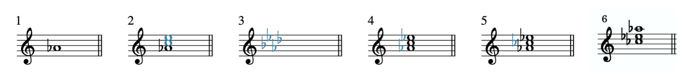
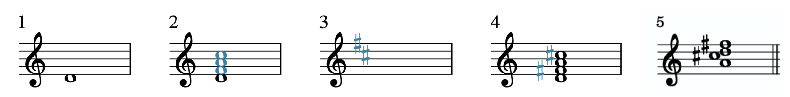

I. 基础

转位
Samuel Brady 和 Chelsey Hamm

要点

- 三和弦和声的低音声部（bass voice），通常简称为"低音"，决定转位（inversion）。
- 转位和声的根音不在低音。当三音在低音时，我们说和弦是第一转位（first inversion）；当五音在低音时，我们说和弦是第二转位（second inversion）；当七音在低音时，我们说和弦是第三转位（third inversion）。
- 在本章中，将只使用和弦符号。
- 三和弦和七和弦根据其根音、性质和转位来识别。

# 三和弦转位

音乐家通常优先考虑三和弦和声中低音声部的音符，简称为"低音"，即作品的最低声部（或声部），无论什么乐器或声部类型在演唱或演奏那个最低音。例1展示了一个A大三和弦，低音有三个不同的音符，以及和弦符号（五线谱上方）：

例1. A大三和弦的原位、第一转位和第二转位。

A大三和弦由三个音符组成，根音（A）、三音（C♯）和五音（E）。当三和弦按三度叠加（即"雪人形式"）时，我们说三和弦是原位。原位的低音是根音。根音不在低音的和弦被称为转位（inverted）。如例1所示，当三音在低音时，和弦是第一转位，当五音在低音时，我们说和弦是第二转位。和弦符号后跟斜线和字母名称表示在低音的音高。

重要的是要注意，和弦的低音声部与和弦的根音不是同一回事。A大三和弦的根音始终是A，无论三和弦是原位、第一转位还是第二转位。然而，低音声部在这些转位之间会变化，从A到C♯到E，如例1所示。

这些信息总结在例2中：

转位 | 根音 | 低音
原位 | 根音 | 根音
第一转位 | 根音 | 三音
第二转位 | 根音 | 五音

例2. 三和弦转位、根音和低音的总结。

# 拼写转位三和弦

要从和弦符号构建转位三和弦，你需要在三和弦章节中所示的步骤基础上再加一步。提醒一下，这些步骤是：

- 在五线谱上画出根音。
- 画出根音上方三度和五度的音符（即画一个雪人）。
- 想出（或写下）三和弦根音的大调调号。
- 要拼写大三和弦，写下适用于三和弦音符的调号中的任何变音记号。
- 对于小、减或增三和弦，在适当时添加额外的变音记号来改变和弦的三音和/或五音。

现在我们将添加第六步：

6. 将适当的音符移到低音以完成三和弦。

让我们对A♭小三和弦第一转位（A♭mi/C）完成这个过程，如例3所示：

例3.
用六个步骤画一个A♭小三和弦第一转位。

- 写下音符A♭，因为它是三和弦的根音。
- 画了一个雪人；换句话说，添加了音符C和E，因为它们分别是A♭上方的通用三度和五度。
- 回忆了A♭大调的调号。A♭大调有四个降号：B♭、E♭、A♭和D♭。
- 添加了E♭，因为它在A♭大调的调号中。不需要B♭和D♭，因为这些音符不在A♭三和弦中。现在我们已经成功拼写了A♭大三和弦（A♭、C和E♭）。
- 小三和弦包含小三度，比大三度小一个半音。因此，我们的最后一步是将和弦的三音（C）降低一个半音（到C♭）。现在我们有了A♭小三和弦（A♭、C♭和E♭）。
- 将C♭移到低音，因为三和弦是第一转位（A♭mi/C）。

同样，遵循这些步骤是初学者拼写转位三和弦的可靠方法，但这很耗时。如果你练习在乐器上演奏所有性质的三和弦（以及下面的七和弦）直到熟练，你的知识将变得更加自动，无需使用这个过程。

# 识别转位三和弦

三和弦根据其根音、性质和转位来识别。加上转位后，你可以通过四个步骤识别三和弦：

- 识别并写出其根音。
- 识别并写出其性质。
- 识别其转位。
- 写出适当的斜线和字母名称。

例4展示了一个转位三和弦（第1小节）和原位三和弦（第2小节）：



例4. 转位三和弦（第1小节）和原位三和弦（第2小节）。

第1小节中三和弦的四步识别过程如下：

- 在第2小节中，和弦已放回原位。现在我们可以看到三和弦的根音是D。
- 这个三和弦是小的。
- 三和弦的三音在低音；因此这个三和弦是第一转位。
- 使用和弦符号，我们将这个三和弦识别为Dmi/F。

例5展示了另一个转位三和弦（第1小节）和原位三和弦（第2小节）：

例5. 转位三和弦（第1小节）和原位三和弦（第2小节）。

第1小节中三和弦的四步识别过程如下：

- 在第2小节中，和弦已放回原位。现在我们可以看到根音是A。
- 这个三和弦是大的。
- 三和弦的五音在低音；因此这个三和弦是第二转位。
- 使用和弦符号，我们将这个三和弦识别为A/E。

请注意，例4和例5的第二小节用括号括起来。建议你想象和弦的原位而不是写出来，以节省时间。

# 七和弦转位

与三和弦一样，七和弦也可以转位；换句话说，它们的根音不一定在低音。例6展示了一个A7和弦的原位、第一转位、第二转位和第三转位：



例6. 七和弦转位。

如例6所示，七和弦比三和弦多一个音符，因此它们多一个转位。当七和弦的和弦七音在低音时，和弦是第三转位。不要忘记低音和和弦的根音不是同义的。在例6中，和弦的根音始终是A，无论其转位和低音如何。

这些信息的总结可以在例7中看到：

转位 | 根音 | 低音
原位 | 根音 | 根音
第一转位 | 根音 | 三音
第二转位 | 根音 | 五音
第三转位 | 根音 | 七音

例7. 七和弦转位、根音和低音的总结。

# 拼写转位七和弦

要从和弦符号构建转位七和弦，你需要在七和弦章节中所示的步骤基础上再加一步。提醒一下，这些步骤是：

- 在五线谱上画出根音。
- 画出根音上方三度、五度和七度的音符（即画一个"加长"雪人）。
- 想出（或写下）三和弦根音的大调调号。
- 写下适用于和弦中其余音符的调号中的任何变音记号。

现在我们将添加第五步：

5. 将适当的音符移到低音以完成七和弦。

让我们对D大-大七和弦第二转位（Dmaj7/A）完成这个过程，如例8所示：

例8.
用五个步骤拼写转位D大-大七和弦。

- 音符D，和弦的根音，被画在五线谱上。
- 画了一个加长雪人——F、A和C，D上方的通用三度、五度和七度的音符。
- 回忆了D大调的调号。D大调有两个升号，F♯和C♯。
- 在F和C的左边添加了升号（♯），因为F♯和C♯在D大调的调号中。
- 将A移到低音，因为七和弦是第二转位。

# 识别转位七和弦

与三和弦一样，七和弦也根据其根音、性质和转位来识别。你可以通过五个步骤识别七和弦：

- 识别并写出其根音。
- 识别并写出其三和弦的性质。
- 识别并写出其七音的性质。
- 识别其转位。
- 写出适当的斜线和字母名称。

例9展示了一个转位七和弦及其识别过程：

例9. 转位七和弦（第1小节）和原位七和弦（第2小节）。

第1小节中七和弦的五步识别过程如下：

- 在第2小节中，七和弦已放回原位。现在我们可以看到和弦的根音是E。
- 三和弦是小的。
- 和弦七音也是小的。
- 原始例子是第一转位，因为三音在低音。
- 这个和弦是Emi7/G。

另一个转位七和弦在例10中展示，以及识别过程：

例10. 转位七和弦（第1小节）和原位七和弦（第2小节）。

第1小节中七和弦的五步识别过程如下：

- 在第2小节中，七和弦已放回原位。现在我们可以看到和弦的根音是G。
- 三和弦是大的。
- 和弦七音是小的。
- 原始例子是第三转位，因为七音在低音。
- 这个和弦是G7/F。

同样，建议你想象和弦的原位而不是写出来，以节省时间（步骤1）。

需要注意的是，三和弦和七和弦的识别不受音符的重复或开放间距的影响，如我们在前面章节中所见。

延伸阅读

- Cohn, Richard, et al. 2001. "Harmony."Grove Music Online.https://doi.org/10.1093/gmo/9781561592630.article.50818.
- Drabkin, William. 2001. "Inversion."Grove Music Online.https://doi.org/10.1093/gmo/9781561592630.article.13879.
- McGrain, Mark. 1986.Music Notation. Boston: Berklee Press.
- Roemer, Clinton. 1985.The Art of Music Copying: The Preparation of Music for Performance, 2nd edition. Sherman Oaks: Roerick Music Company.

在线资源

- 理解三和弦和七和弦的转位（Justin Rubin）
- 三和弦转位（musictheory.net）
- 七和弦转位（musictheory.net）
- 和弦转位如何工作？（Hello Music Theory）
- 和弦转位（key-notes.com）
- 三和弦转位（teoria）
- 什么是和弦转位？（YouTube）
- 什么是和弦转位？钢琴（YouTube）
- 七和弦听觉训练（teoria）
- 和弦听觉训练（musictheory.net）
- 和弦听觉训练（Tone Savvy）

网络作业

- 三和弦构建（含转位），第3–4页（.pdf）
- 三和弦构建与识别（含转位），（.pdf），第4–6页（.pdf）
- 三和弦识别（含转位）（.pdf）
- 七和弦构建（含转位），第7–8、11页（.pdf），第4页（.pdf）

作业

- 三和弦转位（.pdf,.mcsz）。要求学生写和弦符号并识别封闭位置三和弦的转位，并从和弦符号写出转位三和弦。
- 七和弦转位（.pdf,.mcsz）。要求学生写和弦符号并识别封闭位置七和弦的转位，并从和弦符号写出转位七和弦。

---
*原文: [Inversion](https://viva.pressbooks.pub/openmusictheory/chapter/inversion) | CC BY-SA*
