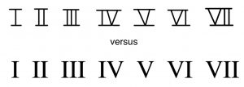

I. 基础

罗马数字
Samuel Brady; Chelsey Hamm; Megan Lavengood; 和 Kris Shaffer

要点

- 罗马数字分析（Roman numeral analysis）是一种和弦标记系统，将和弦置于作品整体调性的背景下。
- 罗马数字中表示的数字对应于和弦根音的音级（scale degree）。
- 如果和弦有七音，则在罗马数字上添加上标七（7）。
- 和弦的性质（quality）也在罗马数字分析中标示：根音上方有大三度的和弦（大、增）使用大写罗马数字。根音上方有小三度的和弦（小、减、半减）使用小写罗马数字。增（+）、减（o）和半减（ø）和弦添加特殊符号。

音乐家使用罗马数字（Roman numerals）在调号的背景下识别和弦。罗马数字识别和弦根音的音级（例1）。因为罗马数字基于音级而非特定的音名，所以它们对于理解不同调中和声如何以类似方式运作非常有用。

音级 | 大写罗马数字 | 小写罗马数字
1 | I | i
2 | II | ii
3 | III | iii
4 | IV | iv
5 | V | v
6 | VI | vi
7 | VII | vii

例1. 音级和罗马数字。

例2.
手写罗马数字和打印罗马数字的区别。

要输入大写罗马数字，使用大写拉丁字母"I"和"V"；同样，对于小写罗马数字，输入小写"i"和"v"。[1] 手写大写罗马数字在数字的顶部和底部有横线，以便进一步区分大小写（例2）。小写罗马数字没有这种区别。

# 罗马数字与性质

除了显示和弦根音外，罗马数字还可以表示和弦的性质（例3）。[2] 大写罗马数字表示大三和弦，小写罗马数字表示小三和弦。例如，在大调中，建立在第一音级 $\hat1$ 或do上的和弦被标识为"I"，建立在第二音级 $\hat2$ 或re上的和弦用小写罗马数字"ii"标识，依此类推。小写罗马数字后跟上标"o"（如viio）表示减三和弦。大写罗马数字后跟+号（如V+）表示增三和弦。

三和弦性质 | 罗马数字特征 | 示例
大 | 大写 | V
小 | 小写 | ii
增 | 大写加+ | V+
减 | 小写加o | viio

例3. 用罗马数字表示三和弦性质。

正如音级和唱名在不同调中相同一样，罗马数字也是如此。例4展示了G大调和G小调自然三和弦的罗马数字作为示例，但无论哪个音高是主音，使用的罗马数字都是相同的。根音的唱名和音级也标注了——注意它们与罗马数字之间的对应关系。



例4. G大调和G小调三和弦的罗马数字。

正如在三和弦中所讨论的，如果小调中的导音（leading tone）升高了，和弦性质就会改变，因此罗马数字也会改变：小v和弦变成大V和弦，下主音VII和弦变成减vii和弦。这意味着小调中的罗马数字有时暗示了升高的导音，所以请记住，当你在小调中看到V或vii时，你将使用升高的导音。

# 七和弦的罗马数字

七和弦的罗马数字标签添加上标7（例如，V7、ii7和vii7）。罗马数字是否大写取决于性质：大和属七和弦大写；小、减和半减七和弦小写。你需要添加特殊符号来表示半减和全减和弦性质：∅表示半减七和弦，o表示全减七和弦。这在例5中进行了总结。

七和弦性质 | 罗马数字特征 | 示例
大-大七和弦（大七和弦） | 大写 | IV7
大-小七和弦（属七和弦） | 大写 | V7
小-小七和弦（小七和弦） | 小写 | ii7
半减七和弦 | 小写加∅ | ii∅7
全减七和弦（减七和弦） | 小写加o | viio7

例5. 用罗马数字表示七和弦性质。

请注意，大七和弦和属七和弦的罗马数字具有相同的特征：大写罗马数字后跟上标7。应该通过调性背景来推断和弦是大还是属。属七和弦仅出现在V7和弦上（或小调中的VII7）；否则，假设带7的大写罗马数字是大七和弦。

例6展示了G大调和G小调音阶的七和弦，用和弦符号和罗马数字（蓝色）标注。同样，这些调的任何移调（transposition）都使用相同的罗马数字。

例6. 大调和小调中七和弦的罗马数字。

# 罗马数字分析

要完成罗马数字分析，你必须首先确定作品的调性。罗马数字分析应在作品或片段的开头标示调性。与和弦符号一样，单独的大写字母名称表示大调，后面跟"mi"表示小调（例如，"B♭mi"表示B♭小调）。另一种常见做法是用小写字母表示小调（例如，"b♭"表示B♭小调）。

罗马数字根据每个和弦根音的音级分配，因此接下来必须识别根音。和弦可能是转位的，所以根音不一定在低音。如果和弦不是以原位出现在音乐中，你可以将其重新叠加为原位（最好在脑中进行）。

罗马数字将根据和弦性质大写或小写。因为调中的每个和弦始终具有相同的性质，你可以记住大调和小调中和弦的性质，以确定罗马数字应该大写还是小写，以及是否需要添加特殊符号。

总结一下，以下是识别和弦罗马数字的步骤：

- 确定调性（别忘了任何升号或降号，如果适用的话！）。
- 找到和弦的根音并注意其音级。这对应于和弦的罗马数字。
- 写出罗马数字，使用大写或小写字母和特殊符号（如适用）来表示和弦性质。

例7展示了Louise Reichardt（1779–1826）的"Die Wiese"（1811）的罗马数字分析。德语文本翻译如下：

"在一个春日，当一切都美丽而欢快时，我曾来到一座孤独的避暑别墅，一个甜美的女孩走出来哭泣。"

注意这个分析的几个特点：

- 调性在分析的开头标注。罗马数字写在五线谱下方。
- 如果和弦没有变化，罗马数字不需要重复。
- 因为这首曲子是小调，它有时使用升高的导音（A小调中的G♯），产生大V和属V7和弦。
- 未升高的G♮下主音音级产生建立在未升高 $\hat7$ 上的属七和弦。[3]
- 第4小节声乐部分中的A是装饰音——不是VII7和声的一部分，不影响罗马数字。
- 这仍然是V7，即使和弦的五音缺失。
- 转位不改变和弦的罗马数字。如果你的老师希望你用数字表示转位，请参见数字低音以获取更多信息。



例7. Louise Reichardt（1811）"Die Wiese"的罗马数字分析。

例8展示了另一个罗马数字分析示例。括号中的音符是装饰音（不是和声的一部分）。



例8. Tommaso Giordani（1785）"Caro mio ben"的罗马数字分析。

如例7和例8所示，音高的几个方面不影响分配给和弦的罗马数字，例如：

- 和弦排列，包括音符的八度、重复音，甚至省略某些音符（特别是和弦五音）。
- 转位/低音。转位可以用数字表示，如数字低音章节中所述，但罗马数字不会改变。
- 装饰音。曲子中的每个音符不一定都是和声的一部分——有时音符更好地理解为装饰音（你可以在装饰音章节中了解更多）。装饰音偶尔可以用数字表示，但它们不影响罗马数字。

音高以外的音乐方面——节奏、音色、力度、力度等——很少影响和弦的罗马数字标签。因此，一首音乐作品的完整分析应该考虑的不仅仅是用罗马数字理解的和声。罗马数字是描述某些音乐现象的有用工具，但它们并不能说明全部情况。

延伸阅读

- Cohn, Richard, et al. 2001. "Harmony."Grove Music Online.https://doi.org/10.1093/gmo/9781561592630.article.50818.
- Drabkin, William. 2001. "Inversion."Grove Music Online.https://doi.org/10.1093/gmo/9781561592630.article.13879.
- McGrain, Mark. 1986.Music Notation. Boston: Berklee Press.
- Roemer, Clinton. 1985.The Art of Music Copying: The Preparation of Music for Performance, 2nd edition. Sherman Oaks: Roerick Music Company.

在线资源

- 罗马数字分析：三和弦（musictheory.net）
- 和声化音阶与罗马数字分析（Kaitlan Bove）
- 罗马数字（learnmusictheory.net）
- 罗马数字分析（8notes.com）
- 罗马数字符号（Robert Hutchinson）
- 大调罗马数字闪卡（gmajormusictheory.org）
- 小调罗马数字闪卡（gmajormusictheory.org）
- 大调转位与罗马数字闪卡（gmajormusictheory.org）
- 小调转位与罗马数字闪卡（gmajormusictheory.org）
- 罗马数字系统如何工作（YouTube）

网络作业

- 罗马数字识别，第15–16、18页（.pdf），第5–7页（.pdf）
- 罗马数字识别与构建，第14页（三和弦）和第17页（七和弦）（.pdf），第8页（.pdf），（网站,网站）
- 罗马数字构建，第22页（.pdf）

作业

- 罗马数字识别A（.pdf,.mscz,.mp3）。要求学生对修改的巴赫众赞歌进行罗马数字分析。
- 罗马数字识别B（.pdf,.mscz,.mp3）。要求学生对修改的巴赫众赞歌进行罗马数字分析。
- 罗马数字识别C（.pdf,.mscz,.mp3）。要求学生对修改的巴赫众赞歌进行罗马数字分析。
- 罗马数字（.pdf, .mscz）。要求学生识别大调和小调中开放排列和弦的和弦符号和罗马数字，在封闭位置实现罗马数字，并用罗马数字标记两个片段的和弦。

---
---

- 罗马数字IV（4）和VI（6）经常被混淆。要记住区别，将IV（4）想成V减I（5 − 1 = 4），将VI（6）想成V加I（5 + 1 = 6）。↵
- 一些音乐理论家（特别是在北美以外）倾向于只使用大写罗马数字，该系统假设和弦性质是凭直觉推断的。↵
- VII和弦，特别是VII7的另一种分析是作为III调中的副属和弦（V/III）。在副属和弦中阅读更多关于主音化和副属和弦的内容。↵

---
*原文: [Roman Numerals](https://viva.pressbooks.pub/openmusictheory/chapter/roman-numerals) | CC BY-SA*
