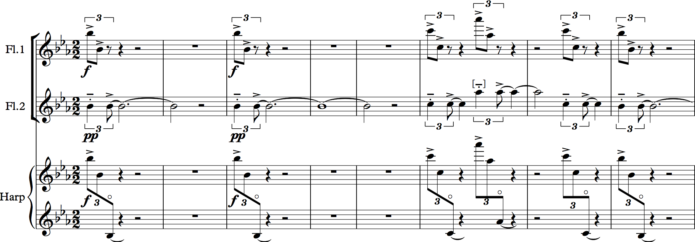
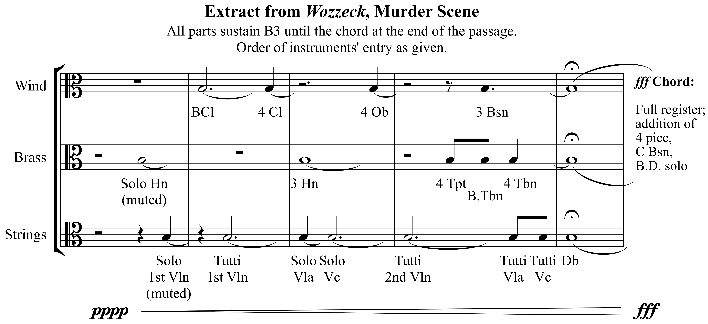

X. 管弦乐法（Orchestration）

微妙的音色变化（Subtle Color Changes）
Mark Gotham

要点总结
上一章讨论了一些重要但相对不太微妙的音色变化。在这里，我们聚焦于一些更精细的方法来进行此类细致的变化，围绕这些变化的表观动机来组织本章，旨在创造：

- 音色终止（timbral cadence）
- 平滑的结构边界（smooth structural boundary）
- "起音–持续"（"共鸣"）效果（"attack-sustain" / "resonance" effect）
- 无缝的管弦乐渐强（seamless orchestral crescendo）
- 音色细腻的旋律（timbrally nuanced melody）

# 为了音色终止（For a Timbral Cadence）

除了在终止之后改变段落之间的音色分布外，一些作曲家为终止本身做出变化，强调终止时刻。这与上一章讨论的保留音色的更形式化考虑相关。

古典时期的管弦乐作曲家有时以这种方式使用木管声部。这里是莫扎特钢琴协奏曲K453第三乐章开头的一个例子。弦乐开始，音色终止通过木管的加入来标记（谱例1）。

谱例1. 在终止处改变管弦乐法以突显终止。

莫扎特 K453

肖斯塔科维奇提供了这一手法的一些非凡的二十世纪例子。考虑肖斯塔科维奇第11号交响曲第三乐章的结尾。这个乐章的外段实际上是一个长大的中提琴独奏，最后齐奏小提琴的音色添加对于将主题正式化结束至关重要。旋律轮廓和对题的终止也有贡献，但和声是高度模糊的。在下面的录音中，主题从0'50"开始演奏，音色终止出现在段落末尾（4'50"和12'40"）。

这种手法并非管弦乐独有。例如，Blink 182在歌曲"I Miss You"中使用了相同的效果来结束主歌：这里的音色终止是通过添加另一位歌手来实现的（例如在0'55"处）。

# 为了精巧地处理结构边界（To Finesse a Structural Boundary）

音色添加也可以从相反的意义上使用：精巧地处理结构边界并积极连接两个段落。这是勃拉姆斯偏爱的手法。勃拉姆斯第2号交响曲第三乐章以一段优美的双簧管主题开始，正是双簧管的回归（连同动机处理和其他方面）精巧地处理了在第101/107小节回到A段。

勃拉姆斯第2号第三乐章

又是双簧管，勃拉姆斯添加它来圆满结束勃拉姆斯第4号交响曲第一乐章的第一个终止。（另请注意此处大提琴和中提琴的交错。）

勃拉姆斯第4号第一乐章

# 为了"起音–持续"（"共鸣"）效果

二十世纪作曲家喜爱的一种技法是"起音–持续"或"共鸣"效果。声学告诉我们，一个音的起始与其余部分有非常不同的特征，作曲家似乎在管弦乐写作中追求类似的东西，让某些乐器承担"起音"角色（开始时较短的音符），而其他乐器承担"持续"角色（较长的音符同时在相同音高上开始）。

例子比比皆是，不限于二十世纪。例如：

- 莫扎特：《魔笛》序曲。当铜管声部进入时，圆号是长音，而小号和长号是短音。
- 莫扎特：《震怒之日》（选自《安魂曲》）：同样，小号和鼓是短音；其他乐器是长音。
- 贝多芬：《第一交响曲》第一乐章的开头是一个标志性的例子，不仅因为其非凡的和声。木管的fp和弦自身就实现了起音–持续配对，并通过弦乐拨奏（仅有起音）得到增强。

在二十世纪，勋伯格开创性的"色彩"（《五首管弦乐曲》第3首）包含这种效果（例如在排练号2处的竖琴），布里顿在《四首海之间奏曲》第三乐章中以壮丽的效果使用了它。从大约0'45"开始播放以下示例。

布里顿使用穿透力强的乐器作为起音（包括再次使用竖琴），并将共鸣设置在持续的长笛线条上，如这段小摘录所示：

布里顿《四首海间奏曲》中的"起音–持续"细节

（注意竖琴泛音的八度移位。）在乐章后面（大约排练号3处），同样的手法出现在木琴和短笛担任起音、小号持续的部分。

这种做法与在相同旋律线条的重叠上使用不同奏法的更广泛手法相关。清晰的例子包括：

- 德彪西：《大海》第三乐章（排练号55）。双簧管有重复音；长笛没有。
- 西贝柳斯：《传奇》：第189小节，（中提琴拨奏+拉奏）；第290小节（小号断奏配双簧管连奏），然后双簧管配中提琴。

这又与在响亮段落中让弦乐声部用震音演奏旋律的做法相关，如格里格的例子所示，来自上一章。

# 为了无缝的管弦乐渐强

那个格里格的例子展示了那种逐步的管弦乐渐强，一些作曲家将其转化为极其微妙的过程。考虑以下瓦格纳《帕西法尔》中两段摘录的例子。旋律是齐奏的，在两种情况下，都在渐强的顶部添加了一种音色。在两种情况下，都添加了已在混音中的乐器的更高、更明亮的版本。在第二种情况下，部分是出于音域的原因（双簧管在高音域取代大管）；在两种情况下，它都微妙地转变了音色，增添了一个音色维度来标记相关时刻。

瓦格纳 – 帕西法尔摘录

再一次，真正标志性的例子要由二十世纪来提供。听这段贝尔格《沃采克》中从无到有的短小渐强（最好用好的音箱听，并提前通知邻居！）。在戏剧上，这是谋杀场景；在音乐上，这是音高B3上的一个巨大管弦乐渐强。看看你能否辨别出一些依次进入的乐器，然后向下滚动查看答案。

这个缩编谱展示了这个过程：

贝尔格《沃采克》中B3齐奏的乐器进入总结

在一本关于声谱的里程碑式著作中，Robert Cogan将这段的开始描述为"几乎完全是基音"：即几乎是一个纯正弦波，严格最小化了泛音。我们以pppp开始，使用加弱音器的圆号：一个完全合适的选择，因为它拥有标准交响管弦乐队中可用的频谱活动最少的声音，并且部分定义上也是最远的。演奏者不仅坐在后面，而且他们的乐器将声音向后投射，进一步增加了距离，确保大多数观众主要听到的是经墙壁反射的声音。在这和使用弱音器之间，大量的高频谱内容被移除，留下了几乎纯净的基音。下一个进入的独奏小提琴上的弱音器具有类似的频谱听觉效果。当低音单簧管加入声音时，引入了一些较高的频谱，但不多，因为该乐器在其音域的高处并且只产生奇数泛音。接下来的内容继续了这个不仅是声音的渐强，也是乐器类型和频谱内容的渐强。自然地，重型铜管最后进入，用光辉为这段频谱进程的结尾增辉。

# 为了音色细腻的旋律

最后，大约自1900年以来，许多作曲家使用音色变化来创造一种"万花筒"旋律。这通常被称为音色旋律（Klangfarbenmelodie，"声音-色彩旋律"）。Klangfarbenmelodie一词由勋伯格在他的《和声学》（1911年）中创造，并在他的"色彩"（《五首管弦乐曲》第3首）中最著名地使用。它也与音乐点彩主义（musical pointillism）相关，其中一条旋律在许多乐器之间传递以给单一线条着色。例子包括韦伯恩标志性的《乐队作品》Op. 24，其中音色有助于阐明音列的结构划分（关于此，参见本章），但也包括大量马勒的作品。例如，参见马勒第7号交响曲第三乐章开头的这个例子，其中点彩式的开始开始凝聚。

我们将以一个非凡的例子结束本章：韦伯恩对巴赫《音乐的奉献》中《利切卡尔》的管弦乐编曲。这部作品既是对原作忠实的、逐音符的转录，也是对其动机和旋律轮廓的通过管弦乐法进行的分析。它更像是一种作曲性的管弦乐法，而非单纯的编曲或转录。下面的图像提供了呈示部的缩编。每一行谱表对应主题的一次呈现（对应赋格声部的六次进入）。

音乐的奉献

韦伯恩对赋格主题的乐器分配遵循回文式、甚至可能是双回文式的设计。每行谱表下方的虚线展示了第一个、主要的、清晰而一致的回文；上方的虚线列出了第二个回文，使用不那么一致，并且在解释最后两个乐器选择方面可能不如方括号有效，方括号说明了这两种乐器如何经常重复早期的配对。谱表上方的星号表示竖琴重叠的音符，其中第一个用于阐明第一个音色再现（启动回文），而后两个标识主题的结束。对角箭头进一步推测了第一个应答的相继乐器音色与开始下两个主题-应答陈述的音色之间的可能关系。

最后，最后两个谱行展示了索菲亚·古拜杜丽娜的小提琴协奏曲《奉献》如何采用了巴赫主题的这种双回文式配器法。那种音色设计并非贯穿始终（因此只呈现了主题的前两个实例），而是与一个整体形式过程相关，该过程在每次相继呈现时从主题的开头和结尾各截去一个音。这一直持续到一个中心点，之后过程对称地逆转。

显然，这些是高度特定的现代主义例子，其中对称性至关重要，但同样，我们可以在二十世纪以前的音乐中看到这种想法的先兆。例如，以下作品中有对称的音色方案：

- 舒伯特第8号交响曲第二乐章：在呈示部中，旋律从单簧管（小调）移到双簧管（大调）；在再现部中过程逆转（双簧管-单簧管）。
- 勃拉姆斯第3号交响曲第三乐章：主题和伴奏在第一段中从弦乐移到木管，在再现段中从木管移到弦乐。

两种情况都反映了它们更大的形式，正如韦伯恩和古拜杜丽娜所做的那样。

作业

- 即将推出！

---

## 🎵 音频与互动示例

<iframe src="https://musescore.com/user/32728834/scores/24655597/embed" width="100%" height="240" frameborder="0" allowfullscreen allow="autoplay"></iframe>

## 许可

Open Music Theory
Copyright © 2023 by
Mark Gotham; Kyle Gullings; Chelsey Hamm; Bryn Hughes; Brian Jarvis; Megan Lavengood; and John Peterson
采用知识共享署名-相同方式共享 4.0 国际许可协议授权，除非另有说明。

---
*原文: [Subtle Color Changes](https://viva.pressbooks.pub/openmusictheory/chapter/subtle-color-changes) | CC BY-SA*
