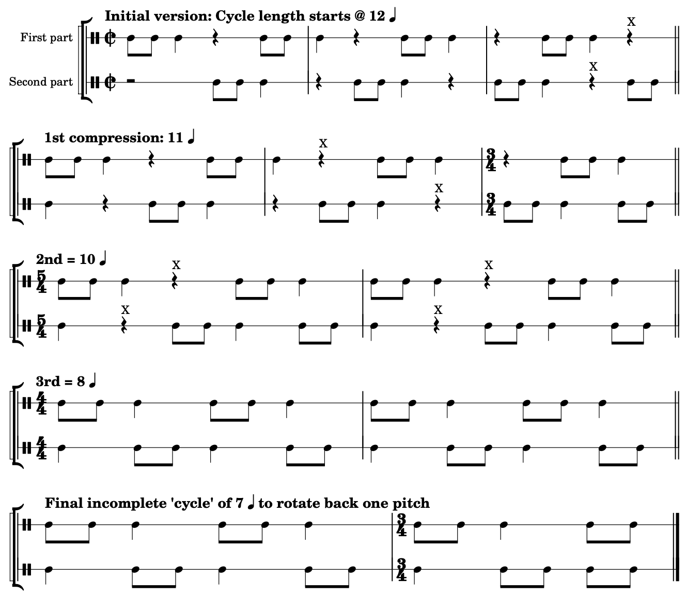

IX. 十二音音乐

用十二音作曲 Mark Gotham
要点
本章通过创作一些新的十二音音乐来进行讲解。以这种方式仔细跟随他人的创作过程会很有帮助。自己尝试类似的事情当然也很有用。

到目前为止，我们已经抽象地看了一些音列和序列属性，以及它们在一些现有作品中的使用。现在让我们通过创作一首新作品来补充这一点。值得重申的是（像任何其他音乐风格或技巧一样），用十二音音列作曲有无限多种方法，因此这只能是一个示例而不能代表全部——事实上，单次分析也不可能代表全部。同样，一个用音列作曲的示例将有助于说明我们如何在理论和实践之间导航。我们可以追求像 Béla Bartók 杰出的 Mikrokosmos 集合那样的作品：具有明确作曲"简报"的短曲，同时也作为"真正的"作品相当有趣。

在这里，我们将从选择和研究音列开始，然后继续写至少一些段落的开头，这些段落以不同的方式处理相同的素材，特别是在使用序列过程的相对"自由"或"严格"程度上。

# 选择音列

让我们从选择一些要使用的音列开始。在选择音列的众多可能动机中，我倾向于寻找那些：

- 具有"有趣的"内部属性……
- ……这些属性暗示了某些作曲策略
- 并且在之前的作品中相对未被充分探索

对我来说，"全三音组"音列非常适合这些标准。Alan Marsden (2012, 162) 将这些定义为"当被视为循环时，在 12 组连续 3 个音级中包含所有 12 种可能的三音组类别的 12 音序列。"[1] Marsden 已证明恰好有四种不同形式的这种音列：

- [0, 2, 6, 10, 5, 3, 8, 9, 11, 7, 4, 1],
- [0, 2, 6, 10, 11, 9, 8, 3, 5, 1, 4, 7],
- [0, 2, 6, 10, 7, 4, 11, 9, 8, 3, 5, 1],
- [0, 2, 6, 10, 1, 4, 5, 3, 8, 9, 11, 7]

以下是从 C 开始的十二音音列，同时给出了相应的三音组并在下方标注：

All-trichord rows by FourScoreAndMore

鉴于所有标准音列都包含所有十二个音高，而包含所有十一个音程的"全音程"音列也是熟悉和常见的，你可以将全三音组音列视为这些熟悉音列属性的逻辑延伸。它们当然很有用，因为我们用十二音作曲的目标是追求最大变化。

也许最引人注目的是，Marsden 总结说他"从未找到一种令人信服的方式在作曲中使用这一点" (2012, 163)。对某些作曲家来说，这种评论是不可抗拒的。

# 示例作曲

以下是几个示例作曲，以及讨论如何用音列生成音乐作品的音高素材。

## （相对）自由的幻想曲

让我们从最不严格的方法开始。在这里，我们将考虑使用这些音列和强调重叠三音组作为足够的约束，将所有其他事项留给自由创作选择，包括：

- 重复一个音符或三音组（但可能不重复其他分组如二音组和四音组）。
- 具体的节奏和乐句划分（只要它们通常强调三组分组）。
- 音域和音色的变化以获得表现力范围。

这个起始前提可以用任何数量的不同方式来实现。以下是一个独奏中提琴的示例开头，从第一个三音组移动到第二个（以上列出的所有四个音列开头共有的两个三音组）：

许多作曲家——序列音乐和其他风格——发现以这种方式设置初始约束很有帮助，部分原因是它可以使你自由地处理更细节的事项。这些限制为如何继续留下了广泛的可能性。例如，我们可能想要创建一个整体轮廓，上升到高点然后从那里下降。或者，我们可能更喜欢一个静态且明显受限的段落。这是完全开放的。

## 过程驱动的"无穷动"

我们也可以以更有活力、更有节奏感的方式处理这些重叠三音组。例如，我们可以有一种极简主义的无穷动风格，在移动到下一个之前坚持重复每个三音组多次。让我们从连续的音符流开始，按顺序重复我们的三音组（所以音高 1-2-3-1-2-3-……）。要移动到下一个三音组，我们可以简单地取第二个音高作为新循环的开始，音高 2-3-4。所以如果我们重复音高 1-2-3-，那么在某个点我们有 1-2-3-1-，后面的 2 标志着 2-3-4- 循环的开始。

我们可以在完成任意数量的 3 音符循环加 1 个音符后进行这个变化：也就是说，在 4 个音符后（一个循环 +1），或 7（两个循环）、10、13、16 等。这应该让我们思考节奏和节拍。假设我们将这个主要 3 分组的模式放入二拍子如 $\\mathbf{^2_2}$ 中。这将赋予音乐一种有吸引力且熟悉的 3 对 4 节拍不协和。无论我们选择什么节拍，我们都必须为一些循环长度做出调整：有些会"适合"节拍，有些会打乱它。例如，在我们的二拍子中，4 循环可以是"一拍"（例如，四个八分音符作为 $\\mathbf{^2_2}$ 中的一拍），16 可以是 2 小节（4 × 4 拍）。相比之下，10 循环意味着稍微打破节拍（例如，用 $\\mathbf{^5_4}$），而 7 延伸到另一个更低的节拍层次（$\\mathbf{^7_8}$）。

以下是为弦乐四重奏实现其中一些想法的短段落，每个循环现在都通过中提琴和大提琴的拨弦清晰标记，同时将模式从一把小提琴移到另一把（这也给了每位演奏者一个受欢迎的休息！）。大多数循环长 16 个音符，但也有一些较短的来打破流动，并对某些三音组停留更久。同样，选择哪些是自由的。

## 严格的固定赋格

最后，让我们探索一种更严格的方法，没有音符重复，并且同时使用多个音列。让我们在经典严格复调形式的背景下做这件事：赋格。[2] 我们可以直接将其中一个音列变成十二音主题，并取一个与这个主题六音组合并的对题。主题和对题将一起演奏（根据定义），所以六音组合并性将确保我们在半循环内不重复音高。

我们还可以确保即使在第三和第四声部进入时音高也不会重复——所以在三音组层面。我们的音列不是三音组合并的，但鉴于我们现有的六音组合并对，我们可以通过交换每个音列的三音组来制作一个新的对，与现有的两个组合并后，每组三音组中都能看到所有十二个音高。

更准确地说，简单地交换三音组会打破这些音列的排序并意味着失去定义性的"全三音组"属性，不过仍然有一种方法可以在保留与原始音列一致的结构的同时实现相同的效果。注意"交换每半部分的三音组"意味着取三音组 1,2,3,4 并最终得到 2,1,4,3。要在保留相同排序的同时从一个到另一个，我们可以逆行并旋转半个循环。所以，例如，对于上行半音阶音列，我们会得到：

音列 | 1 | 2 | 3 | 4 | 5 | 6 | 7 | 8 | 9 | 10 | 11 | 12
逆行并旋转 6 | 6 | 5 | 4 | 3 | 2 | 1 | 12 | 11 | 10 | 9 | 8 | 7

所以，将这个过程应用于初始音列和一个六音组合并对，我们可以得到如下解决方案：

1. 初始音列（如上） | 1 | 2 | 3 | 4 | 5 | 6 | 7 | 8 | 9 | 10 | 11 | 12
2. 六音组合并对 | 7 | 8 | 9 | 10 | 11 | 12 | 1 | 2 | 3 | 4 | 5 | 6
3. 1. 的 R-旋转（如上） | 6 | 5 | 4 | 3 | 2 | 1 | 12 | 11 | 10 | 9 | 8 | 7
4. 2. 的 R-旋转 | 12 | 11 | 10 | 9 | 8 | 7 | 6 | 5 | 4 | 3 | 2 | 1

注意在以下范围内没有音高重复：

- 任何四个音列本身（当然，它们是十二音音列）。
- 初始音列和六音组合并音列的前半部分，这两个音列的后半部分，或旋转对的前半或后半部分。
- 任何离散三音组子集（例如，所有音列组合的音高 1-3）。

这个属性对任何音列来说都是定义上成立的，所以值得保留在作曲技巧库中。

### 实践中的合并性

决定使用合并对很好，但我们需要知道我们的音列中至少有一个实际上具有这个属性。事实上，它们都有，虽然程度不同：每个音列都至少有一些旋转是倒影合并的（记住旋转这些音列保留了至关重要的全三音组属性！），不过音列 3 和 4 比 1 和 2 有更多这样的旋转。以下是音列 3 的列表：

旋转 | 音列 | 合并性
0 | [0, 2, 6, 10, 7, 4, 11, 9, 8, 3, 5, 1] | I3
1 | [2, 6, 10, 7, 4, 11, 9, 8, 3, 5, 1, 0] | I5
2 | [6, 10, 7, 4, 11, 9, 8, 3, 5, 1, 0, 2] |
3 | [10, 7, 4, 11, 9, 8, 3, 5, 1, 0, 2, 6] |
4 | [7, 4, 11, 9, 8, 3, 5, 1, 0, 2, 6, 10] | I2
5 | [4, 11, 9, 8, 3, 5, 1, 0, 2, 6, 10, 7] |
6 | [11, 9, 8, 3, 5, 1, 0, 2, 6, 10, 7, 4] | I4
7 | [9, 8, 3, 5, 1, 0, 2, 6, 10, 7, 4, 11] | I10
8 | [8, 3, 5, 1, 0, 2, 6, 10, 7, 4, 11, 9] |
9 | [3, 5, 1, 0, 2, 6, 10, 7, 4, 11, 9, 8] |
10 | [5, 1, 0, 2, 6, 10, 7, 4, 11, 9, 8, 3] | I4
11 | [1, 0, 2, 6, 10, 7, 4, 11, 9, 8, 3, 5] |

这是从第二个音高开始旋转意味着我们可以围绕三音组旋转并仍然具有 I-合并性（即表中的旋转 1, 4, 7, 10）的演示：

我们可以从这些三音组/旋转中的任何一个开始这个属性。在这些选项中，让我们从第二个音高开始，部分是因为它给了我们增三和弦，这似乎是一个很好的起点：一个对称三音组用于带有倒影相关主题和对题的赋格风格。

### 实际音乐！

剩下的就是写音乐了！让我们用不同的声部、进入点和节奏将音列分开。我们从一个呈示部（第 1-8 小节）开始，涉及：

- 一个主题被分成四个三音组，并带有类似于无穷动中使用的 3 对 4 模式。
- 每个声部以主题进入（当然），但每次都升高半音。
- 对题以互补的节奏逐步填补空白。

呈示部之后，我们探索上面讨论的三音组旋转属性：大提琴循环演奏相同的四个三音组，每次音列重叠一个三音组。这导致其他声部中音列的等效旋转（如上面的音列图表所示）。此外，因为大提琴保持了相同的音高，其他声部也必须转调到新的音高水平以保持合并性（与上面的图表不同，上面的高音谱表保持在同一音高水平而其他声部调整）。

如赋格风格中典型（实际上几乎不可避免）的那样，段落在密度上逐渐增加。与之匹配，这个实现也通过 poco a poco accelerando 和通过迭代缩短乐句跨度来提高变化速率，使用这个减少休止的方案：

带有渐进压缩的节奏循环。每个 X 标识从下一个陈述中被削减的休止。

### 后续步骤

最后，在围绕四个三音组旋转之后，我们旋转回一个音高到音列的原始旋转，从所有四个音列"开头"共有的 [0, 2, 6, 10] 模式开始。这个旋转当然改变了事情。我们到目前为止一直停留在音列的特定分段中，因此只强调十二个三音组中的四个。旋转一个让我们到达另一组四个。如果任何音列支持所有三个连续旋转（即最后一组四个）的六音组合并性，那么我们可能已经平等地围绕三个构建了段落，但这些音列都没有这个属性，所以我们专注于一个，并使用切换到另一个的时刻作为该部分结束的标志。同样，这只是众多可能性中的一种方法。

## 综合

所以这就是：使用这些音列的各种可能方式。后续步骤可能涉及选择其中一个扩展为完整作品，或者将三个（也许还有其他部分）组合成一组短乐章，也许是练习曲。

最后，这里是这首作品的一个实现。我们从自由幻想曲（现在简单地称为"独奏"）开始，然后是赋格风格和无穷动，最后以一个更接近开头轻松精神的短部分结束。同样，在每个转折点都有广泛的选择，从"自由"或"严格"方法的选择到实际实践中的实现。

4x4x4x4 by Mark.Gotham

延伸阅读

- Marsden, Alan (2012): "Final Response: Ontology, Epistemology, and Some Research Proposals." Journal of Mathematics and Music, 6(2): 161–67. doi:10.1080/17459737.2012.698157

在线资源

- Robert Morris 在此页面慷慨提供了大量资源。包括"Elementary Twelve-Tone Theory"文档。

作业

- 尝试类似上述的事情：选择一个或多个你喜欢的音列。用这些属性作曲。思考如何平衡严格约束和自由写作。不要害羞。无论你是否认为自己是"作曲家"，通过实践学习总是有用的，作曲就是一个很好的例子。

- 注意术语"全三音组环"有时用于此主题，而"全三音组音列"指的是不环绕的音列（因此省略两个三音组）。参见 Robert Morris 的"Elementary Twelve-Tone Theory"，例如，注意（Babbitt 之后的）全三音组音列的定义为"排除 SC 3-10[036] 和 3-12[048] 的十音组音列。"↵
- 不熟悉赋格写作的读者可能想先尝试 High Baroque Fugal Exposition 章节。↵